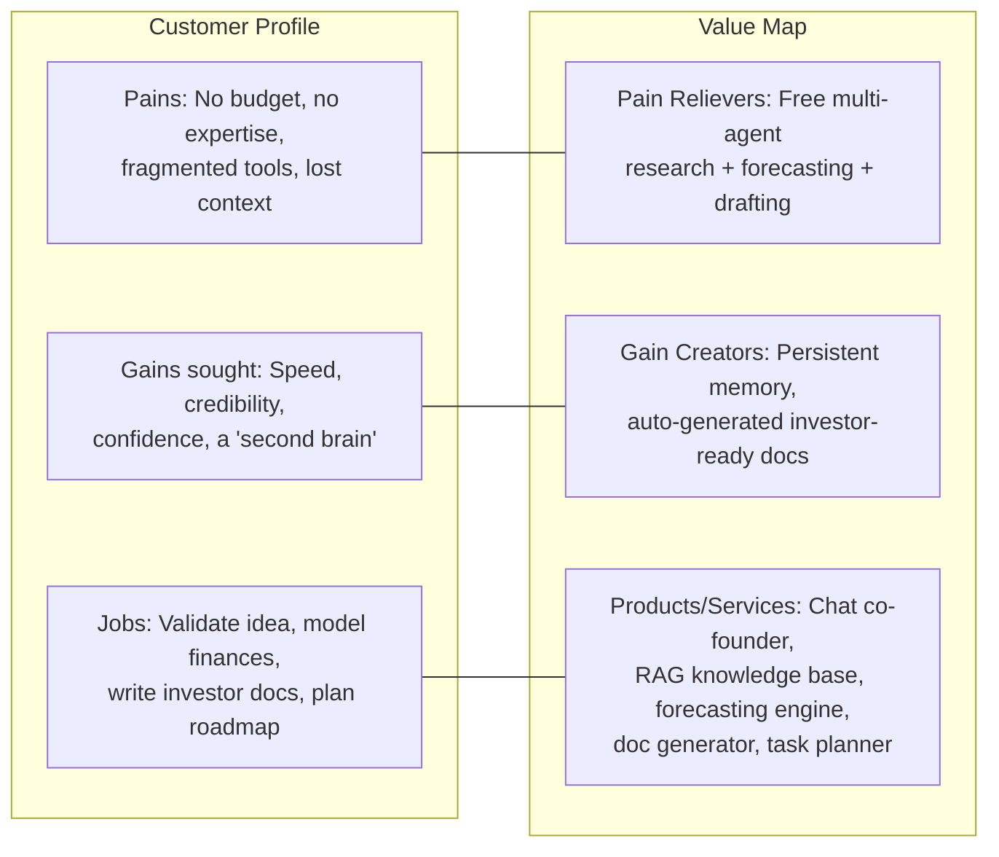
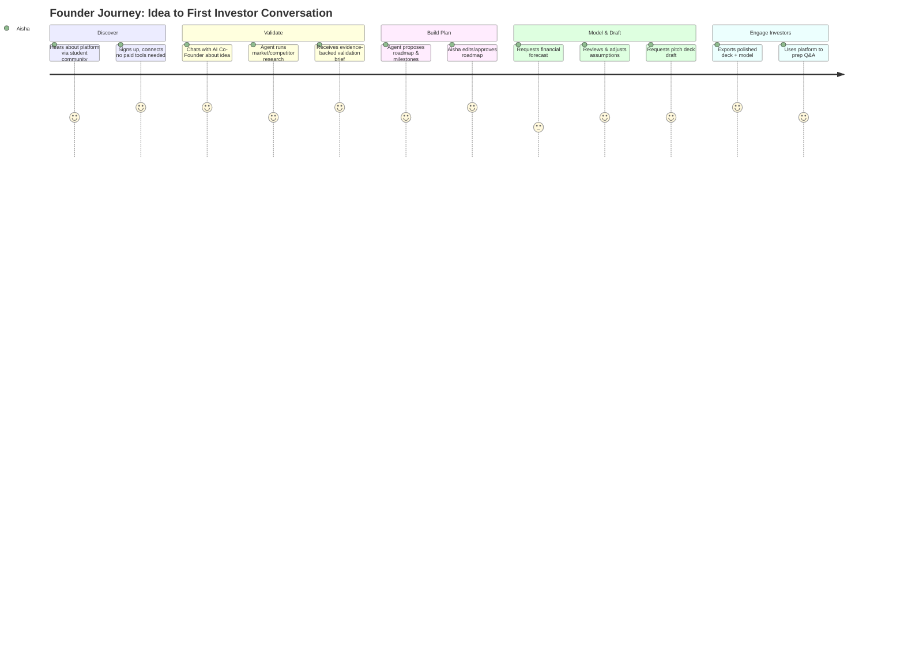
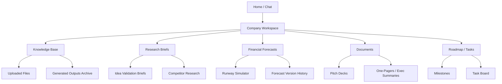
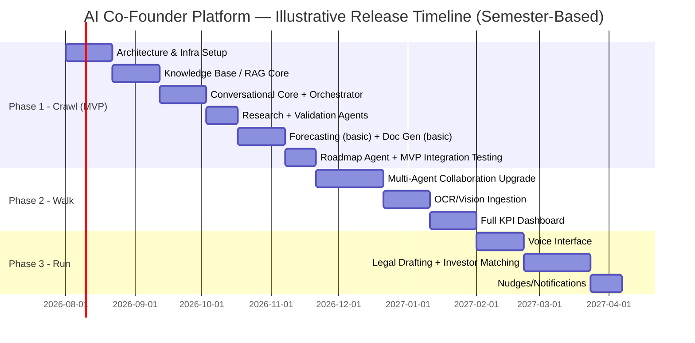

# PART A — PRODUCT REQUIREMENTS DOCUMENT (PRD)
## AI Co-Founder Platform

*This document is Part A of the Master Document (see Master TOC). It assumes zero budget, a solo/small student-developer team, and a stack built entirely from free-tier, open-source, or self-hostable technologies. Every design decision below is made against that constraint first, and against theoretical "best" architecture second — the trade-off analysis in each section makes that reasoning explicit so later chapters (SRS, AI Architecture, Technical Design) can build directly on these decisions without re-litigating them.*

---

## 1. Executive Summary

### 1.1 Product Vision Statement

The AI Co-Founder Platform is a self-hostable, AI-native operating system for early-stage founders — primarily students and bootstrapped indie builders — that behaves like a full-time, tireless co-founder covering the roles a real cofounder or first hire would normally cover: market research, financial modeling, document drafting, task planning, and day-to-day founder coaching. Where existing "AI startup tools" are thin wrappers around a single LLM call, this platform is architected as a **multi-agent system with persistent company memory** (via RAG + knowledge graph), meaning it accumulates context about a specific business over time rather than starting from zero on every session.

The vision is explicitly **not** "a better ChatGPT for founders." It is a persistent, stateful system that:

1. Remembers the company's history, decisions, and rationale (long-term memory).
2. Delegates work to specialized agents (research agent, financial agent, writing agent, planning agent) rather than one generalist prompt.
3. Grounds every output in retrievable evidence (RAG + web search) rather than unverified LLM generation, to reduce hallucination risk in decisions that matter (financial projections, legal-adjacent drafting, market claims).
4. Runs entirely on free-tier or self-hosted infrastructure, so a student with no funding can operate it in production, not just a demo.

### 1.2 Problem Statement & Market Gap

Early-stage student and solo founders face a specific, well-documented resource gap:

| Problem | Why It's Acute for Student Founders | Current Workaround | Why the Workaround Fails |
|---|---|---|---|
| No co-founder with complementary skills (e.g., technical founder lacks GTM/finance knowledge) | Can't afford to hire or equity-split with a stranger this early | Ad-hoc ChatGPT/Claude prompting | No memory across sessions; no structured workflow; user must re-explain context every time |
| No budget for market research tools (CB Insights, PitchBook, etc.) | These cost $1,000s/year | Manual Google searches | Time-consuming, unstructured, not stored anywhere reusable |
| No financial modeling expertise | Building a 3-statement model or runway forecast requires training most students don't have | Spreadsheet templates copied from YouTube | Static, not adaptive to actual usage/revenue data, no forecasting rigor |
| No access to legal/pitch document polish | Lawyers and consultants are unaffordable pre-revenue | Free templates (Y Combinator docs, etc.) | Generic, not tailored to their specific business, no iteration loop |
| Fragmented tools (Notion + ChatGPT + Excel + Canva) | Context is scattered, nothing talks to anything else | Manual copy-paste between tools | High friction, no single source of truth, decisions and rationale get lost |

**Market gap:** There is no dominant, free, open-source platform that combines (a) persistent company memory, (b) multi-agent task execution, and (c) financial/document generation grounded in that memory, targeted specifically at zero-budget builders. Adjacent products (see Chapter 2) either charge significant subscription fees, are single-purpose (only pitch decks, or only financial models), or are generic AI chat wrappers with no domain workflow.

### 1.3 Target Users & Personas

Full persona detail is in Chapter 3; summarized here for scope framing:

| Persona | Description | Primary Need |
|---|---|---|
| **Student Founder (Primary)** | Undergrad/grad student building a startup alongside coursework, no funding, technical or non-technical | End-to-end guidance + document generation without paid tools |
| **Solo Indie Hacker** | Non-student solo builder, side-project-to-startup path | Research + planning agent to compensate for lack of team |
| **Early Non-Technical Co-Founder** | Business-side founder paired with a technical builder | Financial modeling, market research, investor materials |

### 1.4 Value Proposition Canvas

**Figure A1.1 — Value Proposition Canvas.**

### 1.5 Success Definition & North-Star Metric

**North-Star Metric:** *Weekly Active Founders who complete at least one "co-founder action"* — defined as an agent-executed task with a persisted, retrievable output (a saved forecast, a saved research brief, a generated document, a completed task on the roadmap).

**Rationale:** Chat message count is a vanity metric (it rewards verbosity, not value). Tying the metric to *persisted, agent-executed outputs* keeps the product honest to its core differentiator: this is a system that *does things and remembers them*, not a chatbot.

**Supporting metrics (Chapter 4 ties these to features):**

| Metric | Definition | Target (Year 1, post-launch) |
|---|---|---|
| Weekly Active Founders (WAF) | Unique users completing ≥1 co-founder action/week | Growth-stage target, not fixed (pre-revenue product) |
| Memory Retrieval Precision | % of RAG retrievals judged relevant by human eval sample | ≥ 80% |
| Forecast Usage Rate | % of active companies with ≥1 saved forecast | ≥ 40% |
| Document Generation Rate | Avg. generated documents per active company/month | ≥ 2 |
| Free-Tier Cost per Active User | Infra cost per WAF | $0 (hard constraint through Year 1) |

### 1.6 Zero-Budget Constraint Statement & Its Product Implications

This is treated as a **first-class product requirement**, not an engineering afterthought, because it changes what "MVP" means:

- **Implication 1 — Degraded-mode design is mandatory.** Every AI feature must have a documented behavior when its preferred free-tier API is rate-limited or unavailable (see §17.2, AI Architecture Document). The product cannot assume 100% uptime of any single external LLM provider.
- **Implication 2 — Local-first fallback.** Ollama-served local models (Llama 3.x, Qwen 3, Gemma, Phi) must be a viable last-resort fallback for every LLM-dependent feature, even if quality is lower, so the product never fully breaks.
- **Implication 3 — Storage and compute budgets are finite and must be actively monitored**, not assumed infinite as in a funded SaaS product. Chapter 40 (Technical Design) formalizes this; here it means feature scope must be chosen with awareness that e.g. vector DB storage, DB row counts, and LLM token throughput all have free-tier ceilings.
- **Implication 4 — No paid dataset licenses.** All datasets referenced in Chapter 24 (AI Architecture) must be open-licensed (Kaggle/HF/UCI/gov open data/synthetic). This bounds forecasting and NLP model quality below what a funded competitor could achieve — a trade-off explicitly accepted in exchange for zero cost.

---

## 2. Market & Competitive Analysis

### 2.1 Industry Landscape Overview

The "AI for founders" category has grown quickly since 2023 alongside general-purpose LLM adoption, splitting into three broad sub-categories:

1. **General-purpose AI chat tools** used informally for founder tasks (ChatGPT, Claude, Gemini apps) — not purpose-built, no persistent business memory, no agent workflows.
2. **Point-solution AI tools** — single-purpose products: AI pitch-deck generators, AI financial-model generators, AI logo/branding generators. Each solves one job well but doesn't share context with the others.
3. **AI startup-in-a-box / accelerator-style platforms** — emerging category bundling several of the above, typically subscription-priced ($20–$200+/month), aimed at funded or revenue-generating startups rather than pre-funding students.

The platform described in this document sits deliberately across all three: general-purpose conversational core (agentic, not just chat), point-solution depth (forecasting, document generation, research), delivered as a free/self-hosted bundle rather than a subscription product.

### 2.2 Competitor Matrix

**Table A2.1 — Competitor Feature Comparison** *(category-level comparison; specific product names change quickly in this space, so this table should be refreshed each release cycle — see Appendix C for a living version)*

| Capability | General AI Chat Apps | AI Pitch-Deck Generators | AI Financial Model Tools | AI "Startup OS" Bundles | **This Platform** |
|---|---|---|---|---|---|
| Persistent company memory | ✗ (session-only, or basic user memory) | ✗ | ✗ | Partial | ✓ (RAG + Knowledge Graph) |
| Multi-agent task execution | ✗ | ✗ | ✗ | Partial | ✓ (LangGraph orchestration) |
| Financial forecasting (ML-based) | ✗ | ✗ | Partial (formula-based, not ML) | Partial | ✓ (Prophet/LightGBM/TFT) |
| Document generation (pitch, legal templates) | Manual prompting only | ✓ (narrow) | ✗ | ✓ | ✓ |
| Market/competitor research automation | Manual prompting only | ✗ | ✗ | Partial | ✓ (search-grounded agent) |
| Voice interface | Partial | ✗ | ✗ | ✗ | ✓ (Whisper) |
| Document/OCR ingestion of founder's own files | ✗/Partial | ✗ | ✗ | Partial | ✓ (PaddleOCR/Tesseract + VLM) |
| Self-hostable / zero recurring cost | ✗ | ✗ | ✗ | ✗ | ✓ |
| Open-source | ✗ | ✗ | ✗ | ✗ | ✓ |

### 2.3 Feature Gap Analysis

The clearest, most defensible gap is the **combination** of persistent memory + multi-agent execution + zero cost. Individually, each capability exists somewhere in the market; no free/open-source product combines all three. This is the wedge the product should protect as it evolves — later feature decisions (Chapter 5) should be evaluated against "does this deepen the memory+agent+zero-cost moat, or dilute it into a generic feature-parity chase."

### 2.4 SWOT Analysis

**Table A2.2 — SWOT Matrix**

| Strengths | Weaknesses |
|---|---|
| Zero marginal cost to run and to use — strong adoption funnel | Free-tier LLMs are lower quality/reasoning than frontier paid models (GPT-4-class, Claude Opus-class) |
| Full data ownership/self-hosting appeals to privacy-conscious founders | Small team (student developer) means slower iteration than funded competitors |
| Open-source → community contribution potential | No dedicated support/SLA — acceptable for target segment, unacceptable if it tries to move upmarket |
| Differentiated architecture (agentic + memory) vs. commodity chat wrappers | Free-tier API rate limits create real reliability risk at scale |

| Opportunities | Threats |
|---|---|
| Large and growing student-founder / indie-hacker population | Frontier labs could bundle equivalent capability into their own consumer apps |
| Open-source AI tooling (LangGraph, CrewAI, Qdrant, etc.) maturing rapidly, lowering build cost further | Free-tier API terms can change or be revoked with little notice (see Risk Register, Ch. 39) |
| Educational/university partnership channel (career centers, incubators) | Competing "startup OS" bundles could add a free tier defensively |

### 2.5 Differentiation Strategy

Compete on **architecture, not model quality**. Since the platform cannot out-spend competitors on frontier model access, differentiation must come from (a) how well agents are orchestrated, (b) how good the retrieval/memory layer is, and (c) workflow design tailored to the founder journey (Chapter 3). This reframes "AI quality" as an engineering/prompt-design problem the team *can* win on a zero budget, rather than a model-scale problem it cannot.

---

## 3. User Research & Personas

### 3.1 Primary Persona Profiles

**Persona 1 — "Aisha," the Student Technical Founder**
- 21, CS undergrad, building a SaaS side project into a startup.
- Strong at code, weak at go-to-market, financial modeling, and investor communication.
- Zero budget; uses free-tier everything (Vercel, Supabase, etc.) for her own product already.
- Primary need: an AI that can do the "business side" she doesn't have time or skill to learn deeply *yet*, while teaching her enough to eventually not need it.

**Persona 2 — "Marcus," the Solo Indie Hacker**
- 27, ex-corporate, building his second side-project-to-startup attempt after a first failed launch.
- Reasonably strong generalist, but works entirely alone — no one to sanity-check ideas, pressure-test pricing, or draft docs.
- Primary need: a thought partner + research/planning agent that compensates for having no team.

**Persona 3 — "Priya," the Non-Technical Co-Founder**
- 24, MBA-track student, paired informally with a technical friend (not yet incorporated).
- Owns "business side" responsibilities (market sizing, financial model, pitch deck) but lacks formal training in any of them.
- Primary need: credible-looking, grounded outputs (forecasts, decks) she can defend in front of mentors/investors without claiming false expertise.

### 3.2 Jobs-To-Be-Done (JTBD) Framework

**Table A3.1 — JTBD Statements**

| Persona | Situation | Motivation | Desired Outcome |
|---|---|---|---|
| Aisha | Has a product idea, no GTM plan | Wants to know if the idea is viable before investing more build time | A validated, evidence-backed go/no-go read on market size and competition |
| Marcus | Mid-build, second attempt, working alone | Wants to avoid repeating past mistakes | A structured planning + research partner catching blind spots |
| Priya | Preparing for an accelerator application | Needs investor-credible financials and a deck fast | A defensible financial model and polished pitch deck grounded in real data, not guesses |

### 3.3 User Journey Maps

**Figure A3.1 — End-to-End User Journey Map.**

### 3.4 Pain Points & Opportunity Mapping

| Journey Stage | Pain Point Observed/Anticipated | Product Opportunity |
|---|---|---|
| Validate | Founders often can't tell confident-sounding AI text from evidence-backed claims | Every research-agent output must show citations/sources (design constraint carried into Ch. 5.3, 19) |
| Model & Draft | Founders don't trust a black-box number ("why is my Year-2 revenue $400K?") | Forecasts must expose assumptions and allow adjustment, not just output a number (Ch. 5.4) |
| Engage Investors | Generic-sounding AI-drafted documents undermine credibility | Document generation must be grounded in the founder's own stored context (RAG), not generic templates (Ch. 5.5, 5.6) |

---

## 4. Product Scope & Goals

### 4.1 In-Scope Features (MVP)

The MVP scope is intentionally narrower than the full Chapter 5 feature catalog. MVP = the smallest set of features that proves the core differentiated loop (memory + agent + grounded output):

1. Conversational AI Co-Founder core (agentic chat, §5.1)
2. Knowledge Base & Company Memory / RAG (§5.6) — required infrastructure for everything else
3. Market & Competitor Research Agent (§5.3)
4. Business Idea Validation Engine (§5.2)
5. Financial Forecasting & Runway Simulator (§5.4) — basic version
6. Pitch Deck / Document Generator (§5.5) — basic version
7. Task & Roadmap Planning Agent (§5.7)

### 4.2 Out-of-Scope / Future Roadmap Features (Post-MVP)

- Multi-Agent Collaboration framework at full sophistication (§5.8) — MVP uses a simpler orchestrator; full CrewAI/AutoGen-style multi-agent debate patterns are Phase 2+.
- Voice Interface (§5.9)
- Document Intelligence / OCR+Vision ingestion (§5.10)
- Legal/Compliance Drafting Assistant (§5.11)
- Investor & Grant Matching Agent (§5.12)
- Analytics Dashboard & KPI Tracking (§5.13) beyond basic usage stats
- Notifications & Founder Nudges (§5.14)

### 4.3 Product Goals vs. Business Goals Alignment

| Product Goal | Business/Project Goal | Alignment Rationale |
|---|---|---|
| Prove memory+agent architecture works end-to-end | Build a strong, demoable capstone/portfolio project | MVP scope chosen to make the *architecture* legible, not to maximize feature count |
| Keep infra cost at $0 indefinitely | No funding available | Every architectural decision is filtered through Chapter 40's cost model |
| Make outputs defensible/evidence-grounded | Build user trust without a brand or track record | Directly addresses the credibility pain point from Ch. 3.4 |

### 4.4 Assumptions, Dependencies, Constraints

**Assumptions:**
- Target users have basic internet access and a modern browser; no assumption of technical sophistication beyond that.
- Free-tier API terms (Gemini, Groq, Mistral, HF Inference, Tavily, etc.) remain available at comparable limits through the MVP build/launch window. (Risk tracked in Ch. 39.)

**Dependencies:**
- Availability of at least one always-on free-tier LLM provider at any given time (fallback chain design in Ch. 17).
- Free-tier hosting platform (Vercel/Railway/Render/Fly.io) continuing to offer a usable always-free tier for small apps.

**Constraints:**
- Hard $0 recurring infrastructure cost.
- Single or very small development team (student-project velocity).
- No paid dataset or model licenses.

### 4.5 Zero-Budget Feasibility Checklist per Feature

**Table A4.1 — Feasibility Checklist (MVP Features)**

| Feature | Free LLM Feasible? | Free Data Source Feasible? | Free Infra Feasible? | MVP Risk Level |
|---|---|---|---|---|
| Conversational Co-Founder | ✓ (Gemini/Groq free tier + Ollama fallback) | N/A | ✓ | Low |
| Knowledge Base / RAG | ✓ (embeddings via BGE/Sentence-Transformers, self-hosted) | ✓ (user-provided docs) | ✓ (ChromaDB/FAISS self-hosted) | Low |
| Market Research Agent | ✓ | ✓ (Tavily free tier + DuckDuckGo Search) | ✓ | Medium (search API rate limits) |
| Idea Validation Engine | ✓ | ✓ (Kaggle/HF market datasets, Ch. 24) | ✓ | Medium (dataset coverage gaps) |
| Financial Forecasting | ✓ (Prophet/LightGBM, no LLM dependency for core math) | ✓ (synthetic + public financial datasets) | ✓ | Medium (cold-start accuracy) |
| Document Generator | ✓ | N/A (uses RAG context) | ✓ | Low |
| Task/Roadmap Agent | ✓ | N/A | ✓ | Low |

---

## 5. Feature Specifications

*Each feature below follows the fixed template required by the Master TOC: Description & User Story → Acceptance Criteria → Priority (MoSCoW) → Dependent Systems → API Comparison Table → Dataset Table (where applicable).*

### 5.1 Conversational AI Co-Founder (Chat/Agentic Assistant)

**5.1.1 Description & User Story**
> As a founder, I want to talk to an AI that remembers my company's context across sessions and can delegate to specialized sub-agents, so that I get coherent, cumulative help instead of restarting context every time.

This is the primary interface and the orchestrator entry point (see Ch. 18, AI Architecture). All other features are triggered either directly by the user or indirectly by this agent recognizing intent (e.g., user asks "what's my runway look like" → orchestrator routes to Financial Forecasting agent).

**5.1.2 Acceptance Criteria**
- AC1: Given a returning user, when they open a new session, then prior conversation summary and key facts are retrievable from memory within 2 seconds (p95).
- AC2: Given a user request that matches a specialized capability (research, forecasting, document draft), when the orchestrator classifies intent, then it routes to the correct sub-agent ≥ 90% of the time (evaluated against a labeled test set, Ch. 25).
- AC3: Given an LLM provider outage, when the primary model fails, then the system falls back to the next provider in the chain (Ch. 17.2) without the user needing to retry manually.
- AC4: Given any generated claim about facts (market data, competitor data), when displayed, then a source/citation is attached or the system clearly labels it as "AI-generated, unverified."

**5.1.3 Priority:** Must-Have (MVP core)

**5.1.4 Dependent Systems:** Knowledge Base/RAG (§5.6), LLM Orchestration Layer (Ch. 17), Agent Framework (Ch. 18)

**5.1.5 API Comparison Table**

**Table A5.1 — LLM API Comparison for Conversational Core**

| API | Free Tier Limits | Latency | Quality | Context Length | Reasoning Ability | Cost | Recommendation | Justification |
|---|---|---|---|---|---|---|---|---|
| Google Gemini (Free API) | Generous free daily quota on Flash-tier models | Low | High for general chat | Long (1M token class models available) | Strong | $0 within quota | **Primary** | Best combination of context length, quality, and generous free quota for a conversational core |
| Groq API (free tier) | High requests/min, generous free quota, hosts open models (Llama/Qwen) | Very low (fastest inference available) | Good–High depending on hosted model | Model-dependent | Good | $0 within quota | **Primary for low-latency turns** | Groq's inference speed makes it ideal for interactive chat feel; use as first responder, Gemini for longer-context turns |
| Mistral AI API (free tier) | Moderate free quota | Low | Good | Moderate | Good | $0 within quota | Secondary fallback | Reliable EU-hosted alternative when Gemini/Groq are rate-limited |
| Hugging Face Inference API | Free tier with rate limits, variable model availability | Variable (cold starts possible) | Variable by model | Model-dependent | Variable | $0 within quota | Fallback | Best used for open-weight specialized models rather than as primary chat driver |
| OpenRouter (free models) | Aggregates several free-tier open models | Variable | Variable | Variable | Variable | $0 for free-listed models | Fallback aggregator | Useful as a single integration point covering many fallback models at once |
| Ollama (local) | Unlimited (local compute bound) | Depends on hardware | Lower (smaller local models) | Model-dependent | Lower | $0, but requires local compute | **Last-resort fallback** | Guarantees the system never fully breaks even if all hosted free tiers are exhausted |

**Recommendation:** Primary chain = Groq (speed) → Gemini (quality/long-context) → Mistral (secondary) → HF Inference/OpenRouter → Ollama local (guaranteed availability). Full routing logic in Ch. 17.2.

---

### 5.2 Business Idea Validation Engine

**5.2.1 Description & User Story**
> As a founder, I want the platform to evaluate my idea against real market signals (size, competition, trend data), so that I get an evidence-based go/no-go read instead of pure LLM opinion.

**5.2.2 Acceptance Criteria**
- AC1: Given an idea description, when validation is requested, then the system returns a structured brief: market size estimate (with source), top 5 competitors (with source), and a trend signal (growing/flat/declining, with source).
- AC2: Every claim in the brief is either citation-backed or explicitly flagged as "model estimate, no source found."
- AC3: The brief is persisted to the company's knowledge base for future retrieval.

**5.2.3 Priority:** Must-Have (MVP)

**5.2.4 Dependent Systems:** Market Research Agent (§5.3), Search Integration (Ch. 23), Knowledge Base (§5.6)

**5.2.5 API Comparison Table** — shares the Market Research Agent's search API table (Table A5.3); no separate LLM beyond the conversational core's chain.

**5.2.6 Dataset Table**

**Table A5.2 — Datasets for Idea Validation**

| Dataset | Link | License | Columns | Size | Advantages | Limitations | Preprocessing | Training/Use | Evaluation |
|---|---|---|---|---|---|---|---|---|---|
| Kaggle "Startup Success/Failure" datasets (e.g., CB Insights-derived compilations) | kaggle.com (search "startup success prediction") | Varies by dataset (check per-dataset license, typically CC or ODbL) | Company name, sector, funding stage, outcome (success/fail), founding year | 1K–50K rows depending on dataset | Real-world outcome labels useful for base-rate reasoning | Survivorship bias, US-centric, outdated for fast-moving sectors | Dedup, normalize sector taxonomy, handle missing outcome labels | Used as a reference table/heuristic layer, not a trained classifier in MVP | Precision/recall if later used for a classifier; MVP uses descriptive stats only |
| Hugging Face Datasets — company/industry classification sets | huggingface.co/datasets | Varies (check per-dataset card) | Company description, industry label | Varies | Ready-to-use with HF `datasets` library, good for sector classification | Coverage skewed toward large/known companies | Text cleaning, label mapping to internal taxonomy | Fine-tune or zero-shot classify idea → industry sector | Accuracy vs. held-out labeled sample |
| Google Dataset Search / national statistics portals (e.g., data.gov, data.gov.in, Eurostat) | datasetsearch.research.google.com | Public domain/government open license (varies) | Industry-level market size, growth rates | Varies | Authoritative for market-size grounding | Slow-updating, coarse granularity | Extract relevant industry codes (NAICS/NACE), align to idea's sector | Used as a factual grounding source retrieved at query time (RAG), not trained on | Manual spot-check accuracy against known figures |
| Synthetic data (generated) | N/A | N/A | Simulated idea descriptions + labeled plausibility scores | Configurable | Fills gaps where no real dataset exists; useful for testing the pipeline | Not real-world signal; must never be presented to users as market fact | Generate via LLM + human-reviewed rubric | Used only for internal evaluation-pipeline testing, never as a user-facing fact source | Compare pipeline behavior against known synthetic ground truth |

---

### 5.3 Market & Competitor Research Agent

**5.3.1 Description & User Story**
> As a founder, I want an agent that searches the live web for competitors and market context and summarizes findings with sources, so that my validation and pitch materials are grounded in current reality, not the LLM's training-data snapshot.

**5.3.2 Acceptance Criteria**
- AC1: Given a research query, the agent issues at least 3 distinct search queries covering competitors, market size, and recent news/trend.
- AC2: All summarized claims retain a traceable source URL.
- AC3: Research results are cached (Ch. 19.9) to avoid redundant search-API calls for repeat/similar queries within a configurable freshness window.

**5.3.3 Priority:** Must-Have (MVP)

**5.3.4 Dependent Systems:** Search Integration (Ch. 23), Conversational Core (§5.1), Knowledge Base (§5.6)

**5.3.5 API Comparison Table**

**Table A5.3 — Search API Comparison**

| API | Free Tier Limits | Latency | Quality | Context Length | Reasoning Ability | Cost | Recommendation | Justification |
|---|---|---|---|---|---|---|---|---|
| Tavily Search API | Free tier with a monthly search-credit allowance, built for LLM/agent use | Low | High (designed for AI-agent consumption, returns clean structured results) | N/A (search tool, not LLM) | N/A | $0 within quota | **Primary** | Purpose-built for RAG/agent workflows; cleaner, more structured output than generic scraping |
| DuckDuckGo Search (unofficial/free libraries) | No official API; community libraries scrape DDG results, effectively free/unlimited but fragile | Low–Moderate | Moderate | N/A | N/A | $0 | **Secondary/fallback** | Free and unlimited in practice, but no formal SLA/support and subject to breakage if DDG changes its HTML |
| SerpAPI (free tier) | Small free monthly quota (low, e.g. ~100 searches/month) | Low | High (real Google results) | N/A | N/A | $0 within small quota, paid beyond | Tertiary, rate-limited fallback | Best raw Google-result quality but the free quota is too small to be primary; reserve for high-value queries only |

**Recommendation:** Tavily primary (agent-optimized), DuckDuckGo Search as high-volume free fallback, SerpAPI reserved for a small number of high-stakes queries per month (e.g., final investor-brief generation) where Google-quality results matter most.

---

### 5.4 Financial Forecasting & Runway Simulator

**5.4.1 Description & User Story**
> As a founder, I want to input basic financial assumptions (starting cash, burn rate, revenue estimate) and get a runway/revenue forecast with visualized confidence intervals, so I can plan and defend my numbers to mentors/investors.

**5.4.2 Acceptance Criteria**
- AC1: Given minimum required inputs (starting cash, monthly burn, monthly revenue history if any), the system produces a runway forecast (months until $0) with a stated confidence interval.
- AC2: Given at least 3 months of historical revenue data, the system offers a trend-based revenue forecast (not just linear extrapolation).
- AC3: All forecast assumptions are visible and editable by the user (no black-box numbers per Ch. 3.4 finding).
- AC4: Forecast outputs and the assumptions used to generate them are persisted and versioned (so a founder can compare "Forecast v1 vs v2" after changing assumptions).

**5.4.3 Priority:** Must-Have (MVP), with model sophistication (TFT/N-BEATS) as Should-Have/Post-MVP enhancement.

**5.4.4 Dependent Systems:** Knowledge Base (for storing/versioning forecasts), Database Layer (Ch. 30)

**5.4.5 Forecasting Model Trade-off Notes** *(full comparison table lives in Ch. 20, AI Architecture — summarized here for scope decisions)*

| Model | MVP Suitability | Trade-off |
|---|---|---|
| Prophet | High — handles sparse/short time series well, interpretable, minimal tuning | Weaker on complex non-linear patterns; fine for early-stage founders with little history |
| LightGBM/XGBoost/CatBoost | Medium — needs more historical data and feature engineering than most early founders have | Better once a company has 6+ months of real data |
| Temporal Fusion Transformer / N-BEATS | Low for MVP — data-hungry, heavier compute | Reserved for Post-MVP "graduated" companies with enough history |

**Recommendation:** Use Prophet as the MVP forecasting engine given most target users have little to no revenue history; introduce LightGBM-based forecasting as an opt-in "advanced mode" once a company has sufficient logged data (Ch. 20.4 defines the retraining/upgrade cadence).

---

### 5.5 Pitch Deck / Document Generator

**5.5.1 Description & User Story**
> As a founder, I want to generate a pitch deck (and other standard documents — one-pagers, exec summaries) grounded in my stored company context, so I don't start from a blank template or a generic AI draft.

**5.5.2 Acceptance Criteria**
- AC1: Given a document request (e.g., "pitch deck"), the system retrieves relevant stored context (company description, validation brief, financials) via RAG before generating content — it must not generate purely from the prompt with no retrieval step.
- AC2: Generated documents follow a standard structure (Problem, Solution, Market, Traction, Team, Ask) editable/reorderable by the user.
- AC3: Output is exportable in an open, editable format (Markdown → convertible to .pptx/.docx/.pdf via the document-creation tooling defined in Ch. 31/Technical Design).

**5.5.3 Priority:** Must-Have (MVP, basic deck only); richer document types (legal templates, grant applications) are Post-MVP (§5.11, §5.12).

**5.5.4 Dependent Systems:** Knowledge Base/RAG (§5.6), Financial Forecasting (§5.4, for traction/ask slides), Conversational Core (§5.1)

---

### 5.6 Knowledge Base & Company Memory (RAG-based)

**5.6.1 Description & User Story**
> As a founder, I want everything I've told the AI, every document I've uploaded, and every output it has generated to be searchable and reusable, so the platform gets more useful over time instead of resetting each session.

This is **foundational infrastructure**, not a peer feature — nearly every other feature (§5.1–5.5, 5.7–5.14) reads from or writes to this system. Full architecture in Ch. 19.

**5.6.2 Acceptance Criteria**
- AC1: Any user-provided text, uploaded document, or agent-generated output is chunked, embedded, and stored within a bounded time (target: <10s for typical document sizes) of creation.
- AC2: A retrieval query returns the top-k most relevant chunks with a relevance score, and the system's agents cite which chunks informed a given answer.
- AC3: The system distinguishes between conversation memory (short-term) and company knowledge (long-term, structured) at the schema level (Ch. 30).

**5.6.3 Priority:** Must-Have (MVP, foundational)

**5.6.4 Dependent Systems:** Vector Database + Knowledge Graph (Ch. 19), Database Layer (Ch. 30)

**5.6.5 Embedding/Vector-Store Trade-off Summary** *(detailed comparison in Ch. 19.3–19.4; scope-level summary here)*

| Component | MVP Choice | Trade-off Rationale |
|---|---|---|
| Embedding model | BAAI BGE (small/base) or Sentence-Transformers (all-MiniLM class) | Free, self-hostable, strong multilingual/general performance-to-size ratio; avoids per-call API cost of hosted embedding APIs |
| Vector DB | ChromaDB (MVP) → Qdrant CE (scale-up) | Chroma is the fastest to stand up locally with zero ops overhead for MVP; Qdrant CE offers better production-grade filtering/scaling once company/user count grows |
| Knowledge Graph | Neo4j Community Edition (introduced Post-MVP) | Adds structured entity/relationship memory (e.g., "Competitor X — raised — $2M") beyond what pure vector similarity captures; deferred past MVP to keep initial scope lean |

---

### 5.7 Task & Roadmap Planning Agent

**5.7.1 Description & User Story**
> As a founder, I want the AI to propose and track a milestone roadmap based on my stage and goals, so I have structured direction instead of an open-ended to-do list.

**5.7.2 Acceptance Criteria**
- AC1: Given a company profile and stated goal (e.g., "raise a pre-seed round"), the agent proposes a milestone roadmap with suggested timeframes.
- AC2: The user can accept, edit, reorder, or reject proposed milestones; edits are persisted.
- AC3: Completed milestones update the company's stored context (feeding back into §5.6) so later agent outputs reflect current progress.

**5.7.3 Priority:** Must-Have (MVP)

**5.7.4 Dependent Systems:** Knowledge Base (§5.6), Conversational Core (§5.1)

---

### 5.8 Multi-Agent Collaboration (Post-MVP)

**5.8.1 Description & User Story**
> As a founder, I want complex requests (e.g., "prepare a full investor package") to be handled by multiple specialized agents collaborating (research → financial → writing → critique), so the final output is higher quality than a single agent's first pass.

**5.8.2 Acceptance Criteria**
- AC1: For a designated set of "compound" requests, the orchestrator decomposes the task into sub-tasks routed to specialized agents.
- AC2: A "critic" agent reviews outputs from other agents against a checklist before final presentation to the user.
- AC3: The full multi-agent trace (which agent did what, in what order) is inspectable by the user for transparency.

**5.8.3 Priority:** Should-Have (Post-MVP, Phase 2)

**5.8.4 Dependent Systems:** Agent Framework (Ch. 18), all prior agents (§5.2–5.7)

**5.8.5 Framework Trade-off Summary** *(full comparison in Ch. 18.1)*

| Framework | Trade-off for This Use Case |
|---|---|
| LangGraph | Explicit state-machine control over agent hand-offs; steeper setup but most predictable/debuggable — **recommended** for a small team that needs reliability over flexibility |
| CrewAI | Faster to prototype role-based agent crews; less fine-grained control over state than LangGraph |
| AutoGen | Strong for conversational multi-agent debate patterns; heavier framework overhead for a lean team |
| DSPy | Best for optimizing prompt/pipeline performance systematically; complements rather than replaces an orchestration framework |

**Recommendation:** LangGraph as the core orchestrator (predictability matters more than prototyping speed once real users depend on the product), with DSPy used selectively to optimize individual agent prompts.

---

### 5.9 Voice Interface (Post-MVP)

**5.9.1 Description & User Story**
> As a founder, I want to talk to my AI co-founder hands-free (e.g., while commuting), so I can capture ideas and get quick answers without typing.

**5.9.2 Acceptance Criteria**
- AC1: Given spoken input, the system transcribes speech to text with acceptable accuracy for conversational use.
- AC2: Given a text response, the system can optionally read it aloud.

**5.9.3 Priority:** Could-Have (Post-MVP)

**5.9.4 Model Trade-off:** Whisper (baseline) vs. Faster-Whisper (CTranslate2-optimized reimplementation) — Faster-Whisper recommended for self-hosted deployment due to significantly lower inference latency and memory footprint on free-tier/limited compute, at equivalent transcription accuracy.

---

### 5.10 Document Intelligence (OCR + Vision) (Post-MVP)

**5.10.1 Description & User Story**
> As a founder, I want to upload photos of whiteboards, scanned contracts, or PDFs, and have the AI extract and understand their content, so I don't have to manually retype information into the system.

**5.10.2 Acceptance Criteria**
- AC1: Given an uploaded image/PDF, the system extracts machine-readable text via OCR.
- AC2: Given a whiteboard photo or diagram, a vision-language model produces a structured description usable as RAG-ingestible context.

**5.10.3 Priority:** Should-Have (Post-MVP)

**5.10.4 Trade-off:** PaddleOCR (stronger multilingual/layout-aware OCR) vs. Tesseract (lighter-weight, simpler to deploy) — PaddleOCR recommended where layout/table structure matters (e.g., financial statements); Tesseract acceptable for plain-text documents given its lower resource footprint.

---

### 5.11 Legal/Compliance Drafting Assistant (Post-MVP)

**5.11.1 Description & User Story**
> As a founder, I want help drafting standard early-stage legal documents (NDA, simple advisor agreement templates) from open templates, with clear disclaimers, so I have a starting point without paying a lawyer for a first draft.

**5.11.2 Acceptance Criteria**
- AC1: All generated legal content is based on publicly available, open-licensed template sources (e.g., open-sourced founder-document templates), never fabricated from scratch as if authoritative.
- AC2: Every legal document output carries a persistent, non-dismissible disclaimer that it is not legal advice and requires professional review before use.

**5.11.3 Priority:** Could-Have (Post-MVP) — explicitly scoped to avoid unauthorized-practice-of-law risk (see Ch. 41, Compliance).

---

### 5.12 Investor & Grant Matching Agent (Post-MVP)

**5.12.1 Description & User Story**
> As a founder, I want the AI to suggest relevant investors, accelerators, or grants based on my sector/stage using publicly available data, so I don't have to manually research fit.

**5.12.2 Acceptance Criteria**
- AC1: Matches are drawn from publicly available, open datasets/directories (not scraped in violation of terms of service).
- AC2: Each suggested match includes a stated rationale (sector/stage fit) and a source link.

**5.12.3 Priority:** Could-Have (Post-MVP)

---

### 5.13 Analytics Dashboard & KPI Tracking (Post-MVP beyond basic usage stats)

**5.13.1 Description & User Story**
> As a founder, I want a dashboard of my key business metrics alongside my AI-generated forecasts, so I can track actual vs. predicted performance in one place.

**5.13.2 Acceptance Criteria**
- AC1: Dashboard displays user-entered/actual KPIs alongside forecast lines from §5.4 for direct comparison.
- AC2: Basic MVP version (in-scope) shows platform usage stats only (documents generated, research briefs run, tasks completed) — full business-KPI tracking is Post-MVP.

**5.13.3 Priority:** MVP = Won't-Have (basic usage stats only, not a full feature); Full KPI dashboard = Should-Have (Post-MVP)

---

### 5.14 Notifications & Founder Nudges (Post-MVP)

**5.14.1 Description & User Story**
> As a founder, I want proactive nudges (e.g., "you haven't updated your financials in 3 weeks") so the AI stays useful even when I don't remember to engage it.

**5.14.2 Acceptance Criteria**
- AC1: The system defines a configurable set of nudge triggers (staleness of data, approaching milestone deadlines).
- AC2: Users can mute/configure nudge frequency.

**5.14.3 Priority:** Could-Have (Post-MVP)

---

**Table A5.0 — Master Feature Priority Matrix (MoSCoW)**

| Feature | MoSCoW | Phase |
|---|---|---|
| 5.1 Conversational AI Co-Founder | Must | MVP |
| 5.6 Knowledge Base & Company Memory | Must | MVP (foundational) |
| 5.2 Business Idea Validation Engine | Must | MVP |
| 5.3 Market & Competitor Research Agent | Must | MVP |
| 5.4 Financial Forecasting & Runway Simulator | Must | MVP (basic) |
| 5.5 Pitch Deck / Document Generator | Must | MVP (basic) |
| 5.7 Task & Roadmap Planning Agent | Must | MVP |
| 5.8 Multi-Agent Collaboration (full) | Should | Phase 2 |
| 5.10 Document Intelligence (OCR/Vision) | Should | Phase 2 |
| 5.13 Analytics Dashboard (full KPI) | Should | Phase 2 |
| 5.9 Voice Interface | Could | Phase 3 |
| 5.11 Legal/Compliance Drafting Assistant | Could | Phase 3 |
| 5.12 Investor & Grant Matching Agent | Could | Phase 3 |
| 5.14 Notifications & Founder Nudges | Could | Phase 3 |
| (Reserved) Advanced forecasting (TFT/N-BEATS) | Won't (for now) | Phase 4 / Future |

---

## 6. User Experience & Design Requirements

### 6.1 Design Principles & Accessibility

1. **Clarity over cleverness** — every AI output should be scannable in under 10 seconds before the user chooses to read deeper (headlines, bolded key numbers, collapsible detail).
2. **Trust through transparency** — sources, assumptions, and "confidence" indicators are always visible, never hidden behind a "trust me" black box (directly implements the Ch. 3.4 finding).
3. **Accessibility target: WCAG 2.1 Level AA** — color contrast ratios ≥ 4.5:1 for normal text, full keyboard navigability, semantic HTML/ARIA labeling for all interactive components, captions/transcripts for any generated audio (voice feature, §5.9).

### 6.2 Information Architecture

**Figure A6.1 — Information Architecture Diagram.**

### 6.3 Wireframe References (Low-Fidelity)

Low-fidelity wireframes for the following core screens should be produced (in Excalidraw or draw.io, both free) before implementation begins, and stored in Appendix L:

- Chat/Co-Founder home screen (persistent side panel showing active company context)
- Knowledge Base browser (file list + search)
- Research Brief viewer (structured brief with inline citations)
- Financial Forecast viewer (chart + editable assumptions panel)
- Document Generator/editor (side-by-side: generated draft + source context panel)
- Roadmap/Task board (kanban-style)

### 6.4 Design System / Component Library

**Recommendation:** Tailwind CSS + shadcn/ui (both free/open-source), consistent with the Master TOC's preferred frontend stack (Next.js/React). shadcn/ui is chosen over a heavier commercial component library because it ships as copy-in source code rather than an npm dependency with licensing terms that could change — this aligns with the platform's broader "own your stack" zero-budget philosophy.

### 6.5 Responsive & Mobile Considerations

- Chat interface must be fully usable on mobile viewports (≥360px width) as the primary interaction pattern (many student founders will engage from a phone between classes).
- Data-dense views (Financial Forecast charts, Knowledge Base browser) should degrade gracefully to a simplified mobile layout (e.g., stacked cards instead of side-by-side panels) rather than being desktop-only.

### 6.6 Localization/Internationalization Strategy (Future)

Not in MVP scope. Architecture should avoid hardcoding English-only strings in a way that blocks future i18n (i.e., use a string-resource pattern from the start even if only English is populated at launch), since target user base (students globally) has real long-term localization upside.

---

## 7. Release Plan & Roadmap

### 7.1 MVP Definition

MVP = Chapter 4.1's feature list, functioning end-to-end for a single user persona flow: idea → validation brief → roadmap → forecast → pitch deck, all backed by persistent memory, deployed on entirely free infrastructure.

### 7.2 Phase 1–4 Roadmap

| Phase | Theme | Key Features Introduced |
|---|---|---|
| **Phase 1 — Crawl (MVP)** | Prove the core memory+agent loop works | §5.1, 5.2, 5.3, 5.4 (basic), 5.5 (basic), 5.6, 5.7 |
| **Phase 2 — Walk** | Deepen agent sophistication and data richness | §5.8 (full multi-agent), 5.10 (OCR/Vision), 5.13 (full KPI dashboard), advanced forecasting upgrade path (Ch. 20.4) |
| **Phase 3 — Run** | Expand founder-journey coverage | §5.9 (Voice), 5.11 (Legal drafting), 5.12 (Investor matching), 5.14 (Nudges) |
| **Phase 4 — Fly** | Scale-readiness and migration options | Free-to-paid migration triggers (Ch. 40), horizontal scaling (Ch. 36.4), community/open-source contribution model |

### 7.3 Milestone Timeline (Student-Schedule Realistic)

**Figure A7.1 — Roadmap Timeline (illustrative; a real academic-calendar-aligned schedule should replace exact dates before this document is finalized).**

### 7.4 Feature Flagging Strategy for Incremental Rollout

**Recommendation:** Use a simple environment/config-driven feature flag system (no paid feature-flag SaaS needed) — e.g., a `features.json` config or database-backed flags table checked at request time — to allow Phase 2/3 features to be merged into `main` behind a flag and enabled progressively, rather than maintaining long-lived feature branches. This is chosen over a third-party flagging service (e.g., LaunchDarkly) purely on cost grounds; the trade-off accepted is losing built-in analytics/gradual-rollout tooling, which is acceptable given the platform's current scale.

**Table A7.1 — Release Milestones & Exit Criteria**

| Milestone | Exit Criteria |
|---|---|
| M1 — Infra & RAG Core Live | Documents can be uploaded, embedded, and retrieved with measurable relevance (Ch. 25.3 metrics) on a self-hosted vector store |
| M2 — Conversational Core Live | Orchestrator correctly routes ≥ 90% of a labeled test-query set (AC2, §5.1.2) across all available LLM fallbacks |
| M3 — MVP Feature-Complete | All Chapter 4.1 features functional end-to-end in a single persona flow, on $0 infra, per Table A4.1 |
| M4 — Phase 2 Complete | Multi-agent orchestration (§5.8) demonstrably improves output quality vs. Phase 1 single-agent baseline on a defined eval set (Ch. 25.1) |
| M5 — Phase 3 Complete | Full founder-journey feature coverage per Table A5.0 |
| M6 — Phase 4 / Scale-Ready | Documented, tested migration path from free-tier to paid infrastructure exists for every component nearing its free-tier ceiling (Ch. 40) |

---

## References (Part A)

1. IEEE Std 830-1998 / ISO/IEC/IEEE 29148:2018 — Software Requirements Specification structure conventions, used as the organizing basis for Part B and cross-referenced here for PRD/SRS boundary consistency.
2. W3C Web Content Accessibility Guidelines (WCAG) 2.1 — accessibility targets cited in §6.1.
3. Osterwalder, A. & Pigneur, Y. — *Value Proposition Design* — methodological basis for the Value Proposition Canvas (§1.4) and JTBD framing (§3.2).
4. Provider documentation pages for: Google Gemini API, Groq API, Mistral AI API, Hugging Face Inference API, OpenRouter, Ollama, Tavily Search API, DuckDuckGo Search libraries, SerpAPI — consulted for free-tier limit figures in Tables A5.1 and A5.3; **these limits change frequently and must be re-verified against live provider documentation before each release** (see Appendix I, Free-Tier Quota Reference Sheet, for the living snapshot).
5. LangGraph, CrewAI, AutoGen, DSPy official documentation — referenced for the framework trade-off summary in §5.8.5 (full detail in Ch. 18).
6. Prophet, LightGBM, XGBoost, CatBoost, Temporal Fusion Transformer, N-BEATS — original papers/documentation referenced for the forecasting trade-off summary in §5.4.5 (full detail in Ch. 20).
7. Kaggle, Hugging Face Datasets, Google Dataset Search, national open-data portals — referenced as dataset sources in Table A5.2 (full catalog in Ch. 24).

*End of Part A. Part B (Software Requirements Specification) builds directly on the feature list (Ch. 5), priority matrix (Table A5.0), and constraints (§1.6, §4.4) established here to derive numbered functional and non-functional requirements.*
