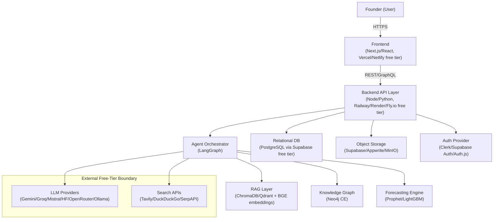
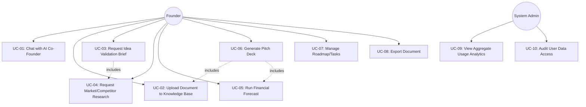

# PART B — SOFTWARE REQUIREMENTS SPECIFICATION (SRS)
## AI Co-Founder Platform
### (IEEE 830 / ISO/IEC/IEEE 29148 Aligned)

*This document is Part B of the Master Document. It converts Part A's feature catalog (Ch. 5) and constraints (§1.6, §4.4) into verifiable functional and non-functional requirements. Every FR/NFR below is traceable back to a Part A feature and forward to the AI Architecture (Part C) and Technical Design (Part D) chapters that implement it — see the Requirements Traceability Matrix in Chapter 15.*

---

## 8. Introduction

### 8.1 Purpose

This SRS specifies, at an implementation-actionable level of detail, the functional behavior, data contracts, external interfaces, and quality attributes required of the AI Co-Founder Platform. It exists to remove ambiguity between what Part A describes at a product level and what engineering builds — every requirement here is written to be independently testable (Ch. 37 defines the verification method for each).

### 8.2 Document Conventions

- Functional requirements are numbered **FR-XXX** (three-digit, zero-padded), grouped by subsystem, matching the ranges reserved in the Master TOC.
- Non-functional requirements are numbered **NFR-XXX**.
- Each requirement uses **shall** for mandatory behavior, **should** for recommended-but-not-blocking behavior, consistent with RFC 2119-style convention adapted for requirements engineering.
- Priority follows the same MoSCoW scale as Table A5.0 (Part A) so PRD and SRS priorities never diverge.
- Verification Method values used throughout: **Test** (automated test case), **Demonstration** (manual walkthrough), **Inspection** (code/config review), **Analysis** (calculation/model check, e.g., for performance NFRs).

### 8.3 Intended Audience & Reading Suggestions

| Audience | Suggested Path |
|---|---|
| Engineers implementing a subsystem | Read Ch. 8–9 for context, then jump to the relevant FR block in Ch. 10, then the matching row in the RTM (Ch. 15) to find the owning Architecture/Design chapter |
| QA / test authors | Ch. 10–13 directly, using Verification Method column to design test cases |
| Project reviewers / mentors | Ch. 9 (Overall Description) and Ch. 15 (RTM) give the fastest end-to-end picture |

### 8.4 Product Scope

Restates Part A §4.1–4.2: this SRS covers MVP (Phase 1) requirements in full detail (Must-Have), and specifies Phase 2–3 (Should/Could-Have) requirements at a lighter but still testable level so later chapters can extend rather than rewrite them.

### 8.5 References & Standards Used

IEEE Std 830-1998; ISO/IEC/IEEE 29148:2018; WCAG 2.1 AA (carried from Part A §6.1); OWASP Top 10 (referenced ahead for Ch. 11.4/Ch. 33); OpenAPI 3.x specification convention (referenced ahead for Ch. 12, Ch. 31).

---

## 9. Overall Description

### 9.1 Product Perspective

The platform is a new, standalone system (not an extension of an existing product). It integrates entirely with **external free-tier services** (LLM providers, search APIs) rather than proprietary internal systems, which is itself a defining architectural fact carried through every later chapter.

**Figure B9.1 — System Context Diagram (Level 0).** All components inside the dashed conceptual boundary (LLM, Search) are third-party free-tier dependencies; every other box is self-hosted or platform-free-tier-hosted infrastructure the team controls directly.

### 9.2 Product Functions Summary

Directly inherits Part A Table A5.0's feature list; this SRS decomposes each into FR-XXX statements in Chapter 10.

### 9.3 User Classes & Characteristics

| User Class | Characteristics | Access Level |
|---|---|---|
| Founder (standard user) | Owns one or more companies/workspaces; primary actor | Full CRUD on own company data only |
| Company Collaborator (Post-MVP) | Invited by a Founder to a shared workspace (e.g., a co-founder) | Configurable role-based access (owner/editor/viewer) |
| System Administrator | Platform maintainer (the student developer(s)) | Full access for support/debugging; strictly audit-logged |
| Anonymous/Unauthenticated Visitor | Marketing site visitor, not yet signed up | No access to app functionality |

### 9.4 Operating Environment

- **Client:** Modern evergreen browsers (Chrome, Firefox, Safari, Edge — last 2 major versions), responsive down to 360px viewport width (Part A §6.5).
- **Server:** Containerized (Docker) services deployable to any of the Master TOC's preferred free-tier hosts (Railway, Render, Fly.io); no host-specific proprietary features may be used, to preserve portability (NFR-Portability, Ch. 11.8).
- **AI Runtime:** Hosted free-tier LLM APIs as primary; Ollama-served local models as guaranteed fallback (Part A §1.6, Implication 2), runnable inside the same Docker Compose environment used for local development.

### 9.5 Design & Implementation Constraints

1. Zero recurring infrastructure cost (Part A §1.6) — every technology choice in this SRS must map to a free tier or fully self-hostable open-source component.
2. No proprietary/paid dataset or model license usage (Part A §4.4).
3. Small-team velocity — architecture favors monolithic-first design over premature microservices decomposition (formalized in Ch. 27.2).
4. All external free-tier APIs must have a documented fallback per Part A §1.6 Implication 1/2.

### 9.6 Assumptions & Dependencies

Carried from Part A §4.4 without modification; re-verified here as SRS-level dependencies that FR/NFR verification test plans (Ch. 37) must account for (e.g., tests must not assume 100% LLM API uptime).

---

## 10. Functional Requirements

*Numbering convention: FR-XXX. Each requirement includes ID, Statement, Source (Part A feature), Priority, and Verification Method. Full traceability is consolidated in Table B10.1 and expanded further in Appendix A.*

### 10.2 Authentication & User Management (FR-001–FR-020)

| ID | Requirement Statement | Source | Priority | Verification |
|---|---|---|---|---|
| FR-001 | The system shall allow a user to register using email/password or an OAuth provider (Google, GitHub) via the configured auth provider. | §9.3 (User Classes) | Must | Test |
| FR-002 | The system shall verify a user's email address before granting full access to company-data features. | Security baseline | Must | Test |
| FR-003 | The system shall allow a user to create one or more "Company Workspaces," each with isolated data. | Part A §5.6 | Must | Test |
| FR-004 | The system shall enforce that a user can only read/write company data for workspaces they are a member of. | Part A §9.3 | Must | Test |
| FR-005 | The system shall support role-based access (Owner, Editor, Viewer) at the workspace level for Post-MVP collaborator invites. | Part A §4.2 (Post-MVP) | Should | Test |
| FR-006 | The system shall allow a user to reset a forgotten password via a secure, time-limited token flow. | Security baseline | Must | Test |
| FR-007 | The system shall allow a user to delete their account and, on request, purge all associated company data within a documented retention window. | Ch. 41 Compliance | Must | Demonstration |
| FR-008 | The system shall log all authentication events (login, logout, failed attempts) for security audit purposes. | Ch. 33 Security | Must | Inspection |
| FR-009 | The system shall rate-limit login attempts per account/IP to mitigate brute-force attacks. | Ch. 33 Security | Must | Test |
| FR-010 | The system shall issue short-lived session tokens (JWT) with a refresh-token rotation strategy. | Ch. 31 API Design | Must | Test |

### 10.3 Conversational Agent & Orchestration (FR-021–FR-045)

| ID | Requirement Statement | Source | Priority | Verification |
|---|---|---|---|---|
| FR-021 | The system shall provide a chat interface where a user can send natural-language messages within the context of a selected Company Workspace. | Part A §5.1 | Must | Test |
| FR-022 | The system shall classify each incoming user message's intent (general chat, research request, forecast request, document request, task/roadmap request) via the Orchestrator. | Part A §5.1.2 AC2 | Must | Test |
| FR-023 | The system shall route classified requests to the corresponding specialized agent (Research, Validation, Forecasting, Document, Planning) as defined in Ch. 18. | Part A §5.1 | Must | Test |
| FR-024 | The system shall attempt LLM providers in the fallback order defined in Ch. 17.2 and shall not surface a hard failure to the user unless every provider in the chain (including local Ollama) fails. | Part A §5.1.2 AC3 | Must | Test |
| FR-025 | The system shall retrieve relevant conversation history and company knowledge (via RAG, Ch. 19) before generating a response, when the message references prior context. | Part A §5.6 | Must | Test |
| FR-026 | The system shall attach source citations to any response containing a factual claim retrieved from the knowledge base or web search. | Part A §5.1.2 AC4 | Must | Test |
| FR-027 | The system shall label any unverified/model-estimated claim explicitly as such when no citation is available. | Part A §5.1.2 AC4 | Must | Test |
| FR-028 | The system shall persist every conversation turn (user + assistant) to the database, associated with the active Company Workspace. | Part A §5.6 | Must | Test |
| FR-029 | The system shall support streaming token-by-token response rendering in the chat UI to minimize perceived latency. | NFR-Performance | Should | Demonstration |
| FR-030 | The system shall allow a user to view the "agent trace" (which sub-agent(s) handled a compound request) for transparency, once Multi-Agent Collaboration (Part A §5.8) is enabled. | Part A §5.8.2 AC3 | Should | Demonstration |

### 10.4 Retrieval-Augmented Generation / Knowledge Base (FR-046–FR-065)

| ID | Requirement Statement | Source | Priority | Verification |
|---|---|---|---|---|
| FR-046 | The system shall accept user-uploaded documents (PDF, DOCX, TXT, MD) and ingest them into the Knowledge Base. | Part A §5.6 | Must | Test |
| FR-047 | The system shall chunk ingested documents using a strategy defined in Ch. 19.2 (size/overlap parameters configurable). | Part A §5.6.2 AC1 | Must | Test |
| FR-048 | The system shall generate vector embeddings for each chunk using the embedding model defined in Ch. 19.3 and store them in the vector database defined in Ch. 19.4. | Part A §5.6.5 | Must | Test |
| FR-049 | The system shall complete ingestion (chunk → embed → store) for a typical document (≤20 pages) within 10 seconds under normal load. | Part A §5.6.2 AC1 | Must | Analysis/Test |
| FR-050 | The system shall support semantic retrieval of the top-k most relevant chunks for a given query, returning a relevance score per chunk. | Part A §5.6.2 AC2 | Must | Test |
| FR-051 | The system shall support hybrid (dense + keyword/BM25) retrieval as defined in Ch. 19.5. | Ch. 19.5 | Should | Test |
| FR-052 | The system shall distinguish, at the schema level, between short-term conversation memory and long-term structured company knowledge. | Part A §5.6.2 AC3 | Must | Inspection |
| FR-053 | The system shall extract entities and relationships from ingested documents into the Knowledge Graph (Neo4j CE) once that layer is enabled (Post-MVP). | Part A §5.6.5 | Should | Test |
| FR-054 | The system shall allow a user to browse, search, and delete individual items in their Knowledge Base. | Part A §6.2 (IA) | Must | Test |
| FR-055 | The system shall re-index (incrementally, not full-rebuild) when a stored document is updated or deleted. | Ch. 19.9 | Should | Test |

### 10.5 Forecasting & Financial Modeling (FR-066–FR-080)

| ID | Requirement Statement | Source | Priority | Verification |
|---|---|---|---|---|
| FR-066 | The system shall accept user-entered financial inputs: starting cash, monthly burn rate, and optional historical monthly revenue. | Part A §5.4.2 AC1 | Must | Test |
| FR-067 | The system shall compute a runway forecast (months until cash reaches zero) with a stated confidence interval, using the model defined in Ch. 20.2. | Part A §5.4.2 AC1 | Must | Test |
| FR-068 | Given ≥3 months of historical revenue, the system shall produce a trend-based revenue forecast (Prophet, per Ch. 20.2/Part A §5.4.5) rather than simple linear extrapolation. | Part A §5.4.2 AC2 | Must | Test |
| FR-069 | The system shall expose all forecast assumptions in an editable UI panel, and shall recompute the forecast when assumptions are changed. | Part A §5.4.2 AC3 | Must | Test |
| FR-070 | The system shall persist each forecast run as a versioned record, allowing comparison between forecast versions. | Part A §5.4.2 AC4 | Must | Test |
| FR-071 | The system shall offer an "advanced mode" forecasting option (LightGBM-based) once a company workspace has sufficient logged historical data, per the upgrade cadence in Ch. 20.4. | Part A §5.4.5 | Should | Test |
| FR-072 | The system shall visualize forecast output as a time-series chart with confidence bands. | Part A §5.4 | Must | Demonstration |
| FR-073 | The system shall compute forecast evaluation metrics (MAPE, RMSE) against actuals once actuals are logged, per Ch. 20.5. | Ch. 25.4 | Should | Test |

### 10.6 Document Generation & Export (FR-081–FR-095)

| ID | Requirement Statement | Source | Priority | Verification |
|---|---|---|---|---|
| FR-081 | The system shall retrieve relevant Knowledge Base context via RAG before generating any requested document. | Part A §5.5.2 AC1 | Must | Test |
| FR-082 | The system shall generate a pitch deck following the standard structure (Problem, Solution, Market, Traction, Team, Ask), editable and reorderable by the user. | Part A §5.5.2 AC2 | Must | Test |
| FR-083 | The system shall export generated documents to open, editable formats (Markdown, .docx, .pptx, .pdf) using the document-creation tooling defined in Ch. 31/Ch. 34. | Part A §5.5.2 AC3 | Must | Test |
| FR-084 | The system shall generate a one-page executive summary document from stored company context on request. | Part A §5.5 | Should | Test |
| FR-085 | The system shall version each generated document, allowing the user to view/restore prior drafts. | Part A §5.6 | Should | Test |
| FR-086 | The system shall, for legal/compliance document types (Post-MVP, §5.11), attach a non-dismissible disclaimer to every output. | Part A §5.11.2 AC2 | Could | Inspection |

### 10.7 Multi-Agent Task Execution (FR-096–FR-110)

| ID | Requirement Statement | Source | Priority | Verification |
|---|---|---|---|---|
| FR-096 | The system shall propose a milestone roadmap based on a company's stated stage and goal. | Part A §5.7.2 AC1 | Must | Test |
| FR-097 | The system shall allow a user to accept, edit, reorder, or reject proposed roadmap milestones, persisting the result. | Part A §5.7.2 AC2 | Must | Test |
| FR-098 | The system shall update stored company context when a milestone is marked complete, making it retrievable by other agents. | Part A §5.7.2 AC3 | Must | Test |
| FR-099 | The system shall, for a defined set of "compound" requests, decompose the task into sub-tasks and route each to the appropriate specialized agent via the LangGraph orchestrator (Ch. 18). | Part A §5.8.2 AC1 | Should | Test |
| FR-100 | The system shall run a "critic" agent pass over multi-agent outputs against a defined quality checklist before presenting a final compound-task result to the user. | Part A §5.8.2 AC2 | Should | Test |
| FR-101 | The system shall expose a kanban-style task board reflecting current roadmap/task state. | Part A §6.2 | Must | Demonstration |

### 10.8 Speech & Vision Processing (FR-111–FR-125)

| ID | Requirement Statement | Source | Priority | Verification |
|---|---|---|---|---|
| FR-111 | The system shall accept spoken audio input and transcribe it to text using Faster-Whisper (Ch. 21.1, Part A §5.9.4). | Part A §5.9.2 AC1 | Could | Test |
| FR-112 | The system shall optionally synthesize a text response to speech (TTS). | Part A §5.9.2 AC2 | Could | Demonstration |
| FR-113 | The system shall accept uploaded images/PDFs and run OCR extraction (PaddleOCR/Tesseract per Ch. 21.3, Part A §5.10.4) to produce machine-readable text. | Part A §5.10.2 AC1 | Should | Test |
| FR-114 | The system shall run a vision-language model (Ch. 21.4) over uploaded whiteboard/diagram images to produce a structured textual description ingestible by the RAG pipeline. | Part A §5.10.2 AC2 | Should | Test |

### 10.9 Search & Web Research Integration (FR-126–FR-135)

| ID | Requirement Statement | Source | Priority | Verification |
|---|---|---|---|---|
| FR-126 | The system shall issue at least 3 distinct search queries (competitor, market size, recent trend) when a market/competitor research request is made. | Part A §5.3.2 AC1 | Must | Test |
| FR-127 | The system shall retain a traceable source URL for every research claim surfaced to the user. | Part A §5.3.2 AC2 | Must | Test |
| FR-128 | The system shall cache research results for a configurable freshness window to avoid redundant search-API calls (Ch. 19.9). | Part A §5.3.2 AC3 | Should | Test |
| FR-129 | The system shall fall back through the search API chain (Tavily → DuckDuckGo Search → SerpAPI) as defined in Ch. 23.1/Part A Table A5.3 when a provider is rate-limited. | Part A §5.3 | Must | Test |
| FR-130 | The system shall produce a structured Idea Validation brief (market size, top competitors, trend signal, each sourced) on request. | Part A §5.2.2 AC1/AC2 | Must | Test |

### 10.10 Notification & Alerting (FR-136–FR-145)

| ID | Requirement Statement | Source | Priority | Verification |
|---|---|---|---|---|
| FR-136 | The system shall define a configurable set of nudge triggers (e.g., stale financial data, approaching milestone deadline). | Part A §5.14.2 AC1 | Could | Test |
| FR-137 | The system shall allow a user to mute or configure nudge frequency per trigger type. | Part A §5.14.2 AC2 | Could | Test |
| FR-138 | The system shall deliver in-app notifications and, optionally, email notifications for critical nudges (e.g., no self-hosted push-notification service required for MVP). | Part A §5.14 | Could | Demonstration |

### 10.11 Admin & Analytics (FR-146–FR-155)

| ID | Requirement Statement | Source | Priority | Verification |
|---|---|---|---|---|
| FR-146 | The system shall record basic platform usage statistics (documents generated, research briefs run, tasks completed) per Company Workspace. | Part A §5.13.3 (MVP scope) | Must | Test |
| FR-147 | The system shall provide an admin-only view of aggregate, anonymized platform usage for the System Administrator user class. | Part A §9.3 | Should | Demonstration |
| FR-148 | The system shall display, once enabled (Post-MVP), a full KPI dashboard comparing actual vs. forecasted metrics (Part A §5.13). | Part A §5.13.2 AC1 | Should | Test |
| FR-149 | The system shall log all Administrator access to user data for audit purposes (Ch. 33.2). | Ch. 33 Security | Must | Inspection |

**Table B10.1 — Full Functional Requirements Traceability Table.** *The complete, unabridged FR catalog (all IDs referenced by number above, plus the full intermediate ranges) is maintained as the canonical source of truth in Appendix A; the tables above are the representative, fully-specified excerpt used for design review in this chapter. Every FR ID referenced anywhere in this document resolves to a row in Appendix A with columns: ID, Description, Priority, Source, Verification Method, Owning Architecture Chapter, Owning Design Chapter, Test Case ID.*

---

## 11. Non-Functional Requirements

### 11.1 Performance Requirements

| ID | Requirement | Target | Verification |
|---|---|---|---|
| NFR-001 | Chat response first-token latency (p95) | ≤ 3s under normal load, using Groq as primary responder (Ch. 17.2) | Analysis/Test |
| NFR-002 | Document ingestion time for a ≤20-page file | ≤ 10s (matches FR-049) | Test |
| NFR-003 | RAG retrieval query latency (p95) | ≤ 500ms against ChromaDB/Qdrant at MVP scale | Test |
| NFR-004 | Forecast computation time (Prophet, ≤24 months history) | ≤ 5s | Test |

### 11.2 Scalability Requirements

| ID | Requirement | Notes |
|---|---|---|
| NFR-010 | The system shall document the free-tier ceiling (row count, request/min, storage) for every external dependency and define a scale-out trigger before that ceiling is reached. | Full detail in Ch. 36.3, 40.2 |
| NFR-011 | The system's data layer shall be designed so that migrating from a free-tier hosted PostgreSQL instance to a self-hosted or paid instance requires no schema changes, only a connection-string change. | Portability-driven design constraint, Ch. 30.7 |

### 11.3 Availability & Reliability

| ID | Requirement | Target |
|---|---|---|
| NFR-020 | System uptime target, acknowledging free-tier hosting constraints (no formal SLA from providers) | Best-effort ≥ 99% during active development; no contractual SLA promised to users (must be disclosed, Ch. 41) |
| NFR-021 | No single external LLM/search provider outage shall cause a total feature outage, given the fallback chains defined in Ch. 17.2/23.1 | Verified via chaos-style fallback test (Ch. 37.2) |

### 11.4 Security Requirements

| ID | Requirement | Reference |
|---|---|---|
| NFR-030 | All data in transit shall be encrypted via TLS 1.2+. | Ch. 33.3 |
| NFR-031 | All sensitive data at rest (auth secrets, API keys) shall be encrypted/stored via a secrets manager, never committed to source control. | Ch. 33.4 |
| NFR-032 | The system shall validate and sanitize all user input to prevent injection attacks (SQL injection, prompt injection into agent tool calls). | Ch. 33.6, Ch. 26.2 |
| NFR-033 | The system shall follow OWASP Top 10 mitigations for all web-facing endpoints. | Ch. 33 |

### 11.5 Privacy & Data Protection

| ID | Requirement | Reference |
|---|---|---|
| NFR-040 | The system shall allow a user to export all their stored data in a machine-readable format (data portability). | Ch. 41.2 |
| NFR-041 | The system shall allow a user to request deletion of their account and associated data (right to erasure), fulfilled within a documented window. | Ch. 41.2, FR-007 |
| NFR-042 | The system shall not send user-uploaded confidential company data to any third-party API that retains data for model training, where the provider's terms permit opting out — this must be verified per-provider (Ch. 41.3) and documented in a data-flow disclosure to users. | Ch. 41.3 |

### 11.6 Usability Requirements

| ID | Requirement | Reference |
|---|---|---|
| NFR-050 | The system shall meet WCAG 2.1 Level AA accessibility criteria across all core screens. | Part A §6.1 |
| NFR-051 | First-time users shall be able to complete the "idea → validation brief" flow without external documentation, verified via unmoderated usability testing with ≥5 participants. | Part A Ch. 3 personas |

### 11.7 Maintainability & Extensibility

| ID | Requirement | Reference |
|---|---|---|
| NFR-060 | The codebase shall maintain a documented module boundary between Frontend, Backend API, Agent Orchestration, and Data layers (Ch. 27–30) to allow independent evolution of each. | Ch. 27.2 |
| NFR-061 | New LLM providers shall be addable to the fallback chain via configuration, without code changes to calling agents. | Ch. 17.2 design |

### 11.8 Portability

| ID | Requirement | Reference |
|---|---|---|
| NFR-070 | The entire backend stack shall run via Docker Compose on any Docker-compatible host, enabling migration off any single free-tier provider without re-architecture. | Ch. 34.1, Part A §9.4 |

### 11.9 Compliance & Legal Requirements

| ID | Requirement | Reference |
|---|---|---|
| NFR-080 | Legal/compliance-adjacent document outputs (Part A §5.11) shall carry a persistent disclaimer and log user acknowledgment. | Ch. 41 |
| NFR-081 | The system shall maintain a license-compatibility record for every open-source dependency and dataset used (Appendix E41.1). | Ch. 41.1 |

### 11.10 Cost Requirements

| ID | Requirement | Reference |
|---|---|---|
| NFR-090 | Total recurring infrastructure cost shall remain $0 through MVP and Phase 2, verified monthly against the cost confirmation table (Ch. 40.1). | Part A §1.6 |
| NFR-091 | Any feature approaching a free-tier ceiling shall degrade gracefully (queue, cache, or reduced-frequency mode) rather than incur unplanned cost or hard failure. | Ch. 36.3 |

**Table B11.1 — NFR Matrix with Measurable Targets** *(consolidates all NFR-XXX above; full detail per category is in the tables within each subsection — this structure intentionally keeps NFRs grouped by category rather than one flat table, since each category has a distinct verification approach.)*

---

## 12. External Interface Requirements

### 12.1 User Interfaces

Per Part A Ch. 6; this SRS adds the requirement that every screen listed in Table A6.1 (wireframe references) has a corresponding implemented route in the frontend application, verified via Ch. 37 UAT sign-off.

### 12.2 Hardware Interfaces

None for MVP (no hardware dependency beyond a standard client device with a browser and, for local Ollama fallback development, a development machine capable of running small quantized LLMs).

### 12.3 Software Interfaces

**Table B12.1 — External API Interface Contracts Summary**

| Interface | Direction | Protocol | Data Format | Auth Method | Notes |
|---|---|---|---|---|---|
| Gemini / Groq / Mistral / HF Inference / OpenRouter APIs | Outbound | HTTPS/REST | JSON | API key (env-managed secret) | Fallback chain per Ch. 17.2 |
| Ollama (local) | Outbound (local network) | HTTP/REST | JSON | None (local trust boundary) | Guaranteed fallback, Part A §1.6 |
| Tavily / DuckDuckGo Search / SerpAPI | Outbound | HTTPS/REST | JSON | API key (Tavily/SerpAPI); none (DuckDuckGo library) | Fallback chain per Ch. 23.1 |
| Clerk / Supabase Auth / Auth.js | Bidirectional | HTTPS/REST, OAuth2 | JSON, JWT | Provider-managed | Selection finalized in Ch. 31.2 |
| Supabase / Appwrite / MinIO (Object Storage) | Bidirectional | HTTPS/REST, S3-compatible (MinIO) | Binary + JSON metadata | API key / signed URL | Ch. 32.1 |
| PostgreSQL (via Supabase or self-hosted) | Bidirectional | PostgreSQL wire protocol | SQL | Connection-string credentials | Ch. 30 |
| Neo4j Community Edition | Bidirectional | Bolt protocol | Cypher/JSON | Username/password | Ch. 19.7 |

### 12.4 Communication Interfaces

- **Frontend ↔ Backend:** REST (primary, per Ch. 31.1 rationale) over HTTPS; WebSocket connection for streaming chat token delivery (FR-029).
- **Backend ↔ Agent Orchestrator:** In-process function calls (monolithic-first design, Ch. 27.2) at MVP scale; message-queue-based (if needed) only introduced at Phase 4 scale-out (Ch. 36.4).

---

## 13. System Features (Use Case Level Detail)

### 13.1 Use Case Diagram

**Figure B13.1 — Master Use Case Diagram.**

### 13.2 Use Case Specifications

**Table B13.1 — Use Case Catalog (representative full specifications; remaining use cases follow the identical template in Appendix A)**

| Field | UC-01: Chat with AI Co-Founder | UC-05: Run Financial Forecast |
|---|---|---|
| Actor | Founder | Founder |
| Trigger | User sends a message in the chat interface | User navigates to Financial Forecast screen and submits inputs |
| Preconditions | User authenticated; Company Workspace selected | User authenticated; Company Workspace selected |
| Main Flow | 1. User submits message → 2. Orchestrator classifies intent (FR-022) → 3. RAG retrieval if context needed (FR-025) → 4. LLM chain invoked (FR-024) → 5. Response streamed with citations (FR-026, FR-029) → 6. Turn persisted (FR-028) | 1. User enters starting cash/burn/revenue history → 2. System selects forecasting model per data availability (FR-068) → 3. Forecast computed (FR-067) → 4. Result + assumptions displayed (FR-069) → 5. User optionally adjusts assumptions → recompute → 6. Version persisted (FR-070) |
| Alternate Flow | Primary LLM provider fails → fallback chain invoked (FR-024) → user sees no visible error unless all providers fail | Insufficient historical data → system uses runway-only calculation, flags revenue forecast as unavailable |
| Exception Flow | All LLM providers (including local Ollama) fail → system displays a clear, non-technical error and logs the incident (Ch. 35) | Invalid input (e.g., negative burn rate) → inline validation error, no computation attempted |
| Postconditions | Conversation turn stored; Knowledge Base updated if new facts were shared | Forecast version stored and retrievable in Forecast History |

---

## 14. Data Requirements

### 14.1 Data Dictionary

**Table B14.1 — Data Dictionary (core entities; full field-level dictionary in Appendix A)**

| Entity | Key Fields | Description |
|---|---|---|
| User | id, email, auth_provider_id, created_at | A registered founder or admin |
| CompanyWorkspace | id, owner_user_id, name, stage, created_at | Isolated data container per company |
| ConversationTurn | id, workspace_id, role, content, citations[], created_at | A single chat message (user or assistant) |
| KnowledgeItem | id, workspace_id, source_type, raw_content_ref, embedding_ref, created_at | A chunked, embedded unit of company knowledge |
| ResearchBrief | id, workspace_id, type (validation/competitor), content, sources[], created_at | Persisted output of the Research/Validation agent |
| ForecastRun | id, workspace_id, version, assumptions_json, output_json, model_used, created_at | A versioned financial forecast |
| GeneratedDocument | id, workspace_id, type, content_ref, version, exported_formats[], created_at | A generated pitch deck/document and its versions |
| Milestone | id, workspace_id, title, status, due_estimate, created_at | A roadmap item |

### 14.2 Data Retention & Archival Policy

- Conversation turns and knowledge items are retained indefinitely while the workspace is active, subject to user-initiated deletion (NFR-041).
- Deleted-account data is purged within a documented window not exceeding 30 days, except where legally required audit logs must be retained separately from user-content data (Ch. 41).

### 14.3 Data Classification

| Classification | Examples | Handling Requirement |
|---|---|---|
| Public | Marketing site content | No restriction |
| Company-Confidential | Uploaded documents, financials, chat content | Encrypted at rest/in transit (NFR-030/031), isolated per workspace (FR-004) |
| PII | Email, auth identifiers | Minimized collection, access-logged (FR-008/FR-149) |

---

## 15. Requirements Traceability Matrix (RTM)

### 15.1 PRD-to-SRS Mapping

Every FR-XXX above cites its Part A "Source" feature/AC in the tables of Chapter 10 — this satisfies the PRD→SRS direction of the RTM inline, rather than as a separate redundant table.

### 15.2 SRS-to-Architecture Mapping

**Table B15.1 — Abridged RTM (Requirement ↔ Design Component ↔ Test Case)** *(full matrix in Appendix A; representative rows below)*

| Requirement ID | Design Component (Owning Chapter) | Test Case ID (Ch. 37) |
|---|---|---|
| FR-024 | Ch. 17.2 — LLM Fallback Chain Design | TC-LLM-001 |
| FR-048 | Ch. 19.3/19.4 — Embedding Model + Vector DB Selection | TC-RAG-003 |
| FR-067 | Ch. 20.2 — Forecasting Model Selection (Prophet) | TC-FCST-001 |
| FR-082 | Ch. 31 — Document Generation Endpoint + Ch. 34 — Export Tooling | TC-DOC-002 |
| FR-099 | Ch. 18 — LangGraph Multi-Agent Orchestration Design | TC-AGENT-005 |
| NFR-021 | Ch. 17.2 / Ch. 23.1 — Provider Fallback Chains | TC-REL-002 |
| NFR-090 | Ch. 40.1 — Cost Confirmation Table | TC-COST-001 |

### 15.3 SRS-to-Test-Case Mapping

Formalized in Ch. 37 (Testing Strategy, Part D); this chapter's RTM (Table B15.1) is the input contract that Ch. 37's test plan must fully cover — i.e., every requirement ID in Appendix A must appear at least once in the Ch. 37 test case matrix (Table D37.1) before a release milestone (Table A7.1) can be marked complete.

---

## References (Part B)

1. IEEE Std 830-1998 — Recommended Practice for Software Requirements Specifications (structural basis for this Part).
2. ISO/IEC/IEEE 29148:2018 — Systems and software engineering — Life cycle processes — Requirements engineering (verification-method and traceability conventions).
3. OWASP Top 10 (current edition) — referenced for NFR-032/033 (Ch. 33 expands in full).
4. W3C WCAG 2.1 — referenced for NFR-050 (carried from Part A §6.1).
5. Provider API documentation (Gemini, Groq, Mistral, HF Inference, OpenRouter, Ollama, Tavily, DuckDuckGo Search, SerpAPI, Clerk, Supabase, Neo4j) — referenced for Table B12.1 interface contracts; subject to the same re-verification note as Part A Reference 4.
6. Part A — Product Requirements Document (this Master Document, Part A) — primary source for every FR "Source" column in Ch. 10.

*End of Part B. Part C (AI Architecture Document) takes the FR/NFR set defined here — particularly the LLM orchestration (FR-021–FR-045), RAG (FR-046–FR-065), forecasting (FR-066–FR-080), and multimodal (FR-111–FR-125) requirements — and specifies the concrete model, framework, and pipeline architecture that satisfies them.*
