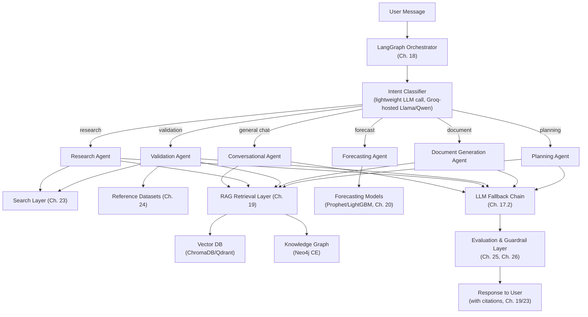
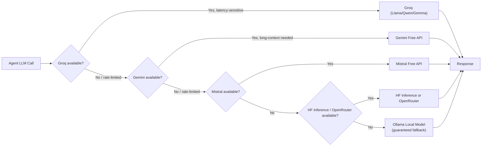
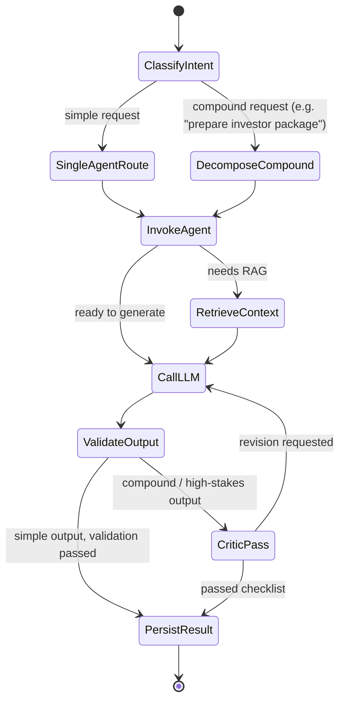
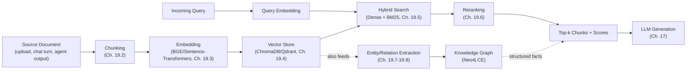
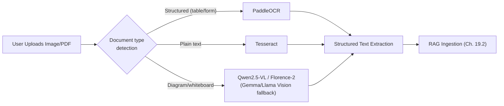

# PART C — AI ARCHITECTURE DOCUMENT
## AI Co-Founder Platform

*This document is Part C of the Master Document. It specifies the concrete AI architecture — model selection, orchestration, retrieval, forecasting, multimodal processing, and evaluation — that satisfies the functional requirements defined in Part B (FR-021–FR-045 orchestration, FR-046–FR-065 RAG, FR-066–FR-080 forecasting, FR-111–FR-125 multimodal, FR-126–FR-135 search). Every design decision here is filtered through the same zero-budget constraint established in Part A §1.6 and is written so that Part D (Technical Design) can implement it directly, without re-deriving model or framework choices.*

---

## 16. AI System Overview

### 16.1 AI Capability Map

| Capability Domain | Owning Chapter | Primary FR Coverage |
|---|---|---|
| LLM reasoning & conversation | Ch. 17 | FR-021–FR-030 |
| Multi-agent orchestration | Ch. 18 | FR-022–FR-024, FR-099–FR-101 |
| Retrieval-augmented memory | Ch. 19 | FR-046–FR-065 |
| Forecasting & predictive analytics | Ch. 20 | FR-066–FR-073 |
| Multimodal (speech, OCR, vision) | Ch. 21 | FR-111–FR-114 |
| Graph AI / relationship intelligence | Ch. 22 | Post-MVP extension of FR-053 |
| Search & external grounding | Ch. 23 | FR-126–FR-130 |
| Datasets | Ch. 24 | Supports Ch. 19, 20, 24-consuming FRs |
| Evaluation & QA | Ch. 25 | Verification method backing for all AI-related FRs |
| Responsible AI & governance | Ch. 26 | NFR-032, NFR-042, Ch. 41 compliance |

### 16.2 Model Selection Philosophy

Three governing principles, applied consistently in every chapter below:

1. **Free-tier-first, capability-second.** A model/API is only considered if it has a genuinely free tier or is self-hostable at zero marginal cost. Capability comparisons happen *within* that filtered set, never used to justify breaking the zero-budget constraint (Part A §1.6).
2. **Fallback chains over single points of failure.** Every AI capability that depends on an external API must have at least one, ideally two, fallback options — culminating in a locally-hosted open-weight model via Ollama as the guaranteed last resort.
3. **Right-sized model for the task, not the biggest available model.** Where a smaller/faster open model (e.g., a distilled Llama or Qwen variant via Groq) meets the accuracy bar for a task (e.g., intent classification), it is preferred over a larger, slower, or quota-constrained model — this both improves latency (NFR-001) and reduces pressure on limited free-tier quotas.

### 16.3 Overall AI Architecture Diagram

**Figure C16.1 — Master AI Architecture Diagram.** Every agent shares the same RAG layer and LLM fallback chain — this is a deliberate design choice (single shared infrastructure, many thin agent personas) rather than each agent maintaining its own model/retrieval stack, which would multiply free-tier quota consumption unnecessarily.

---

## 17. LLM Strategy & Orchestration

### 17.1 LLM Provider Comparison & Routing Strategy

**Table C17.1 — LLM Provider Comparison** *(expands Part A Table A5.1 with implementation-level detail)*

| Feature/API | Free Tier Limits | Latency | Quality | Context Length | Reasoning Ability | Cost | Recommendation | Justification |
|---|---|---|---|---|---|---|---|---|
| Google Gemini (Flash-tier, Free API) | Generous daily request quota at no cost | Low | High for general reasoning and summarization | Very long (models supporting 1M-token-class context available) | Strong | $0 within quota | **Primary for long-context / synthesis tasks** (document generation, research synthesis) | Only provider in the free set offering both strong reasoning and very long context simultaneously — critical for RAG-heavy tasks (Ch. 19) that stuff many retrieved chunks into a prompt |
| Groq API (hosts Llama 3.x, Qwen, Gemma at high inference speed) | High requests/minute, generous free quota | Very low (fastest available, LPU-based inference) | Good–High depending on hosted model size | Model-dependent (typically 8K–128K depending on hosted model) | Good | $0 within quota | **Primary for latency-sensitive, high-frequency tasks** (intent classification, streaming chat) | Speed advantage makes it the right default for the conversational core's "feel," and for cheap high-frequency calls like intent classification where large context isn't needed |
| Mistral AI API (free tier) | Moderate free quota | Low | Good | Moderate (32K class) | Good | $0 within quota | Secondary fallback | Reliable, EU-hosted, good general quality; used when Gemini/Groq are rate-limited |
| Hugging Face Inference API | Free tier, rate-limited, model-availability variable | Variable (cold-start latency possible on less-popular models) | Variable by hosted model | Model-dependent | Variable | $0 within quota | Fallback, and primary route for specialized open models (e.g., a fine-tuned classifier) | Best suited to specific open-weight models not available on Groq/OpenRouter, rather than as a general chat driver |
| OpenRouter (aggregates free-listed open models) | Aggregated free-tier quotas across many hosted open models | Variable | Variable | Variable | Variable | $0 for free-listed models | Fallback aggregator (single integration point) | Reduces integration overhead — one API surface covers many fallback models, useful when a specific named provider is down |
| Ollama (self-hosted, e.g., Llama 3.x 8B, Qwen 3, Phi, Gemma quantized) | Unlimited (bounded by local/server compute) | Depends on host hardware (higher on CPU-only, acceptable on modest GPU) | Lower than frontier hosted models, but adequate for guaranteed-fallback quality bar | Model-dependent | Lower | $0, compute-bound only | **Guaranteed last-resort fallback for every LLM-dependent feature** | The only option in the chain with zero dependency on any external network/service — required to satisfy NFR-021 (no single provider outage may cause total feature outage) |

### 17.2 Primary/Fallback Model Chain

**Figure C17.1 — LLM Routing & Fallback Flowchart.** The router selects an *entry point* based on task type (latency-sensitive → Groq first; long-context/synthesis → Gemini first), then falls through the remaining chain on failure/rate-limit regardless of entry point, always terminating at Ollama.

**Implementation recommendation:** Implement this as a thin **LLM Gateway** abstraction (a single internal interface, e.g., `generate(prompt, task_type) -> response`) so that calling agents never talk to a provider SDK directly. This satisfies NFR-061 (new providers addable via config, not code changes) and keeps Part D's backend implementation decoupled from any single vendor SDK.

### 17.3 Prompt Engineering Standards & Templates

- All agent prompts are stored as versioned template files (not inline strings in application code), consistent with the Prompt Template Library in Appendix F.
- Templates use explicit role/instruction/context/output-format sections, and every prompt that must produce structured output (e.g., a validation brief) specifies a strict JSON schema in the instruction, validated on parse (falling back to a repair-prompt retry once before surfacing an error).
- System prompts explicitly instruct the model to cite retrieved source IDs inline (feeding FR-026/FR-127) and to say "I don't have enough information" rather than fabricate, directly supporting the Responsible AI guardrails in Ch. 26.

### 17.4 Prompt Versioning & Registry

Each prompt template carries a semantic version (e.g., `research_agent_v2`) and is logged alongside every generation call (Ch. 35 observability) so that a quality regression can be traced to a specific prompt version change — this is the mechanism that makes Ch. 25's continuous evaluation pipeline meaningful over time rather than a one-off eval.

### 17.5 Context Window Management Strategy

| Technique | When Used | Trade-off |
|---|---|---|
| Recency-window truncation | Default for conversation history | Simple, cheap; risks losing older-but-relevant context |
| RAG-based retrieval injection (vs. full history dump) | Default for company-knowledge context (Ch. 19) | Scales to arbitrarily large company memory without hitting context limits; adds retrieval latency (~hundreds of ms) |
| Summarization compaction (periodic LLM-generated running summary) | Long-running conversations exceeding a token threshold | Reduces token usage; introduces small risk of summary-induced information loss, mitigated by always keeping raw turns in the Knowledge Base (FR-028) even after summarization |

**Recommendation:** Default to RAG-based retrieval over raw history dumping for anything beyond the last N turns — this is both the more token-efficient approach on free-tier quotas and the approach that scales as company memory grows over months of use (directly serving the Part A vision of "gets more useful over time").

### 17.6 Rate-Limit & Quota Management Across Free Tiers

- A per-provider **token-bucket quota tracker** is maintained server-side (Ch. 29.6), decrementing against known daily/per-minute free-tier limits (Table C17.1), so the router can proactively skip a provider *before* hitting a hard 429 rather than reactively handling failures only.
- Quota state is persisted (not purely in-memory) so quota tracking survives a server restart — a practical necessity on free-tier hosts that may cycle/restart containers periodically.

### 17.7 Cost/Token Budget Governor Design

Even at $0 recurring cost, **token throughput** is a finite resource that must be governed to avoid quota exhaustion mid-day. A lightweight governor:

1. Classifies each request by task type and estimated token cost before dispatch.
2. Applies a per-workspace daily soft cap (configurable) to prevent a single heavy user from exhausting shared free-tier quota for all users — an important consideration once the platform has more than a handful of concurrent users on shared API keys.
3. Logs governor decisions to the observability stack (Ch. 35) so quota-exhaustion incidents are diagnosable rather than silent.

---

## 18. Agentic Framework Design

### 18.1 Agent Framework Selection Rationale

**Table C18.1 — Agent Framework Comparison Table**

| Framework | Strengths | Weaknesses | Fit for This Project |
|---|---|---|---|
| **LangGraph** | Explicit, inspectable state-machine graph; fine-grained control over agent hand-offs, retries, and conditional routing; integrates directly with LangChain's tool-calling ecosystem | Steeper initial setup than higher-level frameworks; more boilerplate for simple single-agent cases | **Recommended primary orchestrator** — the platform's core value proposition (persistent, reliable multi-step workflows) needs the predictability and debuggability LangGraph's explicit graph model provides, more than it needs prototyping speed |
| CrewAI | Fast to prototype role-based "crews"; intuitive for simple sequential/hierarchical agent teams | Less fine-grained control over intermediate state; harder to implement complex conditional branching (e.g., the fallback logic in Fig. C17.1) | Considered for Phase 2 rapid prototyping of new agent roles before hardening them into the LangGraph graph |
| AutoGen | Strong for open-ended multi-agent conversation/debate patterns (e.g., a "critic" agent arguing with a "writer" agent) | Heavier runtime overhead; conversational-debate pattern is less deterministic, harder to test reliably | Used narrowly for the Ch. 5.8 "critic" pass pattern where debate-style refinement genuinely adds value, wrapped as a callable node inside the broader LangGraph graph |
| DSPy | Systematic prompt/pipeline optimization (compiles prompts against a metric) | Not an orchestration framework by itself; requires pairing with LangGraph/CrewAI for actual agent execution | Used to optimize individual high-value prompts (e.g., the intent classifier, the validation-brief generator) against a labeled eval set (Ch. 25), not as the orchestration layer itself |

**Recommendation:** LangGraph is the single orchestration backbone for the entire platform. CrewAI is a prototyping tool used during development, not deployed to production. AutoGen's conversational pattern is embedded as one node type within the LangGraph graph (not a parallel orchestration system) to avoid the operational complexity of running two orchestration frameworks side by side. DSPy is applied selectively to optimize specific prompts, orthogonal to which orchestration framework routes them.

### 18.2 Agent Roles & Responsibilities

| Agent | Responsibility | Primary Tools |
|---|---|---|
| **Orchestrator/Supervisor** | Classifies intent, routes to sub-agents, aggregates multi-agent results | Intent classifier LLM call, LangGraph routing logic |
| **Research Agent** | Executes market/competitor research (Part A §5.3) | Search Layer (Ch. 23), LLM summarization |
| **Validation Agent** | Produces idea validation briefs (Part A §5.2) | Research Agent (as a sub-tool), Reference Datasets (Ch. 24) |
| **Forecasting Agent** | Wraps the forecasting models (Ch. 20) with natural-language input/output | Prophet/LightGBM inference, RAG for prior forecast context |
| **Document Agent** | Generates pitch decks/documents (Part A §5.5) grounded in RAG | RAG retrieval, LLM generation, export tooling (Ch. 31/34) |
| **Planning Agent** | Manages roadmap/milestones (Part A §5.7) | Database read/write, LLM for milestone proposal |
| **Critic Agent** (Phase 2) | Reviews multi-agent compound outputs against a quality checklist before final presentation (FR-100) | LLM-as-judge pattern (Ch. 25.1), AutoGen debate node |

### 18.3 Agent Communication Protocol

Agents communicate via a shared, strongly-typed **state object** passed through the LangGraph graph (not free-text message passing between agents), containing: original user request, classified intent, retrieved context references, intermediate agent outputs, and a running trace log. This design choice directly enables FR-030 (user-visible agent trace) since the trace is a first-class part of the state object rather than something reconstructed after the fact from logs.

### 18.4 Orchestrator / Supervisor Agent Design

**Figure C18.1 — Agent State Machine (LangGraph Graph).** This graph is the literal implementation target for Ch. 18's LangGraph nodes/edges in Part D — each state above corresponds to a LangGraph node, and each transition to a conditional edge.

### 18.5 State Management & Memory Passing Between Agents

The LangGraph state object is checkpointed after each node execution (LangGraph's built-in checkpointing, backed by the platform's PostgreSQL instance rather than an additional in-memory store) — this means a long-running compound task (e.g., a full investor-package generation spanning multiple agents) can be resumed if interrupted by a transient failure, rather than restarting from scratch, which matters on free-tier hosts where request timeouts or container restarts are more likely than on funded infrastructure.

### 18.6 Tool-Calling & Function Schema Design

All agent tools (search, RAG retrieval, forecasting inference, database read/write) are exposed as strictly-typed function schemas (JSON Schema, consistent with the OpenAI/Anthropic/Gemini function-calling convention supported across the LLM fallback chain) so that any provider in Ch. 17.2's chain can invoke them identically — this uniformity is what allows the fallback chain to swap providers transparently mid-conversation without the calling agent code branching per provider. Full schemas are catalogued in Appendix G.

### 18.7 Error Handling, Retries & Human-in-the-Loop Checkpoints

- **Retry policy:** Transient tool/API failures retry once with exponential backoff before triggering the provider fallback (Ch. 17.2) or tool-level fallback (e.g., search provider fallback, Ch. 23.1).
- **Human-in-the-loop checkpoint:** For any agent-proposed action with material consequence (e.g., finalizing/exporting a document, deleting Knowledge Base content), the graph inserts an explicit user-confirmation node before the `PersistResult` state — the platform never auto-executes irreversible actions without the founder's confirmation, which is both a UX-trust requirement (Part A §6.1) and a safety design principle (Ch. 26).

---

## 19. Retrieval-Augmented Generation (RAG) Architecture

### 19.1 RAG Pipeline Overview

**Figure C19.1 — RAG Pipeline Data-Flow Diagram.**

### 19.2 Document Ingestion & Chunking Strategy

| Parameter | Recommendation | Rationale |
|---|---|---|
| Chunk size | ~300–500 tokens | Balances retrieval precision (smaller chunks = more precise matches) against context coherence (too small fragments lose meaning) |
| Chunk overlap | ~15–20% of chunk size | Prevents meaning-critical sentences from being split exactly at a chunk boundary with no surrounding context |
| Chunking method | Recursive character/semantic-aware splitting (e.g., LangChain's `RecursiveCharacterTextSplitter` or LlamaIndex's semantic splitter) respecting paragraph/section boundaries where possible | Naively fixed-length splitting ignores document structure and degrades retrieval quality on structured documents like financial statements or legal templates |
| Metadata attached per chunk | source document ID, workspace ID, creation timestamp, section heading (if extractable) | Enables filtered retrieval (e.g., "only search this company's uploaded contracts") and supports the citation requirement (FR-026) |

### 19.3 Embedding Model Selection & Comparison

**Table C19.1 — Embedding Model Comparison Table**

| Model | Free/Self-Hostable | Dimension | Strengths | Weaknesses | Recommendation |
|---|---|---|---|---|---|
| BAAI BGE (base/small variants) | ✓ (open weights, self-hosted via `sentence-transformers` or `FlagEmbedding`) | 384–1024 depending on variant | Strong retrieval benchmark performance (MTEB) relative to size; multilingual variants available | Slightly higher compute cost than smaller MiniLM-class models at the "base" size | **Primary recommendation** — best accuracy-per-compute trade-off for a self-hosted, free deployment |
| Jina Embeddings (open variants) | ✓ (open weights available) | Varies | Long-context embedding support (useful for embedding entire documents, not just chunks, when needed) | Larger models heavier to self-host on free-tier compute | Secondary option where long-context embedding is specifically needed |
| E5 (open variants) | ✓ | Varies | Strong general-purpose retrieval performance, well-documented | Requires specific query/passage prefix conventions (easy to misuse if not implemented carefully) | Viable alternative to BGE; not chosen as primary only because BGE has marginally better MTEB retrieval scores at comparable size in most published benchmarks |
| Nomic Embed | ✓ (open weights) | Varies | Good performance, permissive licensing, actively maintained | Newer/smaller community/tooling ecosystem than BGE at time of writing | Reasonable fallback/alternative |
| Sentence-Transformers (e.g., all-MiniLM-L6-v2) | ✓ | 384 | Extremely lightweight, fast, minimal compute footprint — ideal for constrained free-tier compute | Lower retrieval accuracy ceiling than BGE-base on harder queries | **Fallback for compute-constrained deployment** (e.g., if the hosting free tier cannot run BGE-base comfortably) |

**Recommendation:** BGE-base as the primary embedding model self-hosted alongside the backend (or as a small dedicated embedding microservice, Ch. 27.2 decision point); Sentence-Transformers MiniLM as an explicit lighter-weight fallback configuration for resource-constrained deployment environments, selectable via configuration without code change (consistent with NFR-061).

### 19.4 Vector Database Selection & Comparison

**Table C19.2 — Vector DB Comparison Table**

| Vector DB | Free/Self-Hostable | Filtering Support | Scalability | Ops Overhead | Recommendation |
|---|---|---|---|---|---|
| ChromaDB | ✓ (embedded or client-server, fully open-source) | Basic metadata filtering | Good for small-to-medium scale (MVP range) | Very low — can run embedded in-process, zero extra infrastructure | **Primary for MVP** — fastest to stand up with zero additional ops burden, matching student-team velocity constraint (Part A §4.4) |
| FAISS | ✓ (library, not a full DB — no built-in persistence/metadata layer) | None built-in (must be layered on manually) | Excellent raw ANN search performance | Higher — requires building persistence/filtering yourself | Considered for a narrow, performance-critical internal use case (e.g., large-scale dataset similarity search in Ch. 24) rather than as the general-purpose company-memory store |
| Qdrant Community Edition | ✓ (self-hosted, open-source) | Rich payload filtering | Good, designed for production scale | Moderate — requires running a dedicated service (Docker) | **Recommended scale-up target** once workspace/document count outgrows ChromaDB's comfortable range (Ch. 36.3 defines the trigger) |
| Weaviate Community Edition | ✓ (self-hosted, open-source) | Rich filtering, built-in hybrid search support | Good | Moderate-to-higher (more moving parts: modules, schema management) | Viable alternative to Qdrant; not chosen as the default scale-up target only because Qdrant's simpler operational model better fits a small team, though Weaviate's built-in hybrid search (Ch. 19.5) is an advantage worth revisiting if team capacity grows |

**Recommendation:** ChromaDB for MVP (Phase 1), migrating to Qdrant Community Edition at the Ch. 36.3-defined scale trigger. Because both are accessed through an internal Vector Store abstraction (mirroring the LLM Gateway pattern in Ch. 17.2), this migration requires no changes to calling agent code — only a configuration/adapter swap.

### 19.5 Hybrid Search (Dense + Sparse/BM25)

Pure dense (embedding) retrieval under-performs on queries containing exact terms that matter (company names, specific numbers, proper nouns) because embedding similarity can miss exact lexical matches. The recommended design combines:

1. **Dense retrieval** (embedding similarity via Ch. 19.4's vector store) for semantic/conceptual matches.
2. **Sparse retrieval** (BM25 over the same chunk corpus, implementable via a lightweight library or Qdrant/Weaviate's native BM25/sparse-vector support once migrated) for exact lexical matches.
3. **Score fusion** (e.g., Reciprocal Rank Fusion) combining both result sets before reranking (Ch. 19.6).

This is marked **Should-Have** (FR-051) for MVP given the added implementation complexity, with dense-only retrieval as the acceptable MVP baseline.

### 19.6 Reranking Strategy

A lightweight open-source cross-encoder reranker (e.g., a BGE-reranker variant, consistent with the BGE embedding family already chosen in Ch. 19.3) re-scores the top-N (e.g., top 20) candidates from hybrid/dense retrieval down to the final top-k (e.g., top 5) passed to the LLM. This meaningfully improves precision at negligible additional cost since reranking runs on the same self-hosted compute as embedding, with no external API dependency.

### 19.7 Knowledge Graph Layer

**Table C19.3 — Neo4j CE vs. Memgraph Trade-off**

| Option | Strengths | Weaknesses | Recommendation |
|---|---|---|---|
| Neo4j Community Edition | Mature ecosystem, extensive documentation, Cypher query language widely taught/supported, strong free self-hosted tier | Community Edition lacks some clustering/enterprise features (irrelevant at this scale) | **Recommended** — ecosystem maturity and documentation quality matter more for a small team than clustering features neither team needs at this scale |
| Memgraph | In-memory performance advantages, Cypher-compatible | Smaller community/ecosystem than Neo4j; free/community tier feature boundaries require careful verification | Viable alternative if in-memory query latency becomes a bottleneck Neo4j CE cannot meet, revisited only if a specific performance need arises |

### 19.8 GraphRAG Design

Entity/relationship extraction (e.g., "Company X — competitor_of — Company Y", "Founder — raised — $Amount — from — Investor") runs as a post-ingestion step over newly chunked/embedded content, using the same LLM fallback chain (Ch. 17.2) with a structured-extraction prompt template (Ch. 17.3). Extracted triples are written to Neo4j. At query time, the Orchestrator can choose to query the Knowledge Graph directly (for relationship-shaped questions like "who are my competitors and who funds them") in addition to or instead of pure vector retrieval — this hybrid retrieval strategy is what differentiates true GraphRAG from plain vector RAG and is the basis for the platform's "persistent structured company memory" differentiation claim (Part A Ch. 2.5).

### 19.9 Caching & Incremental Re-Indexing Strategy

- **Query result caching:** Research/search results (Ch. 23) are cached with a configurable TTL (e.g., 24–72 hours) keyed by normalized query text, satisfying FR-128 and reducing redundant search-API quota consumption.
- **Incremental re-indexing:** When a source document is updated, only the affected chunks are re-embedded and their vector-store entries replaced — the system tracks a content hash per chunk to detect no-op updates and avoid unnecessary re-embedding compute (FR-055).

---

## 20. Forecasting & Predictive Analytics Architecture

### 20.1 Forecasting Use Cases

Revenue forecasting, cash-runway projection, and (Phase 2+) churn/growth-rate forecasting once usage-based company metrics are logged in sufficient volume.

### 20.2 Model Selection

**Table C20.1 — Forecasting Model Comparison Table**

| Model | Data Requirement | Strengths | Weaknesses | Recommendation |
|---|---|---|---|---|
| Prophet | Works with as little as a few data points; handles missing data and seasonality gracefully | Interpretable, minimal tuning, well-suited to sparse early-stage data | Weaker on complex non-linear or multi-variate relationships | **Primary/MVP default** — matches the actual data reality of a pre-revenue or early-revenue student-founder user base |
| LightGBM / XGBoost / CatBoost | Needs meaningful historical data + engineered features (seasonality flags, lag features, external regressors) | Strong accuracy once sufficient data exists; captures non-linear patterns Prophet cannot | Requires feature engineering effort; risk of overfitting on short histories | **"Advanced mode," Phase 2** — introduced once a workspace has ≥6 months of logged actuals (Ch. 20.4 cadence) |
| Temporal Fusion Transformer | Data-hungry (benefits from many time series / long histories), compute-intensive to train | State-of-the-art accuracy on complex multi-horizon forecasting with covariates | Impractical for a single early-stage company's short history; heavy compute cost even self-hosted | Reserved for a future *cross-company* forecasting feature (e.g., benchmarking against anonymized aggregate patterns across all platform companies) — explicitly **not** planned for MVP or Phase 2 |
| N-BEATS | Similar data/compute profile to TFT | Strong pure time-series performance without needing exogenous features | Same data-hungriness issue as TFT for a single early-stage company | Same disposition as TFT — future cross-company use only |

**Recommendation:** Prophet is the only forecasting model required for MVP; LightGBM introduced as an explicit opt-in "advanced mode" in Phase 2 once real usage data justifies it; TFT/N-BEATS deliberately deferred to a speculative future feature rather than over-engineered into the MVP where the data reality (a handful of early-stage founders with sparse financial history) cannot support them.

### 20.3 Feature Engineering Pipeline

For the Phase 2 LightGBM advanced mode: lag features (t-1, t-2, t-3 revenue), rolling averages, month-of-year seasonality indicators, and any user-tagged "event" markers (e.g., "launched paid plan this month") the founder manually logs — since automatic external-event detection is out of scope for a zero-budget system with no paid market-data feed.

### 20.4 Model Training & Retraining Cadence

| Model | Training/Retraining Approach |
|---|---|
| Prophet | Fit fresh on each forecast request directly against the workspace's current logged history (no persistent trained model artifact needed — Prophet fitting is cheap enough to run on-demand) |
| LightGBM (advanced mode) | Retrained per workspace whenever new actuals are logged, on a batched schedule (e.g., nightly) rather than synchronously on every request, to bound compute cost; a workspace only "graduates" into advanced mode once it has ≥6 months of actuals (the threshold that determines FR-071's "sufficient logged data" condition) |

### 20.5 Evaluation Framework

- **MAPE (Mean Absolute Percentage Error)** and **RMSE** computed retrospectively once actuals catch up to a prior forecast's projected period (FR-073).
- **Backtesting:** For any workspace with sufficient history, the system can validate a forecasting approach by fitting on data up to month N and comparing predicted vs. actual for month N+1, N+2, etc. — this backtesting result is surfaced to the user as a rough "how reliable has this forecast been historically for your company" indicator, directly supporting the Part A §3.4 trust requirement (no black-box numbers).

### 20.6 Model Serving Strategy

Both Prophet and LightGBM run as **synchronous or lightweight background-job inference** within the same backend process/worker pool (Ch. 29.4) — no dedicated model-serving infrastructure (e.g., a separate inference server) is justified at MVP/Phase 2 scale, keeping with the monolithic-first constraint (Part A §4.4, Ch. 27.2). This is revisited only if forecasting load becomes a measurable bottleneck (Ch. 36).

---

## 21. Multimodal AI Architecture (Vision, Speech, OCR)

### 21.1 Speech-to-Text Pipeline

**Table C21.1 — Multimodal Model Comparison Table (Speech)**

| Model | Free/Self-Hostable | Latency | Accuracy | Recommendation |
|---|---|---|---|---|
| Whisper (OpenAI, open-weights) | ✓ | Moderate–slow on CPU-only free-tier compute | High | Baseline reference implementation |
| Faster-Whisper (CTranslate2 reimplementation) | ✓ | Significantly faster than baseline Whisper at equivalent accuracy | High (same underlying weights, optimized inference) | **Recommended** — the inference-speed advantage is decisive for a free-tier/limited-compute deployment where baseline Whisper's latency would degrade the voice-interface UX (Part A §5.9) unacceptably |

### 21.2 Text-to-Speech

Open-source self-hostable TTS options (e.g., open neural TTS models available on Hugging Face) are used rather than a paid TTS API; quality is accepted as "good enough for a Could-Have Phase 3 feature" rather than optimized further, consistent with this feature's lower priority (Part A Table A5.0).

### 21.3 OCR Pipeline

| Model | Strengths | Weaknesses | Recommendation |
|---|---|---|---|
| PaddleOCR | Strong layout/table-structure awareness, good multilingual support | Heavier dependency footprint | **Recommended for structured documents** (financial statements, contracts) where table/layout structure carries meaning |
| Tesseract | Lightweight, simple to deploy, long-standing project with broad language support | Weaker on complex layouts/tables | **Recommended for plain-text scans** (e.g., a photographed handwritten note or simple printed page) where layout structure is not meaningful |

**Recommendation:** Route by document type — PaddleOCR for anything resembling a structured financial/legal document, Tesseract for simple text capture, selectable automatically via a lightweight pre-classification step (e.g., detecting table-like structure in the image) or manually by the user.

### 21.4 Vision-Language Models

| Model | Strengths | Weaknesses | Recommendation |
|---|---|---|---|
| Florence-2 | Compact, efficient, strong at structured visual tasks (captioning, detection, grounding) | Less conversational/instruction-following than larger VLMs | Good fit for structured extraction tasks (e.g., "describe this whiteboard diagram's boxes and arrows") |
| Qwen2.5-VL | Strong general vision-language reasoning, good document understanding | Larger compute footprint than Florence-2 | **Recommended primary** for document/whiteboard understanding tasks needing more flexible reasoning, hosted via Groq/OpenRouter/HF Inference where available at no cost, else self-hosted via Ollama-compatible quantized builds |
| Gemma Vision / Llama Vision | Open, self-hostable, integrate naturally with the same provider ecosystem already used for text (Ch. 17) | Vision capability generally a step behind specialized VLMs like Qwen2.5-VL at time of writing | Fallback option, particularly valuable because it reuses the exact same fallback-chain infrastructure (Ch. 17.2) rather than requiring a separate vision-specific fallback system |

### 21.5 Document Understanding Workflow

**Figure C21.1 — Multimodal Ingestion Pipeline Diagram.**

---

## 22. Graph AI & Relationship Intelligence

### 22.1 Use Cases

Investor-network mapping (which investors fund which competitors, which accelerators feed which investors) and competitor-relationship graphs (partnerships, acquisitions) — Post-MVP features supporting Part A §5.12 (Investor & Grant Matching Agent).

### 22.2 PyTorch Geometric / DGL Model Selection

| Library | Strengths | Weaknesses | Recommendation |
|---|---|---|---|
| PyTorch Geometric (PyG) | Larger community, extensive pretrained-layer/model zoo, tightly integrated with PyTorch ecosystem already used elsewhere in the stack (forecasting/vision model tooling) | N/A significant for this use case | **Recommended** for consistency with the rest of the ML stack being PyTorch-based |
| DGL | Also strong, backend-flexible (supports multiple tensor backends) | Smaller community than PyG at time of writing | Viable alternative; not chosen only to minimize the number of distinct deep-learning ecosystems the small team must maintain expertise in |

### 22.3 Graph Construction & Feature Design

Nodes: companies, investors, accelerators, people. Edges: `invested_in`, `competitor_of`, `advises`, `graduated_from`. Node features derived from RAG-ingested/search-sourced text (Ch. 19.8's entity extraction feeds this graph directly — the Knowledge Graph and the Graph AI layer are the same underlying Neo4j graph, with PyG/DGL used for downstream link-prediction/recommendation tasks over it, not a separate data store).

### 22.4 Training & Evaluation Strategy

A simple link-prediction model (e.g., predicting likely-relevant investor-company edges) trained on the accumulated graph once sufficient data exists across the platform's user base (this is explicitly a Post-MVP, data-volume-gated feature — it cannot function meaningfully for a single early user with a sparse graph, and is only viable once enough companies/research briefs have populated the shared/anonymized graph structure).

---

## 23. Search & External Knowledge Integration

### 23.1 Web Search Tool Comparison

**Table C23.1 — Search API Comparison Table** *(expands Part A Table A5.3)*

| API | Free Tier Limits | Latency | Quality | Recommendation | Justification |
|---|---|---|---|---|---|
| Tavily Search API | Free monthly search-credit allowance, purpose-built for LLM/agent consumption | Low | High — returns clean, structured, agent-ready results (not raw HTML) | **Primary** | Removes the need to build/maintain custom scraping-and-cleaning logic; directly optimized for the exact "agent does research" use case this platform needs |
| DuckDuckGo Search (community libraries) | No official API; unofficial libraries scrape DDG, effectively free/unlimited | Low–Moderate | Moderate — less structured, may require additional cleaning | **High-volume fallback** | Free and effectively unlimited, at the cost of fragility (subject to breaking if DDG changes markup) and lower result structure quality — acceptable trade-off for a fallback tier, not for primary use |
| SerpAPI (free tier) | Small free monthly quota | Low | High (authentic Google results) | **Reserved for high-value queries** | Free quota too small for routine use; reserved for scenarios where Google-quality results specifically matter (e.g., final investor-brief generation) |

### 23.2 Search Result Grounding & Citation Strategy

Every search result consumed by an agent retains its source URL through the entire pipeline (search → summarization → agent response), attached as structured citation metadata rather than inlined as freeform text — this is what allows FR-026/FR-127's citation requirement to be verified mechanically (a citation either resolves to a real retained URL or it doesn't) rather than relying on the LLM to "remember" to cite correctly.

### 23.3 Freshness & Caching Policy

Per Ch. 19.9: cached with a 24–72 hour TTL by default, configurable per query type (e.g., "recent news" queries use a shorter TTL than "market size" queries, which change more slowly).

---

## 24. Datasets Catalog (Per Feature)

### 24.1 Dataset Selection Methodology & Priority Order

Per the Master TOC's required priority order: (1) Kaggle, (2) Hugging Face Datasets, (3) UCI, (4) Google Dataset Search, (5) GitHub datasets, (6) academic datasets, (7) government open-data portals, (8) Common Crawl, (9) public APIs, (10) synthetic generation — applied in that order when selecting a dataset for any feature below, only moving down the list when a higher-priority source lacks adequate coverage/license clarity.

### 24.2 Business Idea Validation Datasets

Covered in full in Part A Table A5.2 (Kaggle startup success/failure compilations, HF industry-classification datasets, Google Dataset Search government market-size sources, synthetic data for pipeline testing). Reproduced by reference here rather than duplicated, to keep a single source of truth; Ch. 19.8's GraphRAG entity extraction is the mechanism that turns these static datasets into structured, queryable graph facts over time.

### 24.3 Market/Industry Datasets

**Table C24.1 — Market/Industry Dataset Catalog**

| Dataset | Link | License | Columns | Size | Advantages | Limitations | Preprocessing | Training/Use | Evaluation |
|---|---|---|---|---|---|---|---|---|---|
| World Bank Open Data (industry/economic indicators) | data.worldbank.org | CC-BY 4.0 | Country, indicator, year, value | Large, decades of coverage | Authoritative, broad country coverage, free API access | Coarse (national/industry-level, not company-level) | Filter to relevant indicator codes, align years to forecast horizon | Used as a RAG-retrievable grounding source for macro market context, not model-trained | Manual spot-check against known published figures |
| Google Dataset Search aggregated industry reports (public university/government sources) | datasetsearch.research.google.com | Varies per source (verify per dataset) | Varies | Varies | Wide net across many niche industries | Inconsistent format across sources, requires per-source cleaning | Source-specific ETL scripts, normalized into a common internal schema | RAG-ingested as reference documents | Coverage audit against target company sectors used in early testing |

### 24.4 Financial Forecasting Datasets

**Table C24.2 — Financial Forecasting Dataset Catalog**

| Dataset | Link | License | Columns | Size | Advantages | Limitations | Preprocessing | Training | Evaluation |
|---|---|---|---|---|---|---|---|---|---|
| Kaggle "Startup Financial Data" / SaaS metrics compilations | kaggle.com (search "SaaS metrics" / "startup financials") | Varies (verify per dataset, typically CC0/CC-BY) | Month, MRR, churn, CAC, burn, headcount | Hundreds–thousands of rows depending on dataset | Realistic shape for validating the Prophet/LightGBM pipeline against plausible SaaS revenue curves | Not the user's actual data — used only for pipeline validation/testing, never presented as a real company's forecast | Normalize column names to internal schema, handle missing months | Used to validate forecasting pipeline correctness (backtesting infrastructure, Ch. 20.5) before real user data exists | Compare pipeline MAPE/RMSE on this reference data as a regression-test baseline |
| Synthetic financial time series (generated) | N/A (internal generation script) | N/A | Simulated monthly revenue/burn under configurable growth/seasonality parameters | Configurable | Enables stress-testing Prophet/LightGBM across edge cases (extreme seasonality, sudden drops) impossible to guarantee finding in any single real dataset | Not real-world signal, purely a testing tool | Parametric generation (growth rate, noise, seasonality inputs) | Used exclusively for pipeline/unit testing (Ch. 37), never as production forecasting input | Compare model output against the known-generating parameters as ground truth |

### 24.5 NLP/Chat Fine-Tuning & Evaluation Datasets

**Table C24.3 — NLP Evaluation Dataset Catalog**

| Dataset | Link | License | Columns | Size | Advantages | Limitations | Preprocessing | Use | Evaluation |
|---|---|---|---|---|---|---|---|---|---|
| Hugging Face intent-classification datasets (general-purpose, e.g., banking/customer-intent style sets adapted to founder-request intents) | huggingface.co/datasets | Varies per card | Utterance, intent label | Thousands of rows typically | Ready-to-use for building/validating the Ch. 17/18 intent classifier before enough real usage data exists | Domain mismatch (not founder-specific) requires supplementing with hand-labeled founder-request examples | Relabel/remap categories to the platform's own intent taxonomy (chat/research/forecast/document/planning) | Fine-tune or few-shot prompt the lightweight intent classifier (Ch. 16.2, right-sized model principle) | Accuracy/F1 against a held-out, hand-labeled founder-intent test set (feeds Ch. 25.1) |

### 24.6 OCR/Document Datasets

**Table C24.4 — OCR/Document Dataset Catalog**

| Dataset | Link | License | Columns | Size | Advantages | Limitations | Preprocessing | Use | Evaluation |
|---|---|---|---|---|---|---|---|---|---|
| Kaggle/HF scanned-document and receipt/invoice datasets (e.g., common OCR benchmark sets) | kaggle.com / huggingface.co/datasets | Varies per dataset | Image, ground-truth text/layout annotations | Thousands of images typically | Enables offline evaluation of PaddleOCR/Tesseract accuracy before relying on OCR for real user documents | Domain mismatch (invoices/receipts vs. pitch decks/contracts) partially addressed by testing on the platform's own template-generated sample documents in addition | Standard OCR-benchmark preprocessing (image normalization) | Evaluation-only (both OCR engines are pretrained, not trained from scratch) | Character/word error rate against ground-truth annotations |

### 24.7 Vision Datasets

**Table C24.5 — Vision Dataset Catalog**

| Dataset | Link | License | Columns | Size | Advantages | Limitations | Preprocessing | Use | Evaluation |
|---|---|---|---|---|---|---|---|---|---|
| Hugging Face document-understanding/diagram datasets (e.g., chart/diagram captioning sets) | huggingface.co/datasets | Varies per card | Image, caption/description | Varies | Useful for evaluating Florence-2/Qwen2.5-VL description quality on whiteboard/diagram-like inputs before production use | Not founder-diagram-specific; supplement with a small internally-curated sample of realistic whiteboard photos for final validation | Standard image preprocessing/resizing | Evaluation-only (pretrained VLMs, not trained from scratch) | Human-rated description-quality rubric (since exact-match captioning metrics are a poor fit for open-ended diagram description) |

### 24.8 Synthetic Data Generation Strategy & Tooling

Where real datasets have coverage gaps (e.g., founder-specific intent phrasing, realistic pitch-deck content for testing the Document Agent), synthetic data is generated using the platform's own LLM fallback chain (Ch. 17) with a human-reviewed rubric to catch low-quality or unrealistic generations before they enter any test/eval set — critically, synthetic data is used **only for internal testing/evaluation pipelines**, never presented to end users as real market fact (directly enforced by the Responsible AI guardrails, Ch. 26).

---

## 25. Model Evaluation & Quality Assurance (AI-Specific)

### 25.1 LLM Response Evaluation Framework

- **LLM-as-judge:** A separate evaluation prompt (using a model from the fallback chain, typically Gemini for its reasoning strength) scores agent outputs against a rubric (factual grounding, citation presence, tone, completeness) on a held-out test set of representative founder requests.
- **Human eval rubric:** A lightweight periodic human review (the developer, or a small group of test-user founders) spot-checks a sample of real outputs monthly against the same rubric, both to validate the LLM-judge's calibration and to catch failure modes an automated judge might miss.

### 25.2 Hallucination Detection & Mitigation Strategy

- Structural mitigation: mandatory citation-or-flag behavior (Ch. 17.3 prompt design, FR-026/FR-027) is the primary defense.
- Detection: an automated check verifies that every citation ID referenced in a generated response actually resolves to a retrieved chunk/search result in that response's context — a citation that doesn't resolve is flagged as a likely hallucination and logged for review (Ch. 35), and can trigger an automatic regeneration attempt.

### 25.3 RAG Evaluation Metrics

| Metric | Definition | Target |
|---|---|---|
| Faithfulness | Does the generated answer's claims actually follow from the retrieved chunks (not contradicted or unsupported)? | Assessed via LLM-as-judge on a labeled eval set |
| Relevance (Precision@k) | Of the top-k retrieved chunks, what fraction are judged actually relevant to the query? | Target ≥ 80% (Part A §1.5 supporting metric) |
| Recall@k | Of all truly relevant chunks in the corpus, what fraction appear in the top-k retrieved? | Assessed on a constructed test corpus with known relevant chunks |

### 25.4 Forecasting Model Evaluation Protocol

Backtesting-based MAPE/RMSE per Ch. 20.5, computed both on the synthetic/reference datasets (Ch. 24.4, as a regression-test baseline run in CI, Ch. 34.2) and, once available, on real anonymized aggregate workspace data (opt-in only, respecting Ch. 26/41 privacy commitments).

### 25.5 Bias, Fairness & Safety Evaluation

- Dataset review: reference datasets (Ch. 24) are reviewed for obvious geographic/sector/demographic skew (e.g., startup-outcome datasets skewing heavily toward US tech companies) and this limitation is explicitly surfaced to users in the validation-brief output (e.g., "based on primarily US-market data") rather than presented as universally representative.
- Output safety review: generated content is checked against the Responsible AI guardrails (Ch. 26) for inappropriate legal/financial overreach (e.g., a validation brief must not present itself as guaranteed investment advice).

### 25.6 Continuous Evaluation Pipeline

A regression-test suite of prompts (tied to the versioned prompt registry, Ch. 17.4) runs in CI (Ch. 34.2) on every prompt-template or model-routing change, comparing new outputs against the existing eval rubric (Ch. 25.1) and flagging any statistically meaningful quality regression before it reaches production — this is the mechanism that keeps the zero-budget model-swapping flexibility (NFR-061) from silently degrading quality over time.

---

## 26. Responsible AI, Safety & Governance

### 26.1 Content Safety & Guardrails Design

All LLM outputs pass through a lightweight safety-check layer (either a dedicated small classifier call or a rubric-based check within the existing LLM call) before being persisted/displayed, screening for clearly inappropriate content categories, consistent with the general platform behavior expected of any responsible AI product.

### 26.2 Prompt Injection & Jailbreak Mitigation

- User-uploaded document content and search-result content are treated as **untrusted data**, never as instructions — the prompt template structure (Ch. 17.3) explicitly delineates "context" sections (retrieved chunks, search results) from "instruction" sections, and agents are instructed to ignore any embedded directives found inside retrieved/uploaded content (directly mitigating NFR-032's prompt-injection requirement).
- Tool-calling schemas (Ch. 18.6) are strictly typed and validated server-side before execution, preventing an injected instruction from smuggling an unintended tool call through free-text.

### 26.3 PII Redaction Pipeline

Before any user-provided content is sent to a third-party LLM/search API (as opposed to self-hosted components), a lightweight PII-detection pass (e.g., regex + a small NER model) flags likely personal identifiers (emails, phone numbers) so the system can, per user preference, redact or route that specific request to the self-hosted Ollama fallback instead of an external API — giving privacy-conscious founders a concrete mechanism rather than just a policy statement (supporting NFR-042).

### 26.4 Human-in-the-Loop Escalation Policy

Per Ch. 18.7: irreversible or high-stakes actions always require explicit user confirmation; additionally, any agent output the safety layer (Ch. 26.1) flags as uncertain or borderline is surfaced to the user with a visible "please verify" notice rather than silently suppressed or silently presented as fully reliable.

### 26.5 Model/Data Licensing Compliance Checklist

Every model (Llama, Qwen, Gemma, DeepSeek, Phi, BGE, Whisper, PaddleOCR, etc.) and dataset (Ch. 24) used in production carries a recorded license entry in Appendix E41.1 (Ch. 41.1), checked for compatibility with the platform's own open-source license (Front Matter) before adoption — this is a standing process, re-checked whenever a new model/dataset is introduced in any future chapter or release.

### 26.6 Transparency & Explainability Notices to Users

Every AI-generated output surface (chat responses, research briefs, forecasts, generated documents) carries a visible, consistent notice that content is AI-generated and should be independently verified before being relied upon for material decisions (investment, legal, financial) — implemented as a persistent UI element (Ch. 28) rather than a one-time onboarding disclaimer, so the notice remains present at the point of use.

---

## References (Part C)

1. LangGraph, CrewAI, AutoGen, DSPy — official documentation and papers, referenced for the framework comparison in Ch. 18.1.
2. Prophet (Facebook/Meta), LightGBM, XGBoost, CatBoost, Temporal Fusion Transformer, N-BEATS — original papers/documentation, referenced in Ch. 20.2.
3. BAAI BGE, Jina Embeddings, E5, Nomic Embed, Sentence-Transformers — model cards and MTEB benchmark results, referenced in Ch. 19.3.
4. ChromaDB, FAISS, Qdrant, Weaviate — official documentation, referenced in Ch. 19.4.
5. Neo4j Community Edition, Memgraph — official documentation, referenced in Ch. 19.7.
6. Whisper, Faster-Whisper (CTranslate2) — original paper and implementation repository, referenced in Ch. 21.1.
7. PaddleOCR, Tesseract OCR — official documentation, referenced in Ch. 21.3.
8. Florence-2, Qwen2.5-VL, Gemma Vision, Llama Vision — model cards/technical reports, referenced in Ch. 21.4.
9. PyTorch Geometric, DGL — official documentation, referenced in Ch. 22.2.
10. Tavily Search API, DuckDuckGo Search libraries, SerpAPI — provider documentation, referenced in Ch. 23.1 (subject to the same live re-verification note as Part A/B references, given free-tier terms change frequently).
11. Kaggle, Hugging Face Datasets, UCI Machine Learning Repository, Google Dataset Search, World Bank Open Data — dataset sources referenced throughout Ch. 24.
12. OWASP guidance on LLM/prompt-injection risks — referenced for Ch. 26.2 mitigation design.

*End of Part C. Part D (Technical Design Document) takes the architecture specified here — the LLM Gateway abstraction (Ch. 17.2), the LangGraph orchestration graph (Ch. 18.4), the Vector Store/Knowledge Graph abstractions (Ch. 19.4/19.7), and the forecasting/multimodal serving approach (Ch. 20.6, Ch. 21) — and specifies the concrete system architecture, database schema, API design, and deployment topology that implements it.*
