# PART D — TECHNICAL DESIGN DOCUMENT
## AI Co-Founder Platform

*This document is Part D of the Master Document. It takes the AI architecture specified in Part C — the LLM Gateway (Ch. 17.2), the LangGraph orchestration graph (Ch. 18.4), the Vector Store/Knowledge Graph abstractions (Ch. 19.4/19.7), and the forecasting/multimodal serving approach (Ch. 20.6, Ch. 21) — and specifies the concrete system architecture, database schema, API contracts, security posture, CI/CD pipeline, and deployment topology that implements it end to end on $0 recurring infrastructure cost, per Part A §1.6.*

---

## 27. System Architecture Overview

### 27.1 High-Level Architecture

The platform is composed of four layers: **Frontend** (Next.js/React), **Backend API** (a single Node.js or Python service, decision below), **AI Layer** (the LangGraph orchestrator and its agents, Part C), and **Data Layer** (PostgreSQL + Vector Store + Knowledge Graph + Object Storage).

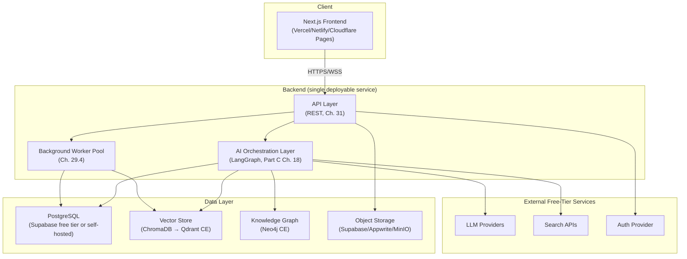

**Figure D27.1 — High-Level System Architecture Diagram.**

### 27.2 Architectural Style: Modular Monolith vs. Microservices

**Table D27.1 — Technology Stack Decision Table**

| Decision Point | Options Considered | Decision | Rationale |
|---|---|---|---|
| Overall architecture style | Microservices vs. Modular Monolith | **Modular Monolith** | A single small team (Part A §4.4) cannot absorb the operational overhead of running/monitoring/deploying multiple services on free-tier hosts (each with its own cold-start, networking, and quota concerns). A monolith with clean internal module boundaries (Frontend/API/Orchestration/Data, enforced via NFR-060) gets nearly all the maintainability benefit at a fraction of the ops cost, and can be decomposed later (Ch. 36.4) only if a specific component (e.g., the RAG ingestion pipeline) demonstrably needs independent scaling |
| Backend language/runtime | Node.js (TypeScript) vs. Python | **Python** for the backend, with the Next.js frontend naturally in TypeScript | The AI/ML ecosystem (LangGraph, LangChain, Prophet, LightGBM, PyTorch Geometric, PaddleOCR, Faster-Whisper) is overwhelmingly Python-native; building the backend in Python avoids a cross-language bridge between the API layer and the AI layer, which would add latency and complexity for no benefit given no other requirement favors Node.js specifically |
| API style | REST vs. GraphQL | **REST** | Simpler to implement, test, and cache on free-tier infrastructure; GraphQL's flexibility benefits (avoiding over/under-fetching) matter more at a scale/complexity this platform is not yet at; full endpoint catalog in Ch. 31 |
| Frontend framework | Next.js vs. plain React SPA vs. Vue | **Next.js (React)** | Matches Master TOC preferred stack; built-in routing, image optimization, and free-tier-friendly static/SSR hybrid deployment on Vercel/Netlify/Cloudflare Pages |

### 27.3 Technology Stack Summary Table

| Layer | Technology | Free-Tier/Self-Hosted Basis |
|---|---|---|
| Frontend | Next.js + React + Tailwind + shadcn/ui | Vercel/Netlify/Cloudflare Pages free tier |
| Backend API | Python (FastAPI recommended for async support + auto-generated OpenAPI schema, Ch. 31.6) | Railway/Render/Fly.io free tier, containerized via Docker |
| AI Orchestration | LangGraph + LangChain tool ecosystem | Runs in-process within the backend (Ch. 27.2) |
| Relational DB | PostgreSQL | Supabase free tier (or self-hosted via Docker Compose) |
| Vector Store | ChromaDB (MVP) → Qdrant CE (scale-up) | Self-hosted (embedded or Docker container) |
| Knowledge Graph | Neo4j Community Edition | Self-hosted via Docker |
| Object Storage | Supabase Storage (MVP) / MinIO (self-hosted alternative) | Free tier / self-hosted |
| Auth | Supabase Auth (MVP, bundled with the same Supabase free-tier project as Postgres) | Free tier |
| Containers | Docker + Docker Compose | Local dev + self-hosted deployment |
| CI/CD | GitHub Actions | Free tier for public/small private repos |
| Monitoring | Prometheus + Grafana (self-hosted), LangSmith free tier for LLM-call tracing | Self-hosted / free tier |

### 27.4 Deployment Topology

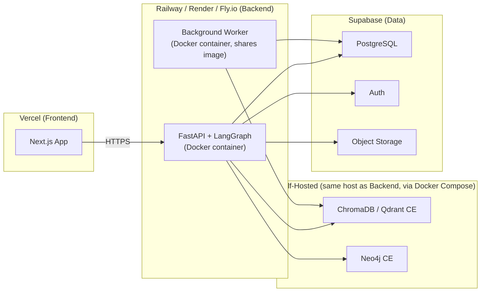

**Figure D27.2 — Deployment Topology Diagram.** The Vector Store and Knowledge Graph are co-located with the backend container (same host, via Docker Compose) rather than as separate managed services, since no free-tier managed Qdrant/Neo4j offering at meaningful scale exists — this is a deliberate self-hosting trade-off accepted to preserve the $0 constraint (Ch. 40 formalizes the resulting operational responsibility).

---

## 28. Frontend Architecture

### 28.1 Framework Selection & Rationale

Next.js is chosen over a plain React SPA specifically for its hybrid rendering model: marketing/landing pages can be statically generated (best for free-tier CDN caching and SEO), while the authenticated app itself runs as a client-rendered SPA-like experience within the same codebase — avoiding the need to maintain two separate frontend projects.

### 28.2 Component Architecture & Folder Structure

```
frontend/
  app/
    (marketing)/           # Statically generated public pages
    (app)/
      chat/                # UC-01 Chat interface
      knowledge-base/       # UC-02 Knowledge Base browser
      research/             # UC-03/04 Validation & Research briefs
      forecast/              # UC-05 Financial Forecast
      documents/             # UC-06/08 Document Generator & Export
      roadmap/               # UC-07 Roadmap/Task board
  components/
    ui/                     # shadcn/ui primitives
    chat/
    forecast/
    documents/
  lib/
    api-client.ts           # Typed client generated from OpenAPI schema (Ch. 31.6)
    auth.ts
  state/                    # Global state management (Ch. 28.3)
```

### 28.3 State Management Strategy

| Concern | Approach | Rationale |
|---|---|---|
| Server data (company data, forecasts, documents) | Server-state caching library (e.g., TanStack Query) over the REST API | Avoids manually reimplementing caching/invalidation logic; keeps UI in sync with backend without polling by default |
| Ephemeral UI state (modals, form state) | Local component state / lightweight global store | No need for a heavy global state library when most state is genuinely server-owned |
| Streaming chat state | WebSocket-driven incremental state updates (FR-029) | Token-by-token rendering requires a state update path distinct from the request/response server-state cache above |

### 28.4 Design System Integration

Per Part A §6.4: Tailwind CSS + shadcn/ui, chosen for its copy-in-source (not npm-dependency) model, preserving long-term control over the component code without licensing/version-drift risk.

### 28.5 Accessibility & Performance Budget

- WCAG 2.1 AA compliance (NFR-050) verified via automated tooling (axe-core in CI, Ch. 34.2) plus manual keyboard-navigation testing before each release milestone.
- Performance budget: Largest Contentful Paint ≤ 2.5s on 4G-equivalent throttling for the marketing/landing pages (SSG-served); authenticated app views optimize for perceived responsiveness (streaming, skeleton states) over raw load time given inherent LLM-response latency.

**Figure D28.1 — Frontend Component Hierarchy Diagram**

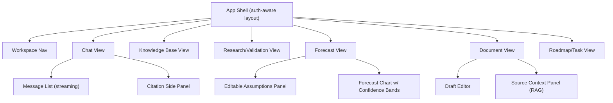

---

## 29. Backend Architecture

### 29.1 API Layer Design

REST, versioned under `/api/v1/`, following resource-oriented conventions (nouns for resources, standard HTTP verbs). FastAPI is recommended specifically because it auto-generates an OpenAPI 3.x schema from typed Python route definitions, which directly feeds both Ch. 31.6 (API documentation) and the frontend's typed API client (Ch. 28.2).

### 29.2 Service Boundaries & Module Decomposition

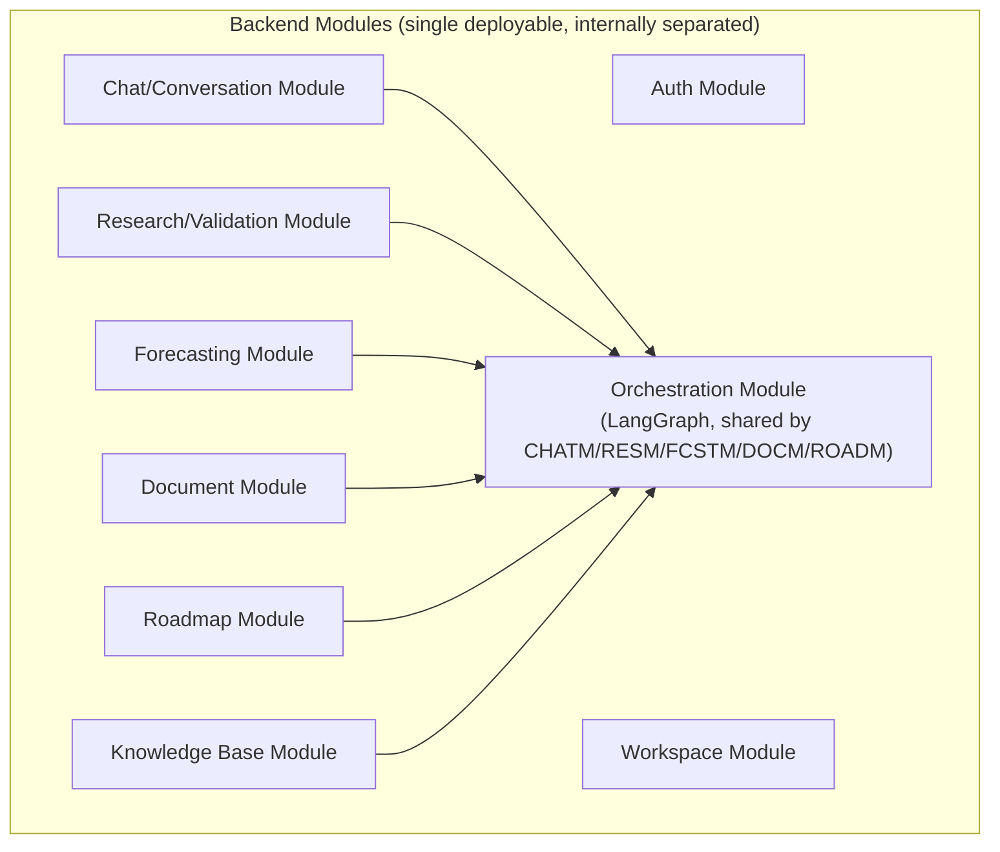

**Figure D29.1 — Backend Service Architecture Diagram.** Module boundaries are enforced at the code level (separate packages/directories with restricted cross-imports, NFR-060) even though all modules deploy as one process — this preserves the *option* of extracting a module into a standalone service later (Ch. 36.4) without a full rewrite.

### 29.3 Agent Orchestration Service Design

The Orchestration Module wraps the Part C Ch. 18.4 LangGraph state machine as an internal service callable by any feature module. It exposes a single entry point (`run_agent_workflow(workspace_id, request, workflow_type)`) so that feature modules never construct LangGraph graphs themselves — only the Orchestration Module owns graph definitions, keeping the LLM Gateway (Part C Ch. 17.2) and graph logic centralized and independently testable.

### 29.4 Job Queue & Background Worker Design

| Requirement | Design | Free-Tier Consideration |
|---|---|---|
| Long-running agent workflows (e.g., multi-agent compound tasks, FR-099) should not block the HTTP request/response cycle | Background job queue backed by PostgreSQL (e.g., a simple `jobs` table polled by a worker process) rather than a dedicated message broker (Redis/RabbitMQ) | Avoids introducing an additional infrastructure dependency purely for queueing at MVP scale — PostgreSQL-backed queuing is "good enough" until job volume justifies a dedicated broker (Ch. 36.4 trigger) |
| Document ingestion (chunk/embed/store) should not block the upload response | Same PostgreSQL-backed job queue, processed by a worker container sharing the backend's Docker image | Keeps deployment topology simple (Fig. D27.2) — one image, two run modes (API server vs. worker), rather than a separate codebase |
| Nightly LightGBM retraining (Ch. 20.4) | Scheduled job via the same worker (cron-style trigger, e.g., using APScheduler or a GitHub Actions scheduled workflow hitting an internal endpoint) | GitHub Actions' free scheduled-workflow minutes are sufficient at this scale, avoiding a dedicated cron infrastructure cost |

### 29.5 Caching Layer Strategy

An in-process/file-based cache (or a self-hosted Redis container if the host's free tier accommodates the extra memory footprint) backs: search-result caching (Part C Ch. 19.9/23.3), quota-tracker state (Part C Ch. 17.6), and rendered-forecast caching for repeated identical-assumption requests. Redis is preferred over a purely in-process cache once multiple backend instances exist (Ch. 36.4), since in-process caching does not share state across instances — flagged here as a scale-out trigger, not an MVP requirement (a single backend instance's in-process cache is sufficient initially).

### 29.6 Rate Limiting & Throttling Design

Two layers: (1) **inbound** rate limiting on the public API (per-user/IP) to protect against abuse, and (2) **outbound** quota governance against external LLM/search providers (Part C Ch. 17.6/17.7) to avoid exhausting shared free-tier quota. Both are implemented as middleware/interceptors around the relevant call sites rather than scattered ad hoc checks, so limits can be tuned centrally.

### 29.7 Key Sequence Diagrams

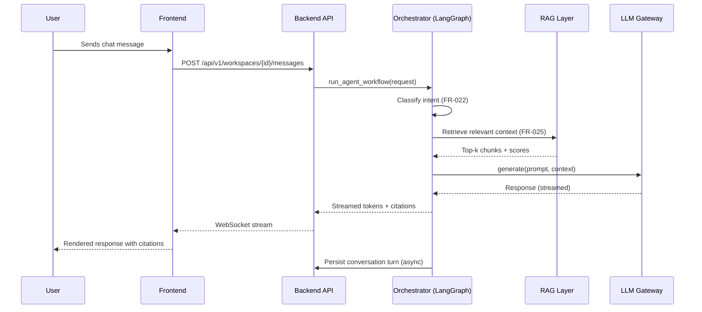

**Figure D29.2 — Sequence Diagram: Chat Request Lifecycle.**

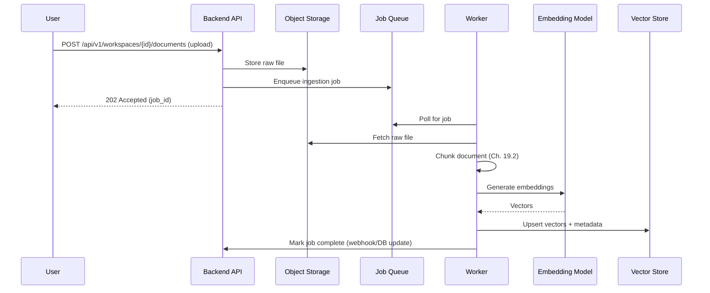

**Figure D29.3 — Sequence Diagram: Document Upload → RAG Ingestion.**

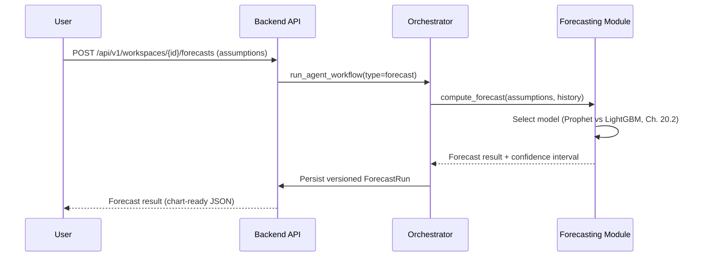

**Figure D29.4 — Sequence Diagram: Forecast Generation Request.**

---

## 30. Database Design

### 30.1 Database Selection Rationale

PostgreSQL is the system of record for all structured/relational data (users, workspaces, conversations, forecasts, documents, milestones) — chosen over MongoDB for this core data because the data is inherently relational (workspace ownership, versioned records, foreign-key relationships) and PostgreSQL's free-tier availability (Supabase) plus mature tooling (migrations, ORMs) outweigh any schema-flexibility benefit MongoDB would offer here. MongoDB Community is reserved for any future unstructured-log-style data if a specific need arises (not required for MVP). SQLite is used only for local development/testing convenience (Ch. 34.3), not production. DuckDB is reserved for ad hoc analytical queries over exported data (Ch. 35 observability), not transactional storage.

### 30.2 Entity-Relationship Diagram

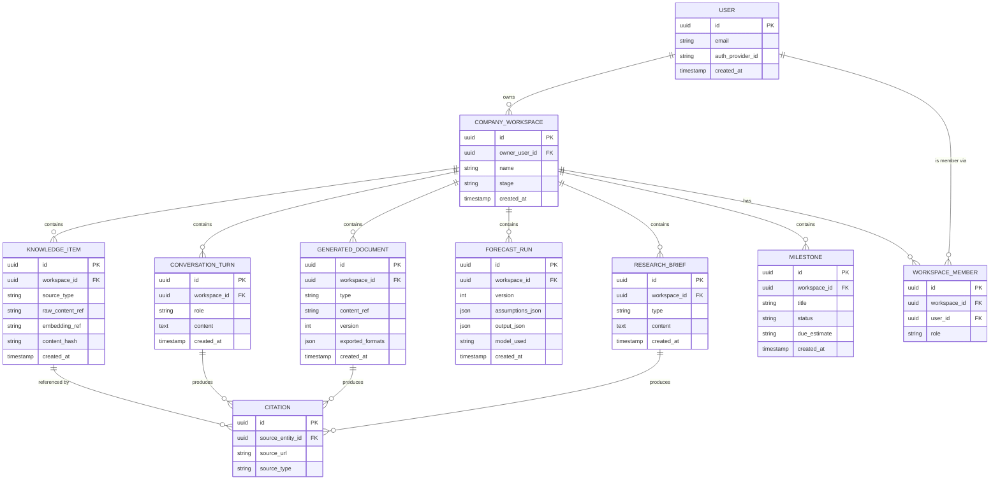

**Figure D30.1 — Entity-Relationship Diagram (ERD).**

### 30.3 Schema Definitions

**Table D30.1 — Full Schema Definition Table (excerpt; full DDL in Appendix D)**

| Table | Key Constraints | Notes |
|---|---|---|
| `users` | `email` unique, not null | `auth_provider_id` links to Supabase Auth/Clerk identity |
| `company_workspaces` | `owner_user_id` FK → `users.id`, not null | Root of all workspace-scoped data isolation (FR-004) |
| `workspace_members` | Composite unique on (`workspace_id`, `user_id`) | Supports Post-MVP collaborator roles (FR-005) |
| `conversation_turns` | `workspace_id` FK, `role` check constraint (`user`/`assistant`) | Indexed on (`workspace_id`, `created_at`) for chronological retrieval |
| `knowledge_items` | `workspace_id` FK, `content_hash` indexed | `content_hash` enables incremental re-indexing (FR-055) |
| `forecast_runs` | `workspace_id` FK, unique on (`workspace_id`, `version`) | Supports version comparison (FR-070) |
| `generated_documents` | `workspace_id` FK, unique on (`workspace_id`, `type`, `version`) | Supports draft history (FR-085) |

### 30.4 Indexing Strategy

- Foreign-key columns (`workspace_id` everywhere) are indexed by default given nearly every query is workspace-scoped (enforcing FR-004's isolation efficiently).
- Composite index on (`workspace_id`, `created_at`) for all time-ordered tables (conversation turns, milestones) to support efficient chronological pagination.
- `content_hash` indexed on `knowledge_items` for fast no-op-update detection (Part C Ch. 19.9).

### 30.5 Vector Store Schema & Collections Design

**Table D30.2 — Vector Collection Schema Table**

| Field | Type | Description |
|---|---|---|
| `id` | string (UUID) | Matches `knowledge_items.id` in PostgreSQL for cross-reference |
| `vector` | float array | Embedding produced by BGE (Part C Ch. 19.3) |
| `workspace_id` | string (metadata/payload) | Used for filtered retrieval — every query must filter by workspace to prevent cross-tenant leakage |
| `source_type` | string (metadata) | e.g., `upload`, `chat_turn`, `agent_output` |
| `chunk_text` | string (metadata, for citation display) | Stored so retrieval results can display the actual matched text without a second database round-trip |

**Design note:** A single vector collection is used with `workspace_id` as a mandatory metadata filter, rather than one collection per workspace — this avoids collection-count sprawl on the free-tier-hosted Vector Store as user count grows, at the cost of every query needing to include the filter (enforced at the Vector Store abstraction layer, Part C Ch. 19.4, so no calling code can accidentally omit it).

### 30.6 Knowledge Graph Schema

Nodes: `Company`, `Competitor`, `Investor`, `Person`, `Milestone`. Relationships: `COMPETITOR_OF`, `INVESTED_IN`, `ADVISES`, `GRADUATED_FROM`, `ACHIEVED` (Company→Milestone). Each node carries a `workspace_id` property mirroring the relational/vector isolation pattern, enforced identically at the Knowledge Graph query layer.

### 30.7 Migration & Versioning Strategy

Alembic (Python-native, pairs naturally with the FastAPI/Python backend decision in Ch. 27.2) manages PostgreSQL schema migrations, version-controlled alongside application code. This satisfies NFR-011 (migrating hosting provider requires only a connection-string change, not a schema rewrite) since Alembic migrations are portable across any PostgreSQL instance regardless of host.

### 30.8 Backup & Disaster Recovery

| Component | Backup Approach | Free-Tier Constraint |
|---|---|---|
| PostgreSQL | Supabase free tier's built-in daily backup retention (verify current retention window against live docs), supplemented by a weekly `pg_dump` exported to Object Storage as a self-managed redundancy | Free-tier managed backup retention windows are typically shorter than a paid tier's — the self-managed `pg_dump` supplement compensates for this gap at no additional cost |
| Vector Store | Periodic snapshot export (Chroma/Qdrant both support data export) to Object Storage | Vector data can technically be regenerated by re-embedding source documents (recoverable from PostgreSQL + Object Storage even without a vector snapshot), making this a lower-priority backup than the relational DB |
| Knowledge Graph | Periodic Neo4j dump exported to Object Storage | Similarly regenerable from source documents via re-extraction, though a snapshot avoids the extraction-compute cost of full regeneration |

---

## 31. API Design Specification

### 31.1 API Design Principles

REST resource-oriented conventions; versioned base path `/api/v1/`; consistent envelope for errors (`{ "error": { "code", "message", "details" } }`); pagination via cursor-based `?cursor=` params for time-ordered collections (conversation turns, milestones).

### 31.2 Authentication & Authorization Flow

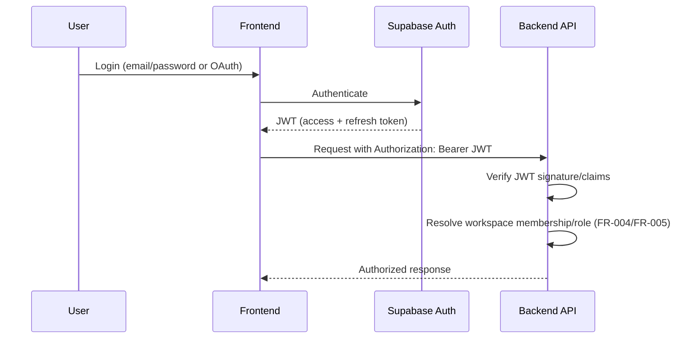

**Figure D31.1 — Auth Flow Sequence Diagram.**

**Recommendation:** Supabase Auth is chosen as the MVP default over Clerk/Auth.js/Better Auth specifically because it's bundled with the same Supabase free-tier project already used for PostgreSQL and Object Storage (Ch. 27.3), minimizing the number of distinct free-tier accounts/services the team must manage. Clerk is noted as a strong alternative if a more polished pre-built UI component set for auth screens is prioritized over infrastructure consolidation — a trade-off worth revisiting if the team's frontend-design bandwidth is more constrained than backend-integration bandwidth.

### 31.3 Endpoint Catalog

**Table D31.1 — Full Endpoint Catalog (representative excerpt; full catalog in Appendix A/E)**

| Method | Path | Description | Auth Required | Maps to FR |
|---|---|---|---|---|
| POST | `/api/v1/auth/register` | Register a new user | No | FR-001 |
| POST | `/api/v1/workspaces` | Create a Company Workspace | Yes | FR-003 |
| GET | `/api/v1/workspaces/{id}` | Retrieve workspace details | Yes (member) | FR-004 |
| POST | `/api/v1/workspaces/{id}/messages` | Send a chat message (streamed response) | Yes (member) | FR-021–FR-030 |
| POST | `/api/v1/workspaces/{id}/documents` | Upload a document for ingestion | Yes (member) | FR-046–FR-049 |
| GET | `/api/v1/workspaces/{id}/knowledge-items` | List/search Knowledge Base items | Yes (member) | FR-050, FR-054 |
| POST | `/api/v1/workspaces/{id}/research-briefs` | Request an idea validation or competitor research brief | Yes (member) | FR-126–FR-130 |
| POST | `/api/v1/workspaces/{id}/forecasts` | Submit assumptions, receive a forecast | Yes (member) | FR-066–FR-070 |
| GET | `/api/v1/workspaces/{id}/forecasts/{version}` | Retrieve a specific forecast version | Yes (member) | FR-070 |
| POST | `/api/v1/workspaces/{id}/documents/generate` | Generate a pitch deck/document | Yes (member) | FR-081–FR-083 |
| GET | `/api/v1/workspaces/{id}/documents/{id}/export` | Export a generated document (docx/pptx/pdf) | Yes (member) | FR-083 |
| POST | `/api/v1/workspaces/{id}/milestones` | Create/propose a roadmap milestone | Yes (member) | FR-096–FR-097 |
| PATCH | `/api/v1/workspaces/{id}/milestones/{id}` | Update milestone status | Yes (member) | FR-098 |
| GET | `/api/v1/admin/usage` | Aggregate anonymized usage stats | Yes (admin) | FR-147 |

### 31.4 Rate Limiting & Quota Enforcement

Per-endpoint rate limits (e.g., stricter limits on `/forecasts` and `/documents/generate` given their higher compute/LLM-token cost) enforced at the API gateway/middleware layer, distinct from but coordinated with the outbound provider-quota governor (Part C Ch. 17.7).

### 31.5 Webhook Design

For async job completions (document ingestion, Fig. D29.3; nightly forecast retraining, Ch. 29.4), the backend uses an internal webhook/callback pattern (worker → API internal endpoint) rather than exposing job-completion webhooks externally — external webhook support (e.g., notifying a third-party tool) is explicitly out of MVP scope.

### 31.6 OpenAPI/Swagger Specification Reference

FastAPI's auto-generated OpenAPI 3.x schema (Ch. 27.2/29.1) is the canonical, always-current API contract, published at `/api/v1/openapi.json` and rendered at `/docs`; the full specification is archived per release in Appendix E rather than manually duplicated in this document, to avoid the two drifting out of sync.

---

## 32. Storage & File Management

### 32.1 Object Storage Strategy

Supabase Storage is the MVP default (bundled with the same free-tier project as Auth/PostgreSQL, Ch. 31.2's consolidation rationale applies identically here). MinIO is documented as the self-hosted alternative for a deployment scenario where the team migrates off Supabase entirely (e.g., hits a free-tier storage ceiling before other components, Ch. 36.3) — since MinIO is S3-API-compatible, the storage abstraction layer (mirroring the LLM Gateway/Vector Store pattern) requires only a configuration change to switch, not application-code changes.

### 32.2 File Upload Pipeline & Validation

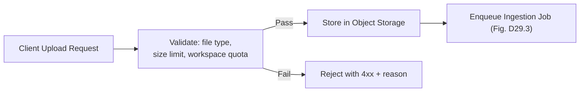

**Figure D32.1 — File Upload & Storage Flow Diagram.**

Validation rules: accepted MIME types restricted to PDF/DOCX/TXT/MD/common image formats (matching FR-046/FR-113); a per-workspace storage quota is enforced server-side to keep any single workspace from exhausting the shared free-tier storage allocation (directly implementing NFR-091's graceful-degradation principle at the storage layer).

### 32.3 CDN & Asset Delivery Strategy

Static frontend assets are served via the hosting platform's built-in CDN (Vercel/Netlify/Cloudflare Pages all include this on their free tiers); user-uploaded content is served via signed, time-limited URLs from Object Storage rather than proxied through the backend, reducing backend bandwidth/compute load.

---

## 33. Security Architecture

### 33.1 Threat Model (STRIDE Analysis)

**Table D33.1 — STRIDE Threat Model Table**

| Threat Category | Example Risk | Mitigation |
|---|---|---|
| Spoofing | Attacker impersonates a user via stolen/forged JWT | Short-lived access tokens + refresh rotation (FR-010), TLS everywhere (NFR-030) |
| Tampering | Attacker modifies request payloads to access another workspace's data | Server-side workspace-membership authorization check on every request (FR-004), never trusting client-supplied workspace context alone |
| Repudiation | A user denies having taken an action (e.g., deleting Knowledge Base content) | Audit logging of authentication and admin-access events (FR-008/FR-149), and action-level logging for destructive operations |
| Information Disclosure | Cross-tenant data leakage via a missing workspace filter (e.g., in the Vector Store, Ch. 30.5) | Mandatory workspace-filter enforcement at the abstraction layer (not per-call-site), PII redaction before third-party API calls (Part C Ch. 26.3) |
| Denial of Service | Free-tier quota exhaustion (intentional or accidental) taking down the platform for all users | Inbound rate limiting (Ch. 29.6), outbound quota governor (Part C Ch. 17.6/17.7), per-workspace soft caps |
| Elevation of Privilege | A Viewer-role collaborator (FR-005) performs an Owner-only action | Role-based authorization checks at the endpoint level, tested explicitly in Ch. 37 |

### 33.2 Authentication & Session Security

Handled by the delegated Auth Provider (Ch. 31.2); the backend independently verifies JWT signatures against the provider's public keys on every request rather than trusting a client-asserted identity, and maintains its own session-scoped audit log (FR-008) since the Auth Provider's own logs may not be exportable in sufficient detail on a free tier.

### 33.3 Data Encryption

TLS 1.2+ enforced for all client-backend and backend-external-API traffic (NFR-030); at-rest encryption relies on the underlying free-tier providers' default encryption (Supabase's managed PostgreSQL/Storage encryption) for MVP, with self-hosted components (Vector Store, Knowledge Graph) relying on host-disk encryption where the hosting platform provides it — explicitly documented as a known gap to revisit if a hosting migration (Ch. 36.4) moves these components to infrastructure without default disk encryption.

### 33.4 Secrets Management

API keys for every external provider (Ch. 17/23 fallback chains) are stored as environment variables injected via the hosting platform's secret-management feature (Railway/Render/Fly.io all support this on free tiers) and via GitHub Actions Secrets for CI — never committed to source control, enforced via a pre-commit hook and CI secret-scanning step (Ch. 34.2).

### 33.5 API Key & LLM Credential Rotation Policy

Each provider's key is rotated on a documented schedule (e.g., quarterly) and immediately upon any suspected exposure; because the LLM Gateway/Search abstraction (Part C Ch. 17.2/23.1) centralizes provider credential usage to one location per provider, rotation requires updating one environment variable rather than hunting through scattered call sites.

### 33.6 Input Validation & Injection Prevention

- SQL injection: mitigated by exclusive use of parameterized queries/ORM (never string-concatenated SQL).
- Prompt injection: per Part C Ch. 26.2, untrusted content (uploads, search results) is structurally separated from instructions in every prompt template, and tool-calling schemas are strictly validated server-side before execution.

### 33.7 Dependency & Supply Chain Security

GitHub's Dependabot (free for all repos) is enabled for automated dependency vulnerability alerts and update PRs across both the Python backend and the Next.js frontend; a lightweight Software Bill of Materials (SBOM) is generated as part of the CI pipeline (Ch. 34.2) to support the license-compliance tracking required in Ch. 41.1.

**Figure D33.1 — Security Architecture Diagram**

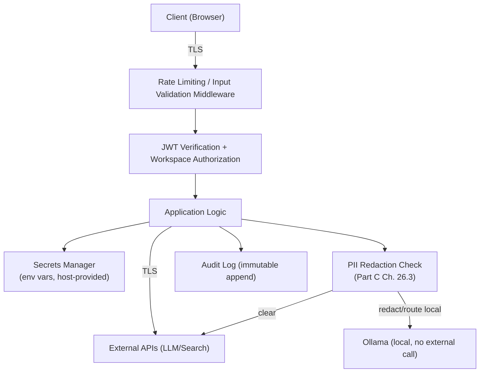

---

## 34. DevOps, CI/CD & Infrastructure

### 34.1 Containerization Strategy

A single Dockerfile builds the backend image, runnable in two modes (API server vs. background worker, Ch. 29.4) via an entrypoint argument — this keeps the container image count minimal (one image, multiple run commands) rather than maintaining separate Dockerfiles per role. `docker-compose.yml` orchestrates the backend, Vector Store (ChromaDB/Qdrant), and Neo4j for local development and for self-hosted deployment targets (Fly.io, a VPS-style Render/Railway deployment).

### 34.2 CI/CD Pipeline Design

```mermaid
flowchart LR
    PUSH["Push / PR to GitHub"] --> LINT["Lint + Type Check"]
    LINT --> UNIT["Unit Tests"]
    UNIT --> SECSCAN["Secret Scan + Dependency Audit"]
    SECSCAN --> A11Y["Accessibility Check (axe-core)"]
    A11Y --> EVALSUITE["AI Regression Eval Suite\n(Part C Ch. 25.6)"]
    EVALSUITE --> BUILD["Build Docker Image"]
    BUILD --> DEPLOYSTAGE["Deploy to Staging"]
    DEPLOYSTAGE --> E2E["E2E Tests (Ch. 37)"]
    E2E -->|"main branch only"| DEPLOYPROD["Deploy to Production"]
```

**Figure D34.1 — CI/CD Pipeline Diagram.** GitHub Actions is used exclusively (per Master TOC preference) — its free tier's included minutes are sufficient for a small team's pipeline volume; the AI regression eval suite step is a deliberate insertion point ensuring prompt/model changes (Part C Ch. 17.4 versioning) can't silently regress quality before reaching users.

### 34.3 Environment Strategy

| Environment | Purpose | Infrastructure |
|---|---|---|
| Local Dev | Individual development | Docker Compose, `.env.local`, SQLite optionally substituted for PostgreSQL for zero-setup onboarding |
| Staging | Pre-production validation | Same free-tier host type as production, separate project/database instance |
| Production | Live user traffic | Free-tier hosted per Ch. 27.4 topology |

### 34.4 Hosting Platform Comparison

**Table D34.1 — Hosting Platform Comparison Table**

| Platform | Free Tier Characteristics | Strengths | Weaknesses | Recommendation |
|---|---|---|---|---|
| Vercel | Generous free tier for frontend (Next.js first-class support) | Best-in-class Next.js integration, built-in CDN/edge | Not suited for long-running backend/stateful containers (Vector Store, Neo4j) | **Frontend hosting** |
| Netlify | Similar to Vercel for static/frontend hosting | Good free tier, simple config | Slightly less Next.js-specific optimization than Vercel | Alternative frontend host |
| Railway | Free tier with usage-based credit allowance, supports long-running containers | Simple Docker Compose-style deployment, good for backend + self-hosted Vector Store/Neo4j together | Free-tier credit allowance requires monitoring to avoid mid-month cutoff | **Primary backend hosting candidate** |
| Render | Free tier for web services (with cold-start/sleep behavior on inactivity) | Simple to configure, good Docker support | Free-tier services sleep after inactivity, adding cold-start latency | Viable backend alternative; cold-start behavior is a trade-off to explicitly test against NFR-001 latency targets |
| Fly.io | Free allowance for small VMs, good for persistent containers (Vector Store, Neo4j) | Genuinely persistent (non-sleeping) small VMs suit self-hosted stateful components well | Free allowance is usage-metered, requires monitoring | Strong candidate specifically for the self-hosted Vector Store/Neo4j components requiring persistence |
| Cloudflare Pages | Free static hosting, edge functions | Excellent free CDN/edge network | Less suited to a stateful Python backend | Frontend/static-asset alternative only |
| GitHub Pages | Free static hosting | Simplest possible static hosting | No support for dynamic backend at all | Marketing/docs pages only, not the app itself |

**Recommendation:** Vercel for the Next.js frontend; Railway or Fly.io for the backend + self-hosted Vector Store/Neo4j (Fly.io favored specifically when the cold-start/sleep behavior of Render's free web-service tier would violate the NFR-001 latency target for the chat interface).

### 34.5 Infrastructure as Code Approach

`docker-compose.yml` plus platform-specific minimal config files (e.g., `railway.json`/`fly.toml`) serve as the IaC layer — a full Terraform setup is judged disproportionate to a small, largely-PaaS-hosted deployment and is deferred to a future scale-up point (Ch. 36.4) if the team ever manages raw VMs directly at scale.

### 34.6 Rollback & Release Strategy

Each deploy is tagged with the Git commit SHA; the hosting platform's built-in rollback-to-previous-deploy feature (available on Vercel/Railway/Render free tiers) is the primary rollback mechanism, avoiding the need for custom blue-green deployment tooling at this scale.

---

## 35. Observability, Monitoring & Logging

### 35.1 Logging Strategy & Standards

Structured (JSON) logging throughout the backend, with a consistent schema (timestamp, workspace_id, request_id, module, level, message) enabling correlation across the Orchestration Module's multi-step agent workflows (Part C Ch. 18.5's state-object trace maps directly into structured log entries).

### 35.2 Metrics & Dashboards

Self-hosted Prometheus scrapes backend-exposed metrics (request latency, job queue depth, provider fallback frequency — directly instrumenting the Ch. 17.2 fallback chain so the team can see how often each provider tier is actually used); Grafana (also self-hosted, same Docker Compose environment) provides dashboards. Both are free/open-source and run alongside the Vector Store/Neo4j containers on the same self-hosted host (Fig. D27.2).

### 35.3 LLM Observability

LangSmith's free tier is used for detailed LLM-call tracing (prompt/response pairs, latency per call, token counts) — this is the recommended complement to Prometheus/Grafana's system-level metrics, since LangSmith's LangChain/LangGraph-native integration gives far richer per-agent-step visibility than generic APM tooling would. MLflow (self-hosted) tracks forecasting-model experiments (Prophet/LightGBM parameter sweeps, Part C Ch. 20) separately from the LLM-tracing concern, since these are a distinct experiment-tracking need (model versions/metrics over time) rather than a request-tracing need.

### 35.4 Alerting Rules & Escalation Policy

| Alert Condition | Severity | Action |
|---|---|---|
| All LLM providers in the fallback chain failing simultaneously (including Ollama) | Critical | Immediate notification to the developer (e.g., via a free-tier-compatible channel like a Discord/Slack webhook) |
| Free-tier quota for any provider approaching its documented ceiling (Ch. 36.3) | Warning | Logged and surfaced on the Grafana dashboard; proactive review before hard cutoff |
| Job queue depth exceeding a configured threshold (indicating worker backlog) | Warning | Investigate worker capacity/scaling |
| Authentication anomalies (spike in failed logins) | Warning | Review audit log (FR-008) |

### 35.5 Distributed Tracing Considerations

At the current modular-monolith scale (Ch. 27.2), full distributed tracing (e.g., OpenTelemetry across multiple services) is not yet justified — request-ID-correlated structured logging (Ch. 35.1) plus LangSmith's agent-step tracing together cover the practical debugging need. This is explicitly revisited if/when Ch. 36.4's microservice decomposition trigger is reached.

**Figure D35.1 — Observability Stack Architecture Diagram**

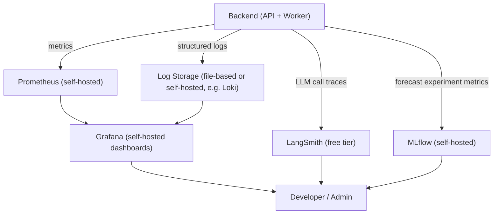

---

## 36. Performance & Scalability Engineering

### 36.1 Performance Benchmarks & Load Testing Plan

Load testing (e.g., using an open-source tool like Locust) against staging before each major release milestone (Table A7.1), targeting the NFR-001–NFR-004 latency thresholds under a simulated concurrent-user load representative of expected early adoption (tens, not thousands, of concurrent users — appropriately scoped to the project's actual stage).

### 36.2 Caching Strategies Across Layers

Consolidates Ch. 19.9 (RAG/search caching), Ch. 29.5 (application-level caching), and CDN-level static-asset caching (Ch. 32.3) into a single layered view: CDN (static assets) → application cache (search results, quota state, rendered forecasts) → database query result caching (where applicable) → cold-path computation (LLM generation, fresh forecast fit) as the last resort, ensuring the most expensive operations (external LLM calls) are hit only when cheaper cache layers cannot serve the request.

### 36.3 Free-Tier Ceiling Analysis & Scale-Out Triggers

**Table D36.1 — Free-Tier Limits Reference Table** *(illustrative structure; exact current figures must be re-verified against live provider documentation before each release, per the recurring note in Parts A–C references)*

| Component | Free-Tier Ceiling (illustrative) | Scale-Out Trigger | Scale-Out Action |
|---|---|---|---|
| Supabase PostgreSQL | Storage/row-count cap on free project tier | Approaching ~70% of documented storage cap | Migrate to a self-hosted PostgreSQL instance (Docker) on the same host as the backend, per NFR-011's portability guarantee |
| Groq/Gemini/Mistral API | Requests/day or requests/minute caps | Sustained rate-limit errors despite fallback chain absorbing overflow | Introduce request queuing/backoff, and/or apply to any available academic/education program credits before considering paid tiers |
| Object Storage (Supabase/free) | Storage size cap | Approaching cap | Migrate to self-hosted MinIO (Ch. 32.1) |
| Vector Store (ChromaDB) | Practical performance ceiling under single-process embedded mode | Retrieval latency (NFR-003) degrading under growing document count | Migrate to Qdrant CE (Part C Ch. 19.4's planned scale-up path) |
| Hosting platform (Railway/Render/Fly.io free allowance) | Usage-metered credit/hour caps | Approaching monthly allowance | Consolidate services, optimize container resource usage, or evaluate splitting load across multiple free-tier accounts/projects as an interim step before considering paid tiers |

### 36.4 Horizontal Scaling Path

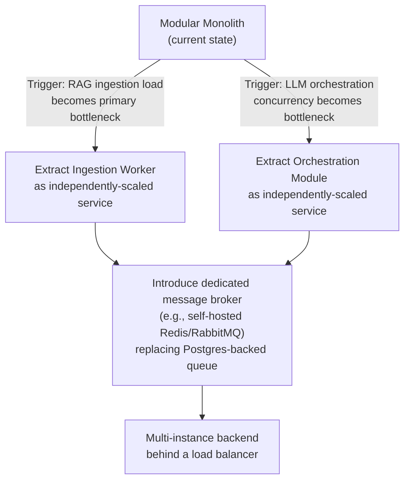

**Figure D36.1 — Scaling Decision Tree.** Decomposition is triggered by *demonstrated* bottlenecks (measured via Ch. 35 observability), never performed speculatively — consistent with the monolith-first rationale in Ch. 27.2.

### 36.5 Cost-to-Scale Projection

Formalized in Ch. 40; summarized here as a principle: every scale-out action above (Table D36.1) is designed to have a **free or self-hosted first option** before any paid tier is considered, and Ch. 40.3/40.4 define the specific trigger points where a paid tier becomes the pragmatically correct choice (e.g., once user count/revenue justifies it).

---

## 37. Testing Strategy

### 37.1 Test Pyramid

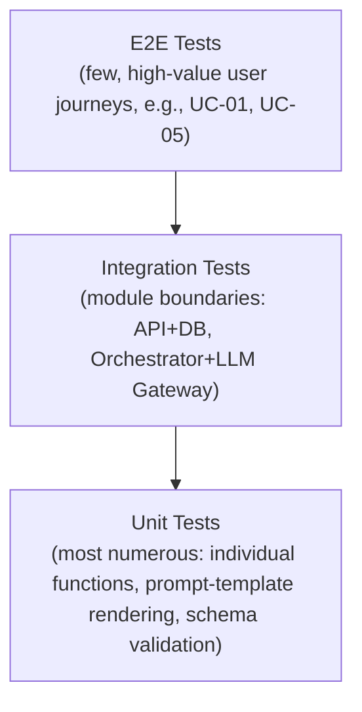

**Figure D37.1 — Test Pyramid Diagram.**

### 37.2 AI-Specific Testing

- **Prompt regression testing:** Per Part C Ch. 25.6, a versioned set of representative requests re-run against every prompt-template/model-routing change, comparing outputs against the eval rubric.
- **RAG evaluation:** Automated Precision@k/Recall@k checks (Part C Ch. 25.3) against a maintained test corpus with known-relevant chunks.
- **Agent behavior tests:** Given a labeled intent-classification test set (Part C Ch. 24.5), assert the Orchestrator routes correctly ≥90% of the time (FR-022's acceptance criterion, directly testable).
- **Fallback-chain chaos test:** Deliberately simulate each provider in the Ch. 17.2 chain failing (mocked failure injection) and assert the system still produces a response via the next fallback, down to Ollama.

### 37.3 Test Data Management

Synthetic and reference datasets (Part C Ch. 24) are used as fixed, version-controlled test fixtures rather than live-scraped data, ensuring test runs are deterministic and don't consume real free-tier search/LLM quota unnecessarily in CI (mocked LLM/search responses are used for most unit/integration tests, with a smaller number of true end-to-end tests against real free-tier APIs run less frequently, e.g., nightly rather than on every commit).

### 37.4 Test Automation & CI Integration

Per Fig. D34.1: lint → unit → security scan → accessibility → AI regression eval → build → staging deploy → E2E, all automated in GitHub Actions, with the AI regression eval suite and full E2E suite deliberately placed late in the pipeline since they are the most expensive/slowest checks.

### 37.5 UAT Plan & Sign-off Criteria

Before each release milestone (Table A7.1), a small group of representative target users (matching the Part A Ch. 3 personas) completes the core journey (Fig. A3.1) unmoderated, with sign-off criteria tied directly to NFR-051 (task completion without external documentation) and the acceptance criteria of the milestone's in-scope features.

**Table D37.1 — Test Case Matrix (excerpt; full matrix in Appendix A)**

| Test Case ID | Requirement(s) Covered | Type | Description |
|---|---|---|---|
| TC-LLM-001 | FR-024, NFR-021 | Integration/Chaos | Simulate sequential provider failures, assert fallback to Ollama succeeds |
| TC-RAG-003 | FR-048, FR-050 | Integration | Ingest known document, assert retrieval returns expected chunk within top-k |
| TC-FCST-001 | FR-067, FR-068 | Unit | Given synthetic financial data (Ch. 24.4), assert Prophet forecast output matches expected shape/confidence interval |
| TC-DOC-002 | FR-081, FR-082, FR-083 | Integration | Request pitch deck generation, assert RAG context retrieved before generation, assert export produces valid .pptx |
| TC-AGENT-005 | FR-099, FR-100 | Integration | Trigger a compound request, assert task decomposition and critic-pass execute in the expected LangGraph sequence |

---

## 38. Deployment & Release Management

### 38.1 Deployment Architecture Diagram

Reuses Fig. D27.2 (Deployment Topology) as the canonical deployment architecture reference — not duplicated here to avoid drift between the two diagrams.

### 38.2 Release Checklist

1. All CI pipeline stages green (Fig. D34.1).
2. UAT sign-off obtained (Ch. 37.5) for milestone-scoped features.
3. Free-tier quota/cost confirmation table (Ch. 40.1) re-verified as still $0.
4. Database migration dry-run executed against a staging copy of production data (Ch. 30.7).
5. Rollback plan confirmed (previous deploy tagged and available, Ch. 34.6).

### 38.3 Feature Flag & Progressive Rollout Strategy

Per Part A §7.4: a database-backed `feature_flags` table checked at request time, allowing Phase 2/3 features to merge into `main` behind a flag and roll out progressively (e.g., enabled first for the developer's own test workspace, then a small beta-tester group, then all users) without maintaining long-lived feature branches.

### 38.4 Rollback Procedures

Platform-native rollback-to-previous-deploy (Ch. 34.6) for application code; Alembic's `downgrade` capability for schema rollback, exercised in the staging dry-run (Ch. 38.2 step 4) before any production migration is applied, given schema rollbacks are inherently riskier than code rollbacks.

**Figure D38.1 — Deployment Pipeline Diagram**

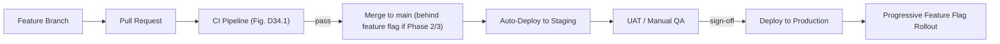

---

## 39. Risk Management

### 39.1 Technical Risk Register

**Table D39.1 — Risk Register**

| Risk | Likelihood | Impact | Mitigation | Owner |
|---|---|---|---|---|
| Free-tier LLM/search API terms change or quota is reduced with little notice | Medium | High | Multi-provider fallback chain (Ch. 17.2/23.1) with Ollama as a guaranteed last resort not dependent on any external provider's terms | Developer |
| Free-tier hosting platform discontinues its always-free tier | Low–Medium | High | Docker Compose portability (NFR-070) ensures migration to an alternative free-tier host or self-hosted VPS is a configuration change, not a rewrite | Developer |
| Single-developer bus-factor (illness, exam schedule conflicts, project abandonment) | Medium | High (project-continuity risk) | Thorough documentation (this Master Document itself), open-source licensing enabling community pickup, modular architecture lowering onboarding cost for a new contributor | Developer/Team |
| Vector Store or Knowledge Graph self-hosted on a free-tier VM experiences data loss (no managed-service durability guarantees) | Medium | Medium | Periodic snapshot export to Object Storage (Ch. 30.8); source documents in Object Storage allow full regeneration as a last resort | Developer |
| Free-tier compute insufficient for self-hosted embedding/reranking/VLM inference at acceptable latency | Medium | Medium | Right-sized model selection (Part C Ch. 16.2 principle — smaller models preferred where they meet the accuracy bar), Ollama quantized model options | Developer |

### 39.2 Free-Tier Dependency Risk & Mitigation

Directly expands the top risk-register row above: the platform's entire cost model depends on continued free-tier availability across ~8–10 distinct third-party services (Ch. 27.3). This concentration of external dependency is the single largest structural risk to the project and is mitigated architecturally (fallback chains, Ch. 17/23), not merely operationally, precisely because a purely operational mitigation (e.g., "monitor closely and react") is insufficient against a provider changing terms with little warning.

### 39.3 AI-Specific Risks

| Risk | Mitigation |
|---|---|
| Model deprecation (a specific hosted model version is retired by its provider) | LLM Gateway abstraction (Ch. 17.2) isolates model identifiers to configuration, not scattered call sites |
| Hallucination in high-stakes outputs (financial claims, market data) | Mandatory citation-or-flag behavior (Part C Ch. 17.3, Ch. 26), citation-resolution validation (Ch. 25.2) |
| Data drift (reference datasets, Ch. 24, becoming stale over time) | Documented dataset refresh cadence as a standing maintenance task, flagged in Appendix I alongside free-tier quota re-verification |

### 39.4 Business/Legal Risks

Unauthorized-practice-of-law exposure from the Legal Drafting Assistant (Part A §5.11) — mitigated by strict scope limitation to open-template-based drafts with mandatory, non-dismissible disclaimers (FR-086, NFR-080), formalized further in Ch. 41.

### 39.5 Contingency & Mitigation Plans

For the top project-continuity risk (§39.1, single-developer bus-factor): this Master Document, the versioned prompt registry (Part C Ch. 17.4), and the Alembic migration history together constitute a sufficient "handoff package" for a new contributor or maintainer to pick up the project without relying on undocumented tribal knowledge — this is treated as a design goal of the documentation itself, not an afterthought.

---

## 40. Cost Analysis & Migration Path

### 40.1 Full Zero-Budget Architecture Cost Breakdown

**Table D40.1 — Zero-Budget Cost Confirmation Table**

| Component | Provider/Tool | Recurring Cost |
|---|---|---|
| Frontend hosting | Vercel (free tier) | $0 |
| Backend hosting | Railway or Fly.io (free tier/allowance) | $0 (within allowance) |
| Relational DB + Auth + Object Storage | Supabase (free tier) | $0 |
| Vector Store | ChromaDB (embedded, self-hosted) / Qdrant CE (self-hosted) | $0 |
| Knowledge Graph | Neo4j Community Edition (self-hosted) | $0 |
| LLM inference | Gemini/Groq/Mistral/HF Inference/OpenRouter free tiers + Ollama local | $0 |
| Search | Tavily/DuckDuckGo Search free tiers + SerpAPI small free quota | $0 |
| Embeddings/Reranking | BGE / Sentence-Transformers (self-hosted) | $0 |
| Forecasting | Prophet/LightGBM (open-source libraries, self-hosted compute) | $0 |
| Speech/OCR/Vision | Faster-Whisper, PaddleOCR/Tesseract, Qwen2.5-VL/Florence-2/Gemma-Llama Vision (self-hosted or free-tier hosted) | $0 |
| CI/CD | GitHub Actions (free tier) | $0 |
| Monitoring | Prometheus + Grafana (self-hosted) + LangSmith (free tier) + MLflow (self-hosted) | $0 |
| **Total** | | **$0** |

### 40.2 Free-Tier Usage Projections vs. Limits

A living version of Table D36.1, populated with real observed usage (via Ch. 35 Prometheus metrics) rather than projections once the platform has real users — tracked in Appendix I and reviewed on the cadence defined in Ch. 39.2's mitigation plan.

### 40.3 Trigger Points for Paid Upgrade

| Trigger | Rationale for Considering a Paid Tier at This Point |
|---|---|
| Sustained user base large enough that free-tier hosting compute/allowance is structurally insufficient even after all self-hosting/consolidation options (Table D36.1) are exhausted | At this point the project has likely also gained enough traction (users, possibly revenue or grant/prize funding from a student competition) to justify and afford a modest paid tier |
| A specific capability (e.g., TFT/N-BEATS cross-company forecasting, Part C Ch. 20.2) requires compute genuinely unavailable in any free/self-hosted form | Paid GPU compute (e.g., a low-cost cloud GPU instance) becomes justified only for this specific, isolated workload, not the whole platform |
| Legal/compliance requirements (Ch. 41) necessitate a paid, contractually-SLA'd service (e.g., for genuine legal-advice liability coverage) | This is a business-model-change trigger, not merely a technical one, and would accompany a broader shift in the platform's positioning |

### 40.4 Migration Roadmap (Free → Paid) Per Component

**Table D40.2 — Free-to-Paid Migration Roadmap Table**

| Component | Free-Tier Path | Paid Migration Path (only when Ch. 40.3 trigger is met) | Migration Effort |
|---|---|---|---|
| LLM inference | Free-tier fallback chain (Ch. 17.2) | Add a paid frontier-model tier (e.g., a paid Gemini/Claude/GPT tier) as a new *top* entry in the same fallback chain, everything below it unchanged | Low — LLM Gateway abstraction (Ch. 17.2) isolates this to a config/priority-order change |
| Hosting | Railway/Fly.io free allowance | Upgrade to the same provider's paid tier | Very low — same platform, just a billing-plan change |
| Vector Store | Self-hosted ChromaDB/Qdrant CE | Qdrant Cloud (managed) or a paid-tier equivalent | Low–Medium — Vector Store abstraction (Part C Ch. 19.4) isolates this to a connection-config change |
| Database | Supabase free tier | Supabase paid tier or dedicated managed PostgreSQL | Very low — same connection-string-based portability as any hosting migration (NFR-011) |

### 40.5 Total Cost of Ownership Projection (Year 1–3)

Year 1 (MVP + Phase 2, per Part A roadmap): **$0**, by design and by the constraint stated throughout this Master Document. Years 2–3 project a *possible* transition to modest paid tiers only if and when Ch. 40.3's triggers are met — this document deliberately does not project a specific dollar figure for that future state, since it is contingent on user growth and funding events that cannot be responsibly forecast at the current stage; Ch. 40.3/40.4 instead specify the *mechanism* by which that transition would happen smoothly, which is the more actionable artifact for a zero-budget student project than a speculative cost projection would be.

---

## References (Part D)

1. FastAPI, Next.js, PostgreSQL, Alembic — official documentation, referenced throughout Ch. 27–31.
2. ChromaDB, Qdrant Community Edition, Neo4j Community Edition, MinIO — official documentation, referenced in Ch. 27.3, 30.5–30.6, 32.1.
3. Supabase, Railway, Render, Fly.io, Vercel, Netlify, Cloudflare Pages, GitHub Pages — platform documentation, referenced in Ch. 34.4 (subject to the same live re-verification note as prior parts, given free-tier terms change frequently).
4. GitHub Actions documentation — referenced in Ch. 34.2.
5. Prometheus, Grafana, LangSmith, MLflow — official documentation, referenced in Ch. 35.
6. OWASP STRIDE threat-modeling methodology — referenced in Ch. 33.1.
7. Locust (load testing) — referenced in Ch. 36.1.
8. Part A §1.6, §4.4 (zero-budget constraint statement) and Part C Ch. 16.2 (model selection philosophy) — the governing constraints this entire Part operationalizes into concrete architecture.

*End of Part D. This completes the four-part Master Document (Parts A–D). Part E (Cross-Cutting Reference Material, Ch. 41–42) and the Appendices consolidate compliance, licensing, team-process guidance, and the full unabridged reference tables (traceability matrix, API catalog, dataset catalog, schema DDL) referenced throughout Parts A–D.*
