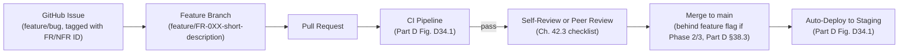
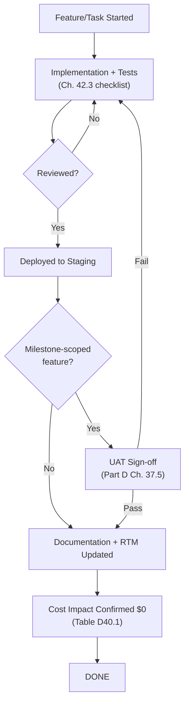

# PART E — CROSS-CUTTING REFERENCE MATERIAL
## AI Co-Founder Platform

*This document is Part E of the Master Document. It formalizes two concerns that touch every prior part rather than belonging to any single one: compliance/legal posture (Ch. 41) and the team/process discipline (Ch. 42) that makes the architecture in Parts A–D actually buildable by a small student team. Where earlier parts referenced "Ch. 41" or "Ch. 41.1" as a forward pointer (Part A §5.11, Part B NFR-080/081, Part C Ch. 26.5, Part D §33.7/39.4), this is the chapter those pointers resolve to.*

---

## 41. Compliance & Legal Considerations

### 41.1 Open-Source License Compatibility Matrix

Every dependency, model, and dataset the platform uses carries a license that must be checked for compatibility with the platform's own chosen license (front matter — MIT or Apache-2.0 recommended, per §41.1.1 below) **before** adoption, not after. This is a standing process (Part C Ch. 26.5), not a one-time audit, because new dependencies are added throughout Parts A–D's implementation.

**41.1.1 Platform License Recommendation**

| Option | Trade-off | Recommendation |
|---|---|---|
| MIT | Maximally permissive, minimal friction for downstream reuse/contribution — the simplest choice for a student open-source project that wants easy community pickup (Part D §39.5's contingency plan depends on this) | **Recommended** |
| Apache-2.0 | Adds an explicit patent grant, marginally more legal text | Reasonable alternative if patent-grant clarity is specifically valued; functionally similar permissiveness to MIT for this project's purposes |
| GPL-family (copyleft) | Would force downstream derivative works to also be open-source | **Not recommended** — copyleft would conflict with several of the platform's own dependencies' terms (see Table E41.1) and would undermine the "easy to fork/adapt" goal that benefits a student portfolio project |

**Table E41.1 — Open-Source License Compatibility Matrix**

| Component | Typical License | Compatible with MIT/Apache-2.0 Platform License? | Notes |
|---|---|---|---|
| LangGraph / LangChain | MIT | ✓ | Verify current license on each major version bump |
| FastAPI | MIT | ✓ | |
| Next.js | MIT | ✓ | |
| PostgreSQL | PostgreSQL License (permissive, similar to MIT/BSD) | ✓ | |
| ChromaDB | Apache-2.0 | ✓ | |
| Qdrant (Community Edition) | Apache-2.0 | ✓ | Verify CE vs. Enterprise license boundary on each version — some vector DB vendors have shifted specific features behind a non-OSS license over time |
| Neo4j Community Edition | GPLv3 | ⚠ Conditional | GPLv3 applies to Neo4j CE itself; since the platform interacts with Neo4j over the network (Bolt protocol) as a separate service rather than statically/dynamically linking its code, this is a materially different situation from bundling GPLv3 code into the platform's own codebase — **recommendation: treat Neo4j CE as an external service dependency (like PostgreSQL), not a linked library, and document this reasoning explicitly in the license record** rather than assuming it's automatically fine; if the project's risk tolerance is very conservative, Memgraph (Ch. 19.7 alternative) should be re-evaluated for its license terms as a substitute |
| Prophet | MIT | ✓ | |
| LightGBM / XGBoost / CatBoost | MIT / Apache-2.0 (verify per-library) | ✓ | |
| BAAI BGE / Sentence-Transformers | Apache-2.0 / MIT (verify per model card) | ✓ | |
| Whisper / Faster-Whisper | MIT | ✓ | |
| PaddleOCR | Apache-2.0 | ✓ | |
| Tesseract OCR | Apache-2.0 | ✓ | |
| Llama 3.x | Meta Llama Community License (custom, not OSI-approved) | ⚠ Conditional | Permits use, including commercial use below a very high user-count threshold irrelevant at this project's scale, but is **not** a standard OSI open-source license — carries specific redistribution/naming conditions (e.g., "Built with Llama" attribution requirements). Must be reviewed against current Meta license terms before any redistribution of model weights or fine-tuned derivatives |
| Qwen 3 / Qwen2.5-VL | Varies by size/version (some Apache-2.0, some custom Tongyi Qianwen license) | ⚠ Conditional | Check the specific model card for the exact variant used — Alibaba has released some Qwen variants under Apache-2.0 and others under a custom license with use restrictions |
| Gemma / Gemma Vision | Custom Gemma Terms of Use (not OSI-approved) | ⚠ Conditional | Google's Gemma license permits broad use but includes specific prohibited-use-policy terms; must be reviewed, particularly if any fine-tuning/redistribution of weights is planned |
| DeepSeek | Varies by model (some MIT, some custom) | ⚠ Conditional | Verify per specific DeepSeek model variant |
| Phi | MIT (recent versions; verify per version) | ✓ (with per-version verification) | |
| Gemini / Groq / Mistral / HF Inference / OpenRouter (APIs, not weights) | Governed by provider Terms of Service, not an open-source license | N/A (service ToS, not code license) | These are consumed as hosted API services, not redistributed code/weights — the relevant compliance question is the **data-usage terms** of the API (Ch. 41.3), not license compatibility |

**Recommendation:** Maintain Table E41.1 as a living document (Appendix E41.1, per the Master TOC), reviewed whenever a new model/library is introduced anywhere in Parts A–D, with any ⚠-flagged item requiring explicit sign-off notes (why it's acceptable, what conditions apply) rather than being silently assumed fine.

### 41.2 Data Privacy Compliance Checklist

The platform is designed to be GDPR/DPDP(India)/CCPA-*aware* — meaning its architecture supports the practical rights these frameworks establish — without claiming full legal compliance certification, which is out of reach for a zero-budget student project and would require legal counsel this project cannot afford (an honest, stated limitation, not a gap to paper over).

**Table E41.2 — Data Privacy Compliance Checklist**

| Right/Principle | Architectural Support | Reference |
|---|---|---|
| Right to access | Data export endpoint returning all user/workspace data in machine-readable format | Part B NFR-040 |
| Right to erasure | Account deletion with documented purge window (≤30 days) | Part B FR-007, NFR-041; Part D Ch. 30.8 (backup interaction: purge requests must also account for backup snapshots, not just live tables) |
| Data minimization | Only email + auth identifier collected for account creation (Part B §14.1 Data Dictionary); no unnecessary PII collected by default | Part B §9.3, §14.3 |
| Purpose limitation / third-party data sharing transparency | Documented data-flow disclosure to users listing which third-party APIs (Ch. 41.3) receive which categories of their data | Part C Ch. 26.3 (PII redaction), Part D §33.3 |
| Consent for third-party AI processing | User is informed (at signup/first use) that conversation/document content may be sent to external LLM/search providers as part of normal platform operation, with the PII-redaction/local-fallback option (Ch. 26.3) offered for privacy-sensitive workspaces | Part C Ch. 26.3 |
| Data breach notification process | Documented (even if manual/lightweight given team size) incident-response process: detect (Ch. 35 alerting) → assess scope → notify affected users within a reasonable window | Part D Ch. 35.4 |

**Recommendation:** Publish a plain-language privacy notice (not just a legal-dense policy document) describing exactly which third parties see what data and why, since target users (student founders, Part A Ch. 3) are more likely to actually read and trust a clear, honest disclosure than a boilerplate legal document — this also directly reduces the credibility/trust risk identified in Part A §3.4.

### 41.3 Third-Party API Terms of Service Summary

**Table E41.3 — Third-Party API ToS Considerations** *(high-level flags; full current terms must be read directly from each provider's live ToS page before production launch, as these change over time)*

| Provider | Key ToS Consideration | Mitigation |
|---|---|---|
| Gemini Free API | Free-tier usage terms may include data-usage-for-model-improvement clauses depending on current policy | PII redaction (Ch. 26.3) before sending sensitive content; route highly sensitive workspace content to Ollama local fallback instead when a user opts in to "privacy mode" |
| Groq, Mistral, HF Inference, OpenRouter | Each has its own data-retention/usage policy for free-tier requests — verify per provider | Same redaction/local-fallback mitigation, applied uniformly via the LLM Gateway (Part C Ch. 17.2) regardless of which provider is active |
| Tavily / SerpAPI | Search query content is sent to a third party; typically less sensitive than full document content but may still reveal company-strategy signals (e.g., a competitor-research query itself is informative) | No redaction typically needed for search queries (they're inherently public-facing research), but this is noted as a lower-priority residual consideration |
| DuckDuckGo Search (unofficial libraries) | Using unofficial/community scraping libraries against DDG carries a nontrivial risk of violating DDG's terms of service around automated access, separate from the technical fragility already noted in Part C Ch. 23.1 | Documented explicitly as an accepted risk for a free/fallback-tier use case, revisited if DuckDuckGo's official developer terms change to explicitly permit or prohibit this pattern |
| Supabase, Railway, Render, Fly.io, Vercel, Netlify, Cloudflare Pages | Standard hosting ToS; free-tier terms typically prohibit abuse patterns (crypto mining, excessive resource use) unrelated to this platform's normal operation | Standard good-faith compliance; no special mitigation needed beyond normal usage |

### 41.4 AI Model License Review

Consolidates the ⚠-flagged rows of Table E41.1 (Llama, Qwen, Gemma, DeepSeek variants) into a standing review process: before any of these models is fine-tuned, redistributed, or has its weights bundled with a platform release (as opposed to simply called via a hosted API), the current license terms for that *specific* model variant are re-read and recorded in Appendix E41.1 with the date of review — this matters because these custom licenses (unlike MIT/Apache-2.0) sometimes carry specific attribution or use-restriction clauses that a generic "it's open-weight" assumption would miss.

---

## 42. Team, Process & Governance (Student-Project Context)

### 42.1 Solo/Small-Team Workflow

**Figure E42.1 — Git Branching & Review Workflow.**

**Recommendation:** Even as a solo developer, branch names and PR descriptions should reference the specific FR-XXX/NFR-XXX ID(s) being implemented (e.g., `feature/FR-067-prophet-runway-forecast`) — this is what makes the Requirements Traceability Matrix (Part B Ch. 15, Table B15.1) something that stays accurate over time rather than a document that's correct on day one and drifts out of sync with the actual codebase. Trunk-based development (short-lived feature branches, frequent merges to `main` behind flags per Part D §38.3) is recommended over long-lived feature branches specifically because a small/solo team has limited capacity to manage merge-conflict-prone divergent branches.

### 42.2 Documentation Standards

| Document Type | Standard | Owning Location |
|---|---|---|
| Master Document (this document, Parts A–E) | Updated whenever an architectural decision changes — this is the canonical source of truth, not a one-time deliverable | Repository root (e.g., `/docs/master-document/`) |
| Code-level documentation | Docstrings on all public functions/classes, especially anything implementing an FR-XXX (the docstring should reference the FR ID) | Inline in source |
| API documentation | Auto-generated from FastAPI's OpenAPI schema (Part D §31.6) — never manually duplicated | `/docs` endpoint, archived per release in Appendix E |
| Architecture Decision Records (ADRs) | For any decision *not* already captured in Parts A–D (e.g., a mid-implementation trade-off discovered during coding), a short ADR is written and linked back to the relevant chapter | `/docs/adr/` |

**Recommendation:** Treat any deviation from this Master Document discovered during implementation as a signal to update the document, not just the code — since Part D §39.5's bus-factor mitigation explicitly depends on the documentation staying accurate, a codebase that silently diverges from its own design document defeats that mitigation.

### 42.3 Code Review Checklist

Whether reviewed by a peer or self-reviewed (common in a solo-developer context, where a deliberate second-pass review before merge substitutes for a second person), every PR is checked against:

1. **Traceability:** Does this PR reference the FR-XXX/NFR-XXX ID(s) it implements, and does the implementation match the requirement's acceptance criteria (Part B Ch. 10)?
2. **Zero-budget compliance:** Does this PR introduce any new dependency, API, or service that isn't free-tier/self-hostable (Part A §1.6)? If so, it should not be merged without an explicit, documented exception and update to Table D40.1.
3. **Fallback-chain integrity:** If this PR touches an LLM/search-provider call site, does it go through the LLM Gateway/Search abstraction (Part C Ch. 17.2/23.1) rather than calling a provider SDK directly?
4. **Workspace isolation:** Does this PR's data access correctly scope by `workspace_id` (Part D §30.5's mandatory-filter pattern), avoiding any risk of cross-tenant data leakage (Part D Table D33.1)?
5. **Test coverage:** Does this PR include unit/integration tests per the test pyramid (Part D Ch. 37.1), and — if it touches a prompt template or model routing — does it include or pass the AI regression eval suite (Part C Ch. 25.6)?
6. **Security:** No secrets committed (Part D §33.4), input validation present on any new user-facing endpoint (Part D §33.6).

### 42.4 Definition of Done

A feature/task is considered "Done" only when **all** of the following hold, not merely when the code merges:

| Criterion | Verification |
|---|---|
| Corresponding FR-XXX/NFR-XXX acceptance criteria pass | Automated test (Part B Ch. 10 Verification Method column) |
| Code reviewed against the Ch. 42.3 checklist | PR approval (self or peer) |
| Documentation updated (Master Document, ADRs, or API docs as applicable) | Ch. 42.2 |
| Deployed to staging and passes UAT sign-off criteria, if the feature is milestone-scoped | Part D Ch. 37.5, Table A7.1 |
| Free-tier cost impact assessed and confirmed $0 (or an explicit, documented exception recorded) | Table D40.1 |
| Traceability Matrix (Part B Table B15.1 / Appendix A) updated to reflect the implementing component | Ch. 42.1 recommendation |

**Figure E42.2 — Definition of Done Flow.**

---

## References (Part E)

1. SPDX License List and OSI (Open Source Initiative) license definitions — referenced for the license-classification judgments in Table E41.1.
2. Meta Llama Community License, Google Gemma Terms of Use, Alibaba Qwen/Tongyi Qianwen License terms, DeepSeek model license terms — provider-published license texts, referenced in §41.1/41.4 (these are custom, non-OSI licenses that must be re-read from the provider's current publication rather than assumed from a general "open-weight" characterization).
3. GDPR (EU Regulation 2016/679), India's Digital Personal Data Protection Act (DPDP) 2023, CCPA (California Consumer Privacy Act) — regulatory frameworks referenced for the privacy-awareness checklist in §41.2 (explicitly noted as informing the architecture, not a claim of certified legal compliance).
4. Individual provider Terms of Service pages (Google AI/Gemini, Groq, Mistral, Hugging Face, OpenRouter, Tavily, SerpAPI, DuckDuckGo, Supabase, Railway, Render, Fly.io, Vercel, Netlify, Cloudflare) — referenced in §41.3; subject to the same recurring live re-verification note as every prior Part's provider references, since ToS terms change independent of this document's revision cycle.
5. Conventional Commits / trunk-based development methodology references — informing the workflow recommendation in §42.1.
6. Architecture Decision Record (ADR) format (e.g., Michael Nygard's original ADR template) — referenced as the recommended lightweight format in §42.2.

*End of Part E. This completes the narrative body of the Master Document (Parts A–E). The remaining Master TOC items — Appendices A–N (full unabridged Requirements Traceability Matrix, API and Dataset catalogs, database DDL scripts, OpenAPI specification, Prompt Template Library, Agent Tool Schema definitions, glossary, wireframe gallery, and diagram/table indices) and the consolidated References section — assemble and cross-reference material already introduced throughout Parts A–E rather than introducing new architectural decisions, and are the natural next deliverable once the team is ready to compile them.*
